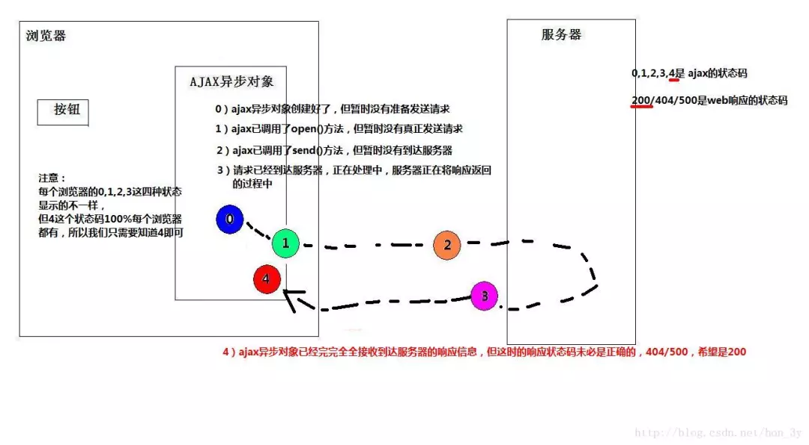

# AJAX入门！

## 一、什么是Ajax  
Ajax(Asynchronous JavaScript and XML) 异步JavaScript和XML  

Ajax实际上是下面这几种技术的融合：
- (1)XHTML和CSS的基于标准的表示技术
- (2)DOM进行动态显示和交互 
- (3)XML和XSLT进行数据交换和处理  
- (4)XMLHttpRequest进行异步数据检索
- (5)Javascript将以上技术融合在一起 

客户端与服务器，可以在【不必刷新整个浏览器】的情况下，与服务器进行异步通讯的技术    

## 二、为什么我们需要Ajax？    

在我们之前的开发，每当用户向服务器发送请求，哪怕只是需要更新一点点的局部内容，服务器都会将整个页面进行刷新。
- 性能会有所降低(一点内容，刷新整个页面！)
- 用户的操作页面会中断(整个页面被刷新了)  

Ajax就是能够做到局部刷新！

## 三、XMLHttpRequest 

XMLHttpRequest对象是Ajax中最重要的一个对象。使用Ajax更多的是编写客户端代码，而不是服务端的代码。

### 3.1XMLHttpRequest 工作原理
传统的web前端与后端的交互中，浏览器直接访问Tomcat的Servlet来获取数据。Servlet通过转发把数据发送给浏览器。

当我们使用AJAX之后，浏览器是先把请求发送到XMLHttpRequest异步对象之中，异步对象对请求进行封装，然后再与发送给服务器。服务器并不是以转发的方式响应，而是以流的方式把数据返回给浏览器

XMLHttpRequest异步对象会不停监听服务器状态的变化，得到服务器返回的数据，就写到浏览器上【因为不是转发的方式，所以是无刷新就能够获取服务器端的数据】


### 3.2创建XMLHttpRequest对象  

```javascript
<script type="text/javascript">

    var httpRequest;

    if(window.XMLHttpRequest) {

        //在IE6以上的版本以及其他内核的浏览器(Mozilla)等
        httpRequest = new XMLHttpRequest();
    }else if(window.ActiveXObject) {

        //在IE6以下的版本
        httpRequest = new ActiveXObject();
    }


</script>
```


### 3.3了解XMLHttpRequest对象的属性和方法 


**3.3.1 XMLHttpRequest方法**

- **open()**

- **send(content)**

- **setRequestHeader(String header,String value)**

- getAllResponseHeaders()

- getResponseHeader(String header)

- abort()    

**常用的方法** 

- **open()：该方法创建http请求**
  - **第一个参数是指定提交方式(post、get)**
  - **第二个参数是指定要提交的地址是哪**
  - **第三个参数是指定是异步还是同步(true表示异步，false表示同步)**
  - 第四和第五参数在http认证的时候会用到。是可选的
- **setRequestHeader(String header,String value)：设置消息头（使用post方式才会使用到，get方法并不需要调用该方法）**
  - **xmlhttp.setRequestHeader("Content-type","application/x-www-form-urlencoded");**
- **send(content)：发送请求给服务器**
  - **如果是get方式，并不需要填写参数，或填写null**
  - **如果是post方式，把要提交的参数写上去**


**3.3.2  XMLHttpRequest属性**

- **onreadystatechange：请求状态改变的事件触发器（readyState变化时会调用此方法），一般用于指定回调函数**
- **readyState：请求状态readyState一改变，回调函数被调用，它有5个状态**
  - 0：未初始化
  - 1：open方法成功调用以后
  - 2：服务器已经应答客户端的请求
  - 3：交互中。Http头信息已经接收，响应数据尚未接收。
  - **4：完成。数据接收完成**



- **responseText：服务器返回的文本内容**
- **responseXML：服务器返回的兼容DOM的XML内容**
- **status：服务器返回的状态码**
- statusText：服务器返回状态码的文本信息


## 四、编写第一个Ajax程序

编写一个ajax的步骤：

1. 创建XMLHttpRequest对象
2. 创建http请求
3. 把文本框的数据发送给http请求的目标
4. 指定回调函数
5. 编写回调函数
6. 发送http请求
7. 回调函数得到http返回的内容


```javascript
<script type="text/javascript">
    
var httpRequest = new XMLHttpRequest();

//创建http请求
httpRequest.open("POST", "Servlet1", true);

//因为我使用的是post方式，所以需要设置消息头
httpRequest.setRequestHeader("Content-type", "application/x-www-form-urlencoded");

//指定回调函数
httpRequest.onreadystatechange = function()=>{
  //判断请求状态码是否是4【数据接收完成】
  if(httpRequest.readyState==4) {

    //再判断状态码是否为200【200是成功的】
    if(httpRequest.status==200) {

      //得到服务端返回的文本数据
      var text = httpRequest.responseText;

      //把服务端返回的数据写在div上
      var div = document.getElementById("result");
      div.innerText = text;
    }

  }
}
</script>

```


  

  

  ​                        

  