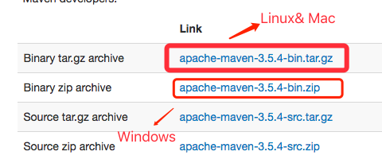
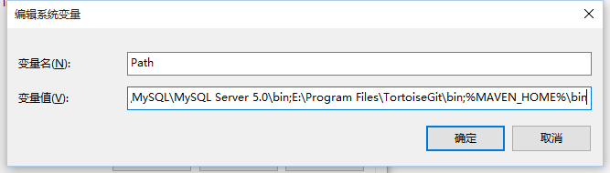
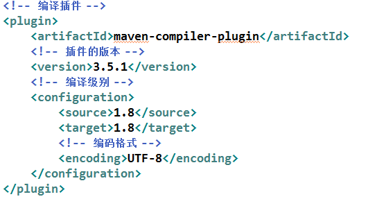
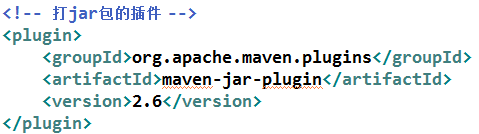
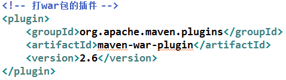
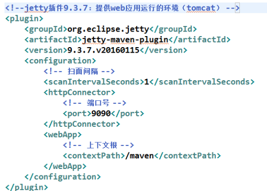
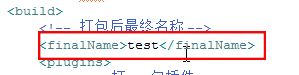

## 一、初识Maven？

### 1.1 什么是Maven
Maven 翻译为"专家"、"内行"，是 Apache 下的一个纯 Java 开发的开源项目。基于项目对象模型（缩写：POM）概念，Maven利用一个中央信息片断能管理一个项目的构建、报告和文档等步骤。

Maven 是一个项目`管理工具`，可以对 Java 项目进行构建、依赖管理。

构建一个项目包括：下载依赖，编译源代码，执行单元测试，以及打包编译后的源代码等一系列子任务。手工的执行这些任务是一项非常繁琐，且容易出错的事情。Maven封装了这些子任务，并提供给用户执行这些子任务的命令。简而言之，Maven是Java项目的一个管理和构建工具。


### 1.2 为什么要使用Maven

Maven是一个项目管理和综合工具。[Maven](http://www.yiibai.com/maven)提供了开发人员构建一个完整的生命周期框架。开发团队可以自动完成项目的基础工具建设，Maven使用标准的目录结构和默认构建生命周期。

在多个开发团队环境时，Maven可以设置按标准在非常短的时间里完成配置工作。由于大部分项目的设置都很简单，并且可重复使用，Maven让开发人员的工作更轻松，同时创建报表，检查，构建和测试自动化设置。


## 二、Maven的安装


### 2.1 准备工作

1. 确定电脑上已经成功安装jdk7.0以上版本
2. win10操作系统
3. maven安装包 下载地址：http://maven.apache.org/download.cgi




### 2.3解压Maven安装包

在上述地址中下载最新的Maven版本，解压到指定目录（此处根据自己的需要），本人解压到了D:\develop\maven\apache-maven-3.5.0目录下，里面有bin、libconf等文件夹。


### 2.3 配置Maven环境变量

添加环境变量 MAVEN_HOME：


右键 "计算机"，选择 "属性"，之后点击 "高级系统设置"，点击"环境变量"，来设置环境变量，有以下系统变量需要配置：

新建系统变量 **MAVEN_HOME**，变量值：**D:\develop\maven\apache-maven-3.5.0**


编辑系统变量 **Path**，添加变量值：**;%MAVEN_HOME%\bin**




### 2.4 验证

检测安装Maven是否成功，在控制台上打上  `mvn -version`就行了…

```
C:\Users\Administrator>mvn -version
Apache Maven 3.3.3 (7994120775791599e205a5524ec3e0dfe41d4a06; 2015-04-22T19:57:3
7+08:00)
Maven home: D:\develop\maven\apache-maven-3.5.0
Java version: 1.8.0_40, vendor: Oracle Corporation
Java home: C:\Program Files\Java\jdk1.8.0_40
Default locale: zh_CN, platform encoding: GBK
OS name: "windows 7", version: "6.1", arch: "amd64", family: "dos"
```


## 三、Maven 项目中主要应用


### 3.1Maven POM

POM( Project Object Model，项目对象模型 ) 是 Maven 工程的基本工作单元，是一个XML文件，包含了项目的基本信息，用于描述项目如何构建，声明项目依赖，等等。    

执行任务或目标时，Maven 会在当前目录中查找 POM。它读取 POM，获取所需的配置信息，然后执行目标。POM 中可以指定以下配置：   

- 项目依赖
- 插件
- 执行目标
- 项目构建 profile
- 项目版本
- 项目开发者列表
- 相关邮件列表信息


在创建 POM 之前，我们首先需要描述项目组 (groupId), 项目的唯一ID。  


```xml
<project xmlns = "http://maven.apache.org/POM/4.0.0"
    xmlns:xsi = "http://www.w3.org/2001/XMLSchema-instance"
    xsi:schemaLocation = "http://maven.apache.org/POM/4.0.0
    http://maven.apache.org/xsd/maven-4.0.0.xsd">
 
    <!-- 模型版本 -->
    <modelVersion>4.0.0</modelVersion>
    <!-- 公司或者组织的唯一标志，并且配置时生成的路径也是由此生成， 如com.companyname.project-group，maven会将该项目打成的jar包放本地路径：/com/companyname/project-group -->
    <groupId>com.companyname.project-group</groupId>
 
    <!-- 项目的唯一ID，一个groupId下面可能多个项目，就是靠artifactId来区分的 -->
    <artifactId>project</artifactId>
 
    <!-- 版本号 -->
    <version>1.0</version>
</project>
```

所有 POM 文件都需要 project 元素和三个必需字段：`groupId`，`artifactId`，`version`。

| 节点         | 描述                                                         |
| ------------ | ------------------------------------------------------------ |
| project      | 工程的根标签。                                               |
| modelVersion | 模型版本需要设置为 4.0。                                     |
| groupId      | 这是工程组的标识。它在一个组织或者项目中通常是唯一的。       |
| artifactId   | 这是工程的标识。它通常是工程的名称。例如，消费者银行。groupId 和 artifactId 一起定义了 artifact 在仓库中的位置。 |
| version      | 是工程的版本号。在 artifact 的仓库中，它用来区分不同的版本。 |


### 3.2 Maven 构建生命周期

Maven 构建生命周期定义了一个项目构建跟发布的过程。

一个典型的 Maven 构建（build）生命周期是由以下几个阶段的序列组成的：


| 阶段          | 处理     | 描述                                                     |
| :------------ | :------- | :------------------------------------------------------- |
| 验证 validate | 验证项目 | 验证项目是否正确且所有必须信息是可用的                   |
| 编译 compile  | 执行编译 | 源代码编译在此阶段完成                                   |
| 测试 Test     | 测试     | 使用适当的单元测试框架（例如JUnit）运行测试。            |
| 包装 package  | 打包     | 创建JAR/WAR包如在 pom.xml 中定义提及的包                 |
| 检查 verify   | 检查     | 对集成测试的结果进行检查，以保证质量达标                 |
| 安装 install  | 安装     | 安装打包的项目到本地仓库，以供其他项目使用               |
| 部署 deploy   | 部署     | 拷贝最终的工程包到远程仓库中，以共享给其他开发人员和工程 |

为了完成 default 生命周期，这些阶段（包括其他未在上面罗列的生命周期阶段）将被按顺序地执行。

Maven 有以下三个标准的生命周期：

- **clean**：项目清理的处理
- **default(或 build)**：项目部署的处理
- **site**：项目站点文档创建的处理

### 3.3仓库(respositories)

在 Maven 的术语中，仓库是一个位置（place）。

Maven 仓库是项目中依赖的第三方库，这个库所在的位置叫做仓库。

在 Maven 中，任何一个依赖、插件或者项目构建的输出，都可以称之为构件。

Maven 仓库能帮助我们管理构件（主要是JAR），它就是放置所有JAR文件（WAR，ZIP，POM等等）的地方。

Maven 仓库有三种类型：

- 本地（local）
- 中央（central）
- 远程（remote）


**本地仓库**

Maven 的本地仓库，在安装 Maven 后并不会创建，它是在第一次执行 maven 命令的时候才被创建。

运行 Maven 的时候，Maven 所需要的任何构件都是直接从本地仓库获取的。如果本地仓库没有，它会首先尝试从远程仓库下载构件至本地仓库，然后再使用本地仓库的构件。

默认情况下，不管Linux还是 Windows，每个用户在自己的用户目录下都有一个路径名为 `.m2/respository/ `的仓库目录。

Maven 本地仓库默认被创建在 %USER_HOME% 目录下。要修改默认位置，在 `%M2_HOME%\conf `目录中的 Maven 的 `settings.xml `文件中定义另一个路径。

```xml
<settings xmlns="http://maven.apache.org/SETTINGS/1.0.0"
   xmlns:xsi="http://www.w3.org/2001/XMLSchema-instance"
   xsi:schemaLocation="http://maven.apache.org/SETTINGS/1.0.0 
   http://maven.apache.org/xsd/settings-1.0.0.xsd">
      <localRepository>C:/MyLocalRepository</localRepository>
</settings>
```

当你运行 Maven 命令，Maven 将下载依赖的文件到你指定的路径中。

**中央仓库**

Maven 中央仓库是由 Maven 社区提供的仓库，其中包含了大量常用的库。

中央仓库包含了绝大多数流行的开源Java构件，以及源码、作者信息、SCM、信息、许可证信息等。一般来说，简单的Java项目依赖的构件都可以在这里下载到。

中央仓库的关键概念：

- 这个仓库由 Maven 社区管理。
- 不需要配置。
- 需要通过网络才能访问。

要浏览中央仓库的内容，maven 社区提供了一个 `URL：<http://search.maven.org/#browse>`。使用这个仓库，开发人员可以搜索所有可以获取的代码库。

**远程仓库**

如果 Maven 在中央仓库中也找不到依赖的文件，它会停止构建过程并输出错误信息到控制台。为避免这种情况，Maven 提供了远程仓库的概念，它是开发人员自己定制仓库，包含了所需要的代码库或者其他工程中用到的 jar 文件。

举例说明，使用下面的 `pom.xml`，Maven 将从远程仓库中下载该 `pom.xml `中声明的所依赖的（在中央仓库中获取不到的）文件。

```xml
<project xmlns="http://maven.apache.org/POM/4.0.0"
   xmlns:xsi="http://www.w3.org/2001/XMLSchema-instance"
   xsi:schemaLocation="http://maven.apache.org/POM/4.0.0
   http://maven.apache.org/xsd/maven-4.0.0.xsd">
   <modelVersion>4.0.0</modelVersion>
   <groupId>com.companyname.projectgroup</groupId>
   <artifactId>project</artifactId>
   <version>1.0</version>
   <dependencies>
      <dependency>
         <groupId>com.companyname.common-lib</groupId>
         <artifactId>common-lib</artifactId>
         <version>1.0.0</version>
      </dependency>
   <dependencies>
   <repositories>
      <repository>
         <id>companyname.lib1</id>
         <url>http://download.companyname.org/maven2/lib1</url>
      </repository>
      <repository>
         <id>companyname.lib2</id>
         <url>http://download.companyname.org/maven2/lib2</url>
      </repository>
   </repositories>
</project>
```


**Maven 依赖搜索顺序**

当我们执行 Maven 构建命令时，Maven 开始按照以下顺序查找依赖的库：

- **步骤 1** － 在本地仓库中搜索，如果找不到，执行步骤 2，如果找到了则执行其他操作。
- **步骤 2** － 在中央仓库中搜索，如果找不到，并且有一个或多个远程仓库已经设置，则执行步骤 4，如果找到了则下载到本地仓库中以备将来引用。
- **步骤 3** － 如果远程仓库没有被设置，Maven 将简单的停滞处理并抛出错误（无法找到依赖的文件）。
- **步骤 4** － 在一个或多个远程仓库中搜索依赖的文件，如果找到则下载到本地仓库以备将来引用，否则 Maven 将停止处理并抛出错误（无法找到依赖的文件）。  

**Maven 阿里云(Aliyun)仓库**

Maven 仓库默认在国外， 国内使用难免很慢，我们可以更换为阿里云的仓库。

第一步:修改 maven 根目录下的 conf 文件夹中的 setting.xml 文件，在 mirrors 节点上，添加内容如下：

```xml
<mirrors>
    <mirror>
      <id>alimaven</id>
      <name>aliyun maven</name>
      <url>http://maven.aliyun.com/nexus/content/groups/public/</url>
      <mirrorOf>central</mirrorOf>        
    </mirror>
</mirrors>
```

第二步: pom.xml文件里添加：

```xml
<repositories>  
        <repository>  
            <id>alimaven</id>  
            <name>aliyun maven</name>  
            <url>http://maven.aliyun.com/nexus/content/groups/public/</url>  
            <releases>  
                <enabled>true</enabled>  
            </releases>  
            <snapshots>  
                <enabled>false</enabled>  
            </snapshots>  
        </repository>  
</repositories>
```

### 3.4 Maven 插件

Maven 是一个执行插件的框架，每一个任务实际上是由插件完成的

**Maven 插件通常用于：**

- 创建 jar 文件
- 创建 war 文件
- 编译代码文件
- 代码单元测试
- 创建工程文档
- 创建工程报告

#### 3.4.1 Maven编译插件



#### 3.4.2Maven打包插件

**打 jar 包插**



**打 war 包插**



**jetty 插件**

jetty 插件提供 Web 应用运行环境，用来替代独立的 tomcat 中间件

**配置 jetty 插件**



**打包后最终名称**




### 3.5 Maven 引入外部依赖

**如果我们需要引入第三库文件到项目，该怎么操作呢？**

Maven 中是通过在 pom.xml 中添加依赖从而来引入 jar 包的。其原理是：每一个 jar 都会有独立的坐标，Maven  就是通过坐标来定位到具体的 jar 的。就好像平面坐标系一样，通过 x 轴 和 y 轴定位一个坐标点。Maven 定义了这样一组规则：世界上任何一个构件都可以使用 Maven 坐标唯一标识。  


#### 3.5.1 **Maven 坐标组成** 

- groupId: 定义当前 Maven 项目隶属的实际项目
- artifactId: 该元素定义实际项目中的一个 Maven 项目或模块
- version: 该元素定义 Maven 项目当前所处的版本
- packaging: 该元素定义 Maven 项目的打包方式
- classifier: 该元素用来帮助定义构建输出的一些附属构件

#### 3.5.2 添加 pom.xml 

添加以下依赖到 pom.xml 文件中：

```xml
<dependencies>
    <!-- 在这里添加你的依赖 -->
    <dependency>
        <groupId>ldapjdk</groupId>  <!-- 库名称，也可以自定义 -->
        <artifactId>ldapjdk</artifactId>    <!--库名称，也可以自定义-->
        <version>1.0</version> <!--版本号-->
        <scope>system</scope> <!--作用域-->
        <systemPath>${basedir}\src\lib\ldapjdk.jar</systemPath> <!--项目根目录下的lib文件夹下-->
    </dependency> 
</dependencies>
```

pom.xml 文件完整代码如下：

```xml
<project xmlns="http://maven.apache.org/POM/4.0.0" 
   xmlns:xsi="http://www.w3.org/2001/XMLSchema-instance"
   xsi:schemaLocation="http://maven.apache.org/POM/4.0.0 
   http://maven.apache.org/maven-v4_0_0.xsd">
   <modelVersion>4.0.0</modelVersion>
   <groupId>com.companyname.bank</groupId>
   <artifactId>consumerBanking</artifactId>
   <packaging>jar</packaging>
   <version>1.0-SNAPSHOT</version>
   <name>consumerBanking</name>
   <url>http://maven.apache.org</url>
 
   <dependencies>
      <dependency>
         <groupId>junit</groupId>
         <artifactId>junit</artifactId>
         <version>3.8.1</version>
         <scope>test</scope>
      </dependency>
 
      <dependency>
         <groupId>ldapjdk</groupId>
         <artifactId>ldapjdk</artifactId>
         <scope>system</scope>
         <version>1.0</version>
         <systemPath>${basedir}\src\lib\ldapjdk.jar</systemPath>
      </dependency>
   </dependencies>
 
</project>
```

