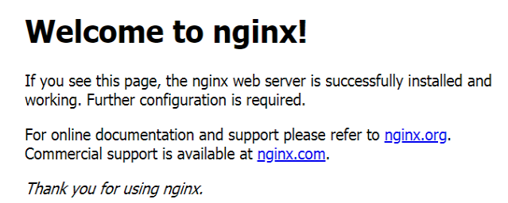
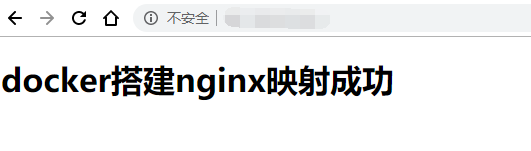

# Docker


## 一、Docker常用命令

### Dcker安装

```shell
# 下载docker
yum install docker

# docker启动与关闭
systemctl start docker.service
systemctl stop docker.service

# 设置开机启动docker
systemctl enable docke
```


### 镜像操作

```shell
# 搜索镜像
docker search

# 下载镜像
docker pull tomcat 

# 删除指定的本地镜像
docker rmi image-id 

# 查看本地镜像
docker images
```

### 容器操作

```shell
# 搜索容器
docker search tomcat

# 拉取容器
docker pull tomcat

# 删除容器
docker rm tomcat

# 容器启动与关闭
docker start tomcat
docker stop tomcat

```


## 二、常用软件安装

### MySQL 5.7

- 下载 mysql 镜像

```shell
docker pull mysql:5.7 
```

- 启动容器

```shell
docker run -p 3306:3306 --name mysql \
-v /mydata/mysql/log:/var/log/mysql \
-v /mydata/mysql/data:/var/lib/mysql \
-v /mydata/mysql/conf:/etc/mysql \
-e MYSQL_ROOT_PASSWORD=root \
-d mysql:5.7
```
参数说明
--name：容器名
-p：映射宿主主机端口
-v：挂载宿主目录到容器目录
-e：设置环境变量，此处指定root密码
-d：后台运行容器


- 修改配置文件

```shell
vi /mydata/mysql/conf/my.cnf
```

```shell
[client]
default-character-set=utf8

[mysql]
default-character-set=utf8

[mysqld]
init_connect='SET collation_connection = utf8_unicode_ci'
init_connect='SET NAMES utf8'
character-set-server=utf8
collation-server=utf8_unicode_ci
skip-character-set-client-handshake
skip-name-resolve
```

- 重启

```shell
docker restart mysql
```

- 设置开机启动容器

```shell
docker update mysql --restart=always
```


### Redis

- 下载 redis 镜像

```shell
docker pull redis
```


- 创建配置文件

```shell
mkdir -p /mydata/redis/conf
touch /mydata/redis/conf/redis.conf
```

- 启动容器

```shell
docker run -p 6379:6379 --name redis \
-v /mydata/redis/data:/data \
-v /mydata/redis/conf/redis.conf:/etc/redis/redis.conf \
-d redis redis-server /etc/redis/redis.conf
```

- 运行 redis

```shell
docker exec -it redis redis-cli
```

- 开启 aof 持久化

```shell
vi /mydata/redis/conf/redis.conf
# 添加如下内容
appendonly yes
```

- 重启 redis

```shell
docker restart redis
```

- 设置开机启动容器

```shell
docker update redis --restart=always
```


### nginx

#### 1. 下载nginx镜像

拉取nginx最新版本

```
docker pull nginx
```

使用nginx镜像来创建nginx容器实例

```shell
docker run --name nginx-test -p 80:80 -d nginx
```

访问 本机测试




#### 2.将nginx关键目录映射到本机

首先在本机创建nginx的一些文件存储目录

```shell
mkdir -p /root/nginx/www /root/nginx/logs /root/nginx/conf
```

- **www**: nginx存储网站网页的目录

- **logs**: nginx日志目录

- **conf**: nginx配置文件目录

 查看`nginx-test`容器id

```shell
docker ps -a
```


将nginx-test容器配置文件copy到本地

```shell
docker cp 481e121fb29f:/etc/nginx/nginx.conf /root/nginx/conf
```

复制完`nginx.conf`后，删除`nginx-tes`t容器

```shell
docker stop 481e121fb29f
docker rm   481e121fb29f
```


创建新nginx容器`nginx-web`,并将**www,logs,conf**目录映射到本地

```shell
docker run -d -p 80:80 --name nginx-web -v /root/nginx/www:/usr/share/nginx/html -v /root/nginx/conf/nginx.conf:/etc/nginx/nginx.conf -v /root/nginx/logs:/var/log/nginx nginx
```

在本机`/root/nginx/www`目录下创建`index.html`内容为

```html
<!DOCTYPE html>
<html>
<head>
<title>docker搭建nginx</title>
</head>
<body>
    <h1>docker搭建nginx映射成功</h1>
</body>
</html>
```

完成后重新访问本机



