# Linux

## 一、 Linux的概述：

### 1．学习Linux之前先了解Unix

Unix是一个强大的多用户、多任务操作系统。于1969年在AT&T的贝尔实验室开发。UNIX的商标权由国际开放标准组织（The Open Group）所拥有。UNIX操作系统是商业版，需要收费，价格比Microsoft Windows正版要贵一些。

### 2．Linux的概述：

Linux是基于Unix的

Linux是一种自由和开放源码的操作系统，存在着许多不同的Linux版本，但它们都使用了Linux内核。Linux可安装在各种计算机硬件设备中，比如手机、平板电脑、路由器、台式计算机

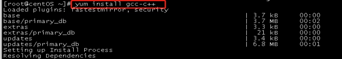

诞生于1991 年10 月5 日。是由芬兰赫尔辛基大学学生Linus Torvalds和后来加入的众多爱好者共同开发完成

### 3．Linux的历史：

Linux最初是由芬兰赫尔辛基大学学生Linus Torvalds由于自己不满意教学中使用的MINIX操作系统， 所以在1990年底由于个人爱好设计出了LINUX系统核心。后来发布于芬兰最大的ftp服务器上，用户可以免费下载，所以它的周边的程序越来越多，Linux本身也逐渐发展壮大起来，之后Linux在不到三年的时间里成为了一个功能完善，稳定可靠的操作系统.

### 4．Linux系统的应用：

服务器系统Web应用服务器、数据库服务器、接口服务器、DNS、FTP等等； 

嵌入式系统路由器、防火墙、手机、PDA、IP 分享器、交换器、家电用品的微电脑控制器等等，

高性能运算、计算密集型应用Linux有强大的运算能力。

桌面应用系统

移动手持系统

### 5．Linux的版本

Linux的版本分为两种：内核版本和发行版本；内核版本是指在Linus领导下的内核小组开发维护的系统内核的版本号 ；

### 6．Linux的主流版本


## 二、Linux的安装：

### 1．虚拟机安装(VmWare)

> 参考《虚拟软件vmware安装.doc》   

### 2．CentOS的安装

> 参考《CentOS6详细安装文档.doc》

### 3．Linux的远程访问

#### 3.1．安装一个远程访问的软件:CRT

#### 3.2．连接Linux

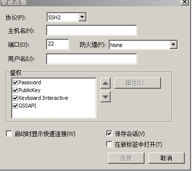


需要录入linux的ip地址及用户名密码

查看ip地址ifconfig

## 三、Linux的目录结构：

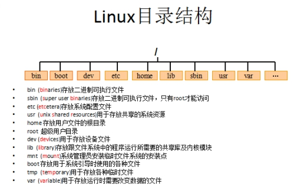

 

root管理员的home目录root

其他用户的home目录home目录中

## [四、Linux常用命令](<https://blog.csdn.net/qq_23329167/article/details/83856430>)

## 五、Vi和Vim编辑器

### 1．Vim编辑器：

```
在Linux下一般使用vi编辑器来编辑文件。vi既可以查看文件也可以编辑文件。三种模式：命令行、插入、底行模式。
切换到命令行模式：按Esc键；
切换到插入模式：按 i 、o、a键；
    i 在当前位置前插入
    I 在当前行首插入
    a 在当前位置后插入
    A 在当前行尾插入
    o 在当前行之后插入一行
    O 在当前行之前插入一行

切换到底行模式：按 :（冒号）；更多详细用法，查询文档《Vim命令合集.docx》和《vi使用方法详细介绍.docx》


打开文件：vim file
退出：esc  :q
修改文件：输入i进入插入模式
保存并退出：esc:wq

不保存退出：esc:q!

三种进入插入模式：
i:在当前的光标所在处插入
o:在当前光标所在的行的下一行插入
a:在光标所在的下一个字符插入

快捷键：
dd – 快速删除一行
yy - 复制当前行
nyy - 从当前行向后复制几行
p - 粘贴
R – 替换
```

### 2．重定向输出>和>>

```
>  重定向输出，覆盖原有内容；>> 重定向输出，又追加功能；示例：
cat /etc/passwd > a.txt  将输出定向到a.txt中
cat /etc/passwd >> a.txt  输出并且追加

ifconfig > ifconfig.txt
```

### 3．系统管理命令

```
ps 正在运行的某个进程的状态
ps –ef  查看所有进程
ps –ef | grep ssh 查找某一进程
kill 2868  杀掉2868编号的进程
kill -9 2868  强制杀死进程
```


4．管道 |

```
管道是Linux命令中重要的一个概念，其作用是将一个命令的输出用作另一个命令的输入。示例
ls --help | more  分页查询帮助信息
ps –ef | grep java  查询名称中包含java的进程

ifconfig | more
cat index.html | more
ps –ef | grep aio
```


## 六、Linux的权限命令


### 1．文件权限


r:对文件是指可读取内容 对目录是可以ls

w:对文件是指可修改文件内容，对目录 是指可以在其中创建或删除子节点(目录或文件)

x:对文件是指是否可以运行这个文件，对目录是指是否可以cd进入这个目录

### 2．Linux三种文件类型：

普通文件： 包括文本文件、数据文件、可执行的二进制程序文件等。 

目录文件： Linux系统把目录看成是一种特殊的文件，利用它构成文件系统的树型结构。  

设备文件： Linux系统把每一个设备都看成是一个文件

### 3．文件类型标识

普通文件（-）目录（d）符号链接（l）

进入etc可以查看，相当于快捷方式字符设备文件（c）块设备文件（s）套接字（s）命名管道（p）

### 4．文件权限管理：

chmod 变更文件或目录的权限。

chmod 755 a.txt 
chmod u=rwx,g=rx,o=rx a.txt

## 七、Linux上常用网络操作

### 1．主机名配置

```linux
hostname 查看主机名
hostname xxx 修改主机名 重启后无效
如果想要永久生效，可以修改/etc/sysconfig/network文件
```


### 2．IP地址配置

```linux
ifconfig 查看(修改)ip地址(重启后无效)
ifconfig eth0 192.168.12.22 修改ip地址
如果想要永久生效
修改 /etc/sysconfig/network-scripts/ifcfg-eth0文件
DEVICE=eth0 #网卡名称
BOOTPROTO=static #获取ip的方式(static/dhcp/bootp/none)
HWADDR=00:0C:29:B5:B2:69 #MAC地址
IPADDR=12.168.177.129 #IP地址
NETMASK=255.255.255.0 #子网掩码
NETWORK=192.168.177.0 #网络地址
BROADCAST=192.168.0.255 #广播地址
NBOOT=yes #  系统启动时是否设置此网络接口，设置为yes时，系统启动时激活此设备。
```


### 3．域名映射

```
/etc/hosts文件用于在通过主机名进行访问时做ip地址解析之用,相当于windows系统的C:\Windows\System32\drivers\etc\hosts文件的功能
```


### 4．网络服务管理

```
service network status 查看指定服务的状态
service network stop 停止指定服务
service network start 启动指定服务
service network restart 重启指定服务

service --status–all 查看系统中所有后台服务
netstat –nltp 查看系统中网络进程的端口监听情况

防火墙设置
防火墙根据配置文件/etc/sysconfig/iptables来控制本机的”出”、”入”网络访问行为。
service iptables status 查看防火墙状态
service iptables stop 关闭防火墙
service iptables start 启动防火墙
chkconfig  iptables off 禁止防火墙自启
```


## 八、Linux上软件安装

### Linux上的软件安装有以下几种常见方式介绍

- 二进制发布包

  软件已经针对具体平台编译打包发布，只要解压，修改配置即可

- RPM包

  软件已经按照redhat的包管理工具规范RPM进行打包发布，需要获取到相应的软件RPM发布包，然后用RPM命令进行安装

- Yum在线安装

  软件已经以RPM规范打包，但发布在了网络上的一些服务器上，可用yum在线安装服务器上的rpm软件，并且会自动解决软件安装过程中的库依赖问题

- 源码编译安装

  软件以源码工程的形式发布，需要获取到源码工程后用相应开发工具进行编译打包部署。

### 上传与下载工具介绍

- FileZilla


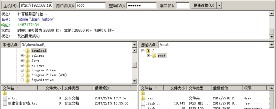


### 1．在Linux上安装JDK:

【步骤一】：上传JDK到Linux的服务器.

```
* 上传JDK
* 卸载open-JDK

java –version
rpm -qa | grep java

rpm -e --nodeps java-1.6.0-openjdk-1.6.0.35-1.13.7.1.el6_6.i686
rpm -e --nodeps java-1.7.0-openjdk-1.7.0.79-2.5.5.4.el6.i686
```

【步骤二】：在Linux服务器上安装JDK.

\* 通常将软件安装到/usr/local

\* 直接解压就可以

   tar –xvf  jdk.tar.gz  -C 目标路径  


【步骤三】：配置JDK的环境变量

```
1. vi /etc/profile

2.在末尾行添加
	#set java environment
	JAVA_HOME=/usr/local/jdk/jdk1.7.0_71
	CLASSPATH=.:$JAVA_HOME/lib.tools.jar
	PATH=$JAVA_HOME/bin:$PATH
	export JAVA_HOME CLASSPATH PATH
保存退出
3.source /etc/profile  使更改的配置立即生效
```


### 2．在Linux上安装Mysql:

【步骤一】：将mysql的安装文件上传到Linux的服务器.

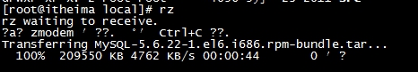

将mysql的tar解压

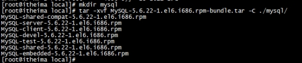

将系统自带的mysql卸载

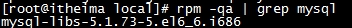


【步骤二】：安装MYSQL服务端

下面的提示是告诉我们root用户的密码第一次是随机生成的，它保存在/root/.mysql_secret中，第一次登录需要修改root密码

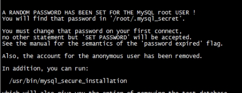

【步骤三】：安装MYSQL客户端


查看生成的root密码

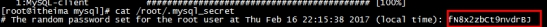

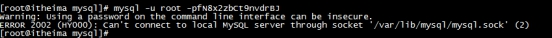

报错:原因是没有启动mysql服务

需要开启mysql服务

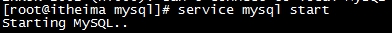

执行下面操作报错，原因是第一次操作mysql必须修改root用户的密码

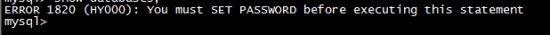

设置root用户的密码

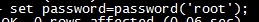

Mysql服务加入到系统服务并自动启动操作：

```
chkconfig --add mysql
```

自动启动：

```
chkconfig mysql on
```

查询列表：

```
chkconfig
```

关于mysql远程访问设置

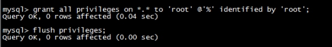

在linux中很多软件的端口都被”防火墙”限止，我们需要将防火墙关闭

防火墙打开3306端口

```
/sbin/iptables -I INPUT -p tcp --dport 3306 -j ACCEPT

/etc/rc.d/init.d/iptables save

/etc/init.d/iptables status

```


学习阶段我们也可以直接将防火墙关闭

```
service iptables stop;
```


### 3．在Linux上安装tomcat:

1.Tomcat上传到linux上

2.将上传的tomcat解压

3.在tomcat/bin目录下执行 startup.sh（注意防火墙）

4.查看目标 tomcat/logs/catalina.out


### 4．在Linux上安装redis

【步骤一】安装gcc-c++

redis是C语言开发，安装redis需要先将官网下载的源码进行编译，编译依赖gcc环境。
输入命令:

```
 yum install gcc-c++
```


输入y确认下载


输入y确认安装

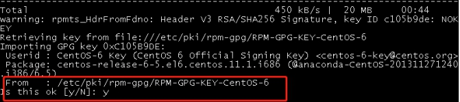

安装 gcc 成功！

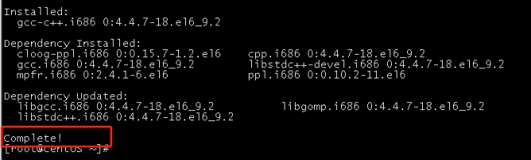

【步骤二】安装redis

1.下载redis

```
wget http://download.redis.io/releases/redis-3.0.4.tar.gz
```

2.解压

```
tar -xzvf redis-3.0.4.tar.gz
```

3.编译安装、切换至程序目录，并执行make命令编译：

```
cd redis-3.0.4
make
```

4.执行安装命令

```
make PREFIX=/usr/local/redis install  
make install安装完成后，会在/usr/local/bin目录下生成下面几个可执行文件，它们的作用分别是：
redis-server：Redis服务器端启动程序
redis-cli：Redis客户端操作工具。也可以用telnet根据其纯文本协议来操作
redis-benchmark：Redis性能测试工具
redis-check-aof：数据修复工具
redis-check-dump：检查导出工具
```


【步骤三】配置redis

复制配置文件到/usr/local/redis/bin目录：

```
cd redis-3.0.4
cp redis.conf /usr/local/redis/bin
```

【步骤四】启动redis

进入redis/bin目录

           ```
cd redis-3.0.4
cp redis.conf /usr/local/redis/bin
           ```

【步骤四】启动redis

进入redis/bin目录

```
cd redis/bin
```

启动redis服务端

```
./redis-server redis.conf
```

克隆新窗口，启动redis客户端

```
./redis-cli
```

### 5．部署项目到Linux

1. 修改pom配置
    在pom.xml中添加`<finalName>`,修改jdk版本1.7

  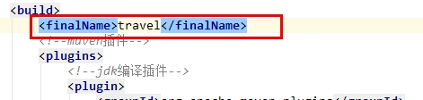

  


  2. 修改项目

   druid.properties 

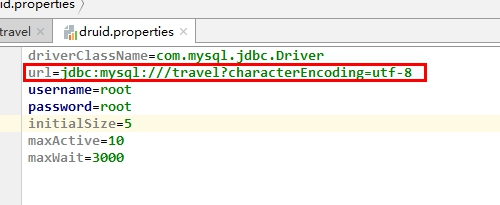

3. 使用package命令打包

   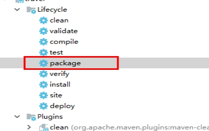

4. 将travel.war上传到tomcat中的webapps目录

5. 重启tomcat

6. 到出本地mysql数据，并导入linux中的mysql