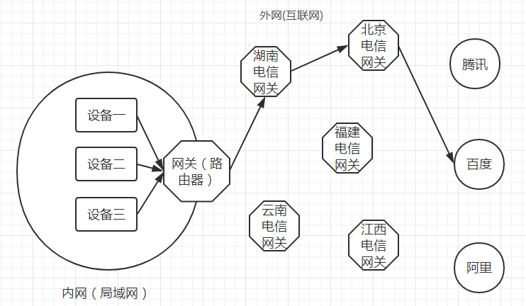

一、网络结构

假设我们的计算机现在就是设备一，我们想要访问百度。如果我们正使用着校园网，那么首先我们需要先通过校园网的路由器把我们的内网ip转为校园网的外网ip。然后通过这个外网ip先连接上湖南电信的网关，最后在连接上百度的网关。百度把你请求的信息回传到你的校园网网关，校园网网关再把信息传给你（整个网络呈网状结构，它会自动找到一条通往百度的路径——基于深度优先搜索或者广度优先搜索）。

二、注意点

1.公网ip具有世界范围的唯一性，而内网ip只在局域网内部具有唯一性。并且，一个局域网里所有电脑的内网IP是互不相同的,但共用一个外网IP。

2.在局域网中，每台电脑都可以自己分配自己的IP，但是这个IP只在局域网中有效。而如果你将电脑连接到互联网，你的网络提供商的服务器会为你分配一个IP地址，这个IP地址才是你在外网的IP。两个IP同时存在，一个对内，一个对外。