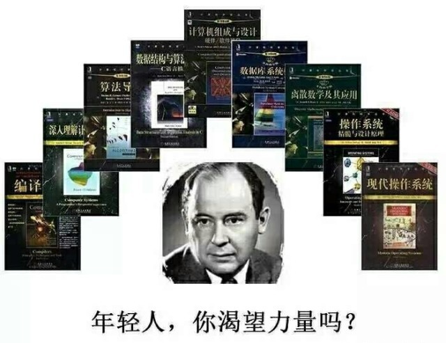

# 计算机专业书籍推荐

  

## **前言：技术书阅读方法论**

世界上并不存在速成的终南捷径，但阅读好的技术书籍，尤其是阅读大师们的经典著作，总能收到事半功倍之效。

一位优秀的程序员，或许就是一名好的阅读者。好的阅读者，总是知道如何选择好的书籍。

**一.速读一遍（最好在1~2天内完成）**
人的大脑记忆力有限，在一天内快速看完一本书会在大脑里留下深刻印象，对于之后复习以及总结都会有特别好的作用。对于每一章的知识，先阅读标题，弄懂大概讲的是什么主题，再去快速看一遍，不懂也没有关系，但是一定要在不懂的地方做个记号，什么记号无所谓，但是要让自己后面再看的时候有个提醒的作用，看看第二次看有没有懂了些。    

**二.精读一遍（在2周内看完）**
有了前面速读的感觉，第二次看会有慢慢深刻了思想和意识的作用，具体为什么不要问我，去问30年后的神经大脑专家，现在人类可能还没有总结出为什么大脑对记忆的完全方法论，但是，就像我们专业程序员，打代码都是先实践，然后就渐渐懂了过程，慢慢懂了原理，所以第二遍读的时候稍微慢下来，2周内搞定。记住一句话：没看完一个章节后，总结一下这个章节讲了啥。很关键。    

**三.实践（在整个过程中都要）**
实践的时候，要注意不用都去实践，最好看着书，敲下代码，把重点的内容敲一遍有个肌肉记忆就很不错了。这个过程最好结合”费曼思想”进行思考，反思，总结。当然如果能把刚刚学习到的内容结合现在做的项目‘注入’，即即学即用，效果甚佳。
以及到自己做过的项目中去把每个有涉及的原理的代码，研究一遍，就可以了

## 优秀的程序员应该具备两方面能力

**- 良好的程序设计能力：**

-  掌握常用的数据结构和算法（例如链表，栈，堆，队列，排序和散列）； 
-  理解计算机科学的核心概念（例如计算机系统结构、操作系统、编译原理和计算机网络） 
-  熟悉至少两门以上编程语言（例如C++，Java，C#，和Python）

**专业的软件开发素养：**

- 具备良好的编程实践，能够编写可测试（Testable），可扩展（Extensible），可维护（Maintainable）的代码； 
-  把握客户需求，按时交付客户所需要的软件产品； 
-  理解现代软件开发过程中的核心概念（例如面向对象程序设计，测试驱动开发，持续集成，和持续交付等等）。 

## 一、计算机导论类

**深入理解计算机系统** 

本书从程序员的视角详细阐述计算机系统的本质概念，并展示这些概念如何实实在在地影响应用程序的正确性、性能和实用性。全书共12章，主要内容包括信息的表示和处理、程序的机器级表示、处理器体系结构、优化程序性能、存储器层次结构、链接、异常控制流、虚拟存储器、系统级I/O、网络编程、并发编程等。书中提供大量的例子和练习，并给出部分答案，有助于读者加深对正文所述概念和知识的理解。  

  

深入理解计算机系统是我读过的最优秀的计算机系统导论型作品，它创造性的把操作系统，计算机组成结构，数字电路，以及编译原理这些计算机基础学科中的核心概念汇集在一起，从而覆盖了指令集体系架构，汇编语言，代码优化，计算机存储体系架构，链接，装载，进程，以及虚拟内存这些程序员所需了解的关键计算机系统知识。如果想打下扎实的计算机基础又不想把操作系统计算机结构编译原理这些书统统读一遍，阅读深入理解计算机系统是最有效率的方式。

**编码-隐匿在计算机软硬件背后的语言**

编码：隐匿在计算机软硬件背后的语言这本书其实不应该叫编码——它更应该叫“Petzold教你造计算机”——作者Charles Petzold创造性的以编码为主题，从电报机和手电筒讲到数字电路，然后利用数字电路中的逻辑门构造出加法器和触发器，最后构造出一个完整的存储程序计算机。不要被这些电路概念吓到——编码使用大量形象贴切的类比简化了这些概念，使其成为最精彩最通俗易懂的计算机入门读物。

    

这本书是偏向数字电路的，从硬件这一层面讲解了一些基本电子元器件的工作方式，比如8位加法器，触发器，锁存器等等，然后再进一步将这些电子元器件组合成内存，甚至cpu，简单的说，它就是告诉你“计算机是如何工作的”。可是当提到数字电路的时候，你脑子里首先想到的是什么？是那些跟一座破庙里面的蜘蛛网一样混乱的电路图？晦涩难懂的概念？看似复杂的逻辑？跟枕头一样厚的教科书？我不知道你是怎么想的，反正大学里面的数字电路这门课给我的印象就是这样，当然，我对这门课毫无兴趣。可是当我看完这本书的时候，我才发现，原来数字电路不是用来死记硬背的，复杂的逻辑完全可以从简单的逻辑入手推导过来。作者用导线，电灯泡，开关，这3个家喻户晓的东西拼装出一个个功能各异的元器件，然后再把元器件横向拼装成更复杂的器件，所以整本书的知识结构非常有层次感，在循序渐进的学习过程中，你会觉得一些原本认为复杂难懂的东西是这样“理所当然的简单”。更好玩的是，你完全可以把书上介绍的电路实现一遍，比如去做个内存，甚至cpu出来，你不需要去买二极管，电路板，电焊铁，焊锡丝等等这些工具，只需要下载个《minecraft》(中文名《我的世界》)游戏就行，这是一款模拟现实世界的沙盒游戏，你千万不要被这游戏的低像素给吓跑了，耐心点，你会发现里面有“红石”，“中继器”，“开关”等等元素，你可以用它们模拟出现实中的电路。

##  二、编程语言类 

尽管Java没有什么出色的入门书籍，但这不代表Java没有出色的必读书籍。Effective Java是我读过的最好的编程书籍之一，它包含大量的优秀Java编程实践，并对泛型和并发这两个充满陷阱的Java特性给出了充满洞察力的建议，以至于Java之父James Gosling为这本书作序：“我很希望10年前就拥有这本书。可能有人认为我不需要任何Java方面的书籍，但是我需要这本书。

    

##  三、算法和数据结构类 

 **算法导论** 

 在有关算法的书中，有一些叙述非常严谨，但不够全面；另一些涉及了大量的题材，但又缺乏严谨性。本书将严谨性和全面性融为一体，深入讨论各类算法，并着力使这些算法的设计和分析能为各个层次的读者接受。全书各章自成体系，可以作为独立的学习单元；算法以英语和伪代码的形式描述，具备初步程序设计经验的人就能看懂；说明和解释力求浅显易懂，不失深度和数学严谨性。 

 全书选材经典、内容丰富、结构合理、逻辑清晰，对本科生的数据结构课程和研究生的算法课程都是非常实用的教材，在IT专业人员的职业生涯中，本书也是一本案头必备的参考书或工程实践手册。 

    

##  四、编译原理类 

 **编译原理**

本书是编译领域无可替代的经典著作，被广大计算机专业人士誉为“龙书”。本书上一版自1986年出版以来，被世界各地的著名高等院校和研究机构（包括美国哥伦比亚大学、斯坦福大学、哈佛大学、普林斯顿大学、贝尔实验室）作为本科生和研究生的编译原理课程的教材。该书对我国高等计算机教育领域也产生了重大影响。　　第2版对每一章都进行了全面的修订，以反映自上一版出版20多年来软件工程。程序设计语言和计算机体系结构方面的发展对编译技术的影响。本书全面介绍了编译器的设计，并强调编译技术在软件设计和开发中的广泛应用。每章中都包含大量的习题和丰富的参考文献。　　本书适合作为高等院校计算机专业本科生和研究生的编译原理与技术课程的教材，也可供广大计算机技术人员参考。 

    

##  五、计算机网络 

 **计算机网络 自顶向下方法** 

 本书采用了独创的自顶向下方法，即从应用层开始沿协议栈向下讲解计算机网络的基本原理，强调应用层范例和应用编程接口，内容深入浅出，注重教学方法，理论与实践相结合。第3版的内容相应更新并反映了网络领域的最新进展，如增加了无线和移动网络一章，扩充了对等网络、BGP、MPLS、网络安全、广播选路和因特网编址及转发方面的材料；还增加了一套实用的实验，并修订了习题。本书适合作为计算机、电子、通信工程相关专业的本科生和研究生的计算机网络课程教科书，对于网络业界甚至网络科研人员，本书也是一本不可多得的参考书。 

    

 **TCP/IP详解 系列** 

 《TCP/IP详解卷1：协议》是一本完整而详细的TCP/IP协议指南。描述了属于每一层的各个协议以及它们如何在不同操作系统中运行。作者W.Richard Stevens用Lawrence Berkeley实验室的tcpdump程序来捕获不同操作系统和TCP/IP实现之间传输的不同分组。对tcpdump输出的研究可以帮助理解不同协议如何工作。 《TCP/IP详解卷1：协议》适合作为计算机专业学生学习网络的教材和教师参考书。也适用于研究网络的技术人员。 

  

 《TCP/IP详解·卷2：实现》完整而详细地介绍了TCP/IP协议是如何实现的。书中给出了约500个图例，15000行实际操作的C代码，采用举例教学的方法帮助你掌握TCP/IP实现。《TCP/IP详解·卷2：实现》不仅说明了插口API和协议族的关系以及主机实现与路由器实现的差别。还介绍了4.4BSD-Lite版的新的特点。《TCP/IP详解·卷2：实现》适用于希望理解TCP/IP协议如何实现的人，包括编写网络应用程序的程序员以及利用TCP/IP维护计算机网络的系统管理员。 

  

 《TCP.IP详解(卷3):CP事务协议.HP.P和UIX域协议》是“TCP/IP详解系列”的延续。主要内容包括：TCP事务协议，即T/TCP，这是对TCP的扩展，使客户-服务器事务更快、更高效和更可靠；TCP/IP应用，主要是HTTP和NNTP；UNIX域协议，这些协议提供了进程之间通信的一种手段。当客户与服务器进程在同一台主机上时，UNIX域协议通常要比TCP/IP快一倍。《CP.IP详解(卷3):CP事务协议.HP.P和UIX域协议》同样采用了大量的实例和实现细节，并参考引用了卷2中的大量源程序。适用于希望理解TCP/IP如何工作的人，包括编写网络应用程序的程序员以及利用TCP/IP维护计算机网络的系统管理员。 

  

  

##  六、操作系统以及与系统相关的 

 **现代操作系统** 

 本书是操作系统领域的经典之作，与第2版相比，增加了关于Linux、Windows Vista和Symbian操作系统的详细介绍。书中集中讨论了操作系统的基本原理，包括进程、线程、存储管理、文件系统、输入/输出、死锁等，同时还包含了有关计算机安全、多媒体操作系统、掌上计算机操作系统、微内核、多核处理机上的虚拟机以及操作系统设计等方面的内容。此外，还在第2版的基础上对部分习题进行了增删，更有助于读者学习和对知识的理解及掌握。 

 本书适合作为高等院校计算机专业操作系统课程教材，也是设计、开发操作系统的重要参考书。 

    

 **鸟哥的Linux私房菜** 

《鸟哥的Linux私房菜:基础学习篇》是最具知名度的Linux入门书《鸟哥的Linux私房菜基础学习篇》的最新版，全面而详细地介绍了Linux操作系统。全书分为5个部分：第一部分着重说明Linux的起源及功能，如何规划和安装Linux主机；第二部分介绍Linux的文件系统、文件、目录与磁盘的管理；第三部分介绍文字模式接口shell和管理系统的好帮手shell脚本，另外还介绍了文字编辑器vi和vim的使用方法；第四部分介绍了对于系统安全非常重要的Linux账号的管理，以及主机系统与程序的管理，如查看进程、任务分配和作业管理；第五部分介绍了系统管理员(root)的管理事项，如了解系统运行状况、系统服务，针对登录文件进行解析，对系统进行备份以及核心的管理等。

  

 **UNIX环境高级编程** 

本书是被誉为UNIX编程“圣经”的Advanced Programming in the UNIX Environment一书的更新版。在本书第1版出版后的十几年中，UNIX行业已经有了巨大的变化，特别是影响UNIX编程接口的有关标准变化很大。本书在保持了前一版风格的基础上，根据最新的标准对内容进行了修订和增补，反映了最新的技术发展。书中除了介绍UNIX文件和目录、标准I/O库、系统数据文件和信息、进程环境、进程控制、进程关系、信号、线程、线程控制、守护进程、各种I/O、进程间通信、网络IPC、伪终端等方面的内容，还在此基础上介绍了多个应用示例，包括如何创建数据库函数库以及如何与网络打印机通信等。此外，还在附录中给出了函数原型和部分习题的答案。

本书内容权威，概念清晰，阐述精辟，对于所有层次UNIX程序员都是一本不可或缺的参考书

  

30天自制操作系统

 看到这种N天学会xxx的书，出自本能的反应就是嗤之以鼻，是的，实际上我们很难在30天搞定，但30天不是重点。关键是这本书从0开始到一个完整的操作系统每一步都有源代码，也就是说你完全可以跟着一起敲代码，最后也能做出一个操作系统来，非常具有可操作性。事实上，我觉得最牛逼的“hello word”就是在机器通电后直接在屏幕上显示“hello world”。 

  

