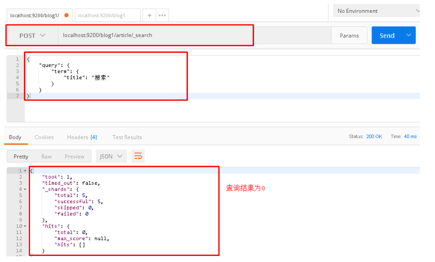
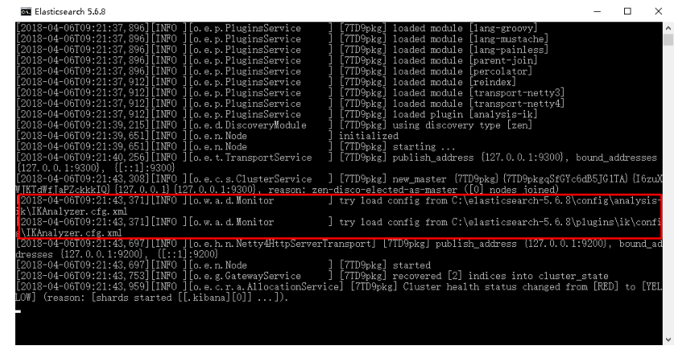

# ElasticSearch

Elaticsearch，简称为es， es是一个开源的高扩展的分布式全文检索引擎，它可以近乎实时的存储、检索数据；本
身扩展性很好，可以扩展到上百台服务器，处理PB级别的数据。es也使用Java开发并使用Lucene作为其核心来实
现所有索引和搜索的功能，但是它的目的是通过简单的RESTful API来隐藏Lucene的复杂性，从而让全文搜索变得
简单。

## 第一章 ElasticSearch安装与启动

### 1.1 下载ES压缩包

ElasticSearch分为Linux和Window版本，基于我们主要学习的是ElasticSearch的Java客户端的使用，所以我们课
程中使用的是安装较为简便的Window版本，项目上线后，公司的运维人员会安装Linux版的ES供我们连接使用。
ElasticSearch的官方地址： https://www.elastic.co/products/elasticsearch


### 1.2 安装ES服务

Window版的ElasticSearch的安装很简单，类似Window版的Tomcat，解压开即安装完毕，解压后的ElasticSearch
的目录结构如下：


修改elasticsearch配置文件：config/elasticsearch.yml，增加以下两句命令：

```shell
http.cors.enabled: true
http.cors.allow‐origin: "*"
```

此步为允许elasticsearch跨越访问，如果不安装后面的elasticsearch-head是可以不修改，直接启动。

### 1.3 启动ES服务

点击ElasticSearch下的bin目录下的elasticsearch.bat启动，控制台显示的日志信息如下：


注意：9300是tcp通讯端口，集群间和TCPClient都执行该端口，9200是http协议的RESTful接口 。
通过浏览器访问ElasticSearch服务器，看到如下返回的json信息，代表服务启动成功：


注意：ElasticSearch是使用java开发的，且本版本的es需要的jdk版本要是1.8以上，所以安装ElasticSearch之前保
证JDK1.8+安装完毕，并正确的配置好JDK环境变量，否则启动ElasticSearch失败。

### 1.4 安装ES的图形化界面插件


## 第二章 ElasticSearch相关概念(术语)

### 2.1 概述

Elasticsearch是面向文档(document oriented)的，这意味着它可以存储整个对象或文档(document)。然而它不仅
仅是存储，还会索引(index)每个文档的内容使之可以被搜索。在Elasticsearch中，你可以对文档（而非成行成列的数据）进行索引、搜索、排序、过滤。Elasticsearch比传统关系型数据库如下：

```shell
Relational DB ‐> Databases ‐> Tables ‐> Rows ‐> Columns
Elasticsearch ‐> Indices   ‐> Types  ‐> Documents ‐> Fields
```

### 2.2 Elasticsearch核心概念

### 2.2.1 索引 index

一个索引就是一个拥有几分相似特征的文档的集合。比如说，你可以有一个客户数据的索引，另一个产品目录的索
引，还有一个订单数据的索引。一个索引由一个名字来标识（必须全部是小写字母的），并且当我们要对对应于这
个索引中的文档进行索引、搜索、更新和删除的时候，都要使用到这个名字。在一个集群中，可以定义任意多的索
引。

### 2.2.2 类型 type

在一个索引中，你可以定义一种或多种类型。一个类型是你的索引的一个逻辑上的分类/分区，其语义完全由你来
定。通常，会为具有一组共同字段的文档定义一个类型。比如说，我们假设你运营一个博客平台并且将你所有的数
据存储到一个索引中。在这个索引中，你可以为用户数据定义一个类型，为博客数据定义另一个类型，当然，也可
以为评论数据定义另一个类型。

### 2.2.3 字段Field

相当于是数据表的字段，对文档数据根据不同属性进行的分类标识

### 2.2.4 映射 mapping

mapping是处理数据的方式和规则方面做一些限制，如某个字段的数据类型、默认值、分析器、是否被索引等等，这些都是映射里面可以设置的，其它就是处理es里面数据的一些使用规则设置也叫做映射，按着最优规则处理数据对性能提高很大，因此才需要建立映射，并且需要思考如何建立映射才能对性能更好。

### 2.2.5 文档 document

一个文档是一个可被索引的基础信息单元。比如，你可以拥有某一个客户的文档，某一个产品的一个文档，当然，
也可以拥有某个订单的一个文档。文档以JSON（Javascript Object Notation）格式来表示，而JSON是一个到处存
在的互联网数据交互格式。

在一个index/type里面，你可以存储任意多的文档。注意，尽管一个文档，物理上存在于一个索引之中，文档必须
被索引/赋予一个索引的type。

### 2.2.6 接近实时 NRT

Elasticsearch是一个接近实时的搜索平台。这意味着，从索引一个文档直到这个文档能够被搜索到有一个轻微的延
迟（通常是1秒以内）

### 2.2.7 集群 cluster

一个集群就是由一个或多个节点组织在一起，它们共同持有整个的数据，并一起提供索引和搜索功能。一个集群由
一个唯一的名字标识，这个名字默认就是“elasticsearch”。这个名字是重要的，因为一个节点只能通过指定某个集
群的名字，来加入这个集群

### 2.2.8 节点 node

一个节点是集群中的一个服务器，作为集群的一部分，它存储数据，参与集群的索引和搜索功能。和集群类似，一
个节点也是由一个名字来标识的，默认情况下，这个名字是一个随机的漫威漫画角色的名字，这个名字会在启动的
时候赋予节点。这个名字对于管理工作来说挺重要的，因为在这个管理过程中，你会去确定网络中的哪些服务器对
应于Elasticsearch集群中的哪些节点。

一个节点可以通过配置集群名称的方式来加入一个指定的集群。默认情况下，每个节点都会被安排加入到一个叫
做“elasticsearch”的集群中，这意味着，如果你在你的网络中启动了若干个节点，并假定它们能够相互发现彼此，
它们将会自动地形成并加入到一个叫做“elasticsearch”的集群中。

在一个集群里，只要你想，可以拥有任意多个节点。而且，如果当前你的网络中没有运行任何Elasticsearch节点，
这时启动一个节点，会默认创建并加入一个叫做“elasticsearch”的集群。

### 2.2.9 分片和复制 shards&replicas

一个索引可以存储超出单个结点硬件限制的大量数据。比如，一个具有10亿文档的索引占据1TB的磁盘空间，而任
一节点都没有这样大的磁盘空间；或者单个节点处理搜索请求，响应太慢。为了解决这个问题，Elasticsearch提供
了将索引划分成多份的能力，这些份就叫做分片。当你创建一个索引的时候，你可以指定你想要的分片的数量。每
个分片本身也是一个功能完善并且独立的“索引”，这个“索引”可以被放置到集群中的任何节点上。分片很重要，主
要有两方面的原因： 1）允许你水平分割/扩展你的内容容量。 2）允许你在分片（潜在地，位于多个节点上）之上

进行分布式的、并行的操作，进而提高性能/吞吐量。
至于一个分片怎样分布，它的文档怎样聚合回搜索请求，是完全由Elasticsearch管理的，对于作为用户的你来说，
这些都是透明的。

在一个网络/云的环境里，失败随时都可能发生，在某个分片/节点不知怎么的就处于离线状态，或者由于任何原因
消失了，这种情况下，有一个故障转移机制是非常有用并且是强烈推荐的。为此目的，Elasticsearch允许你创建分
片的一份或多份拷贝，这些拷贝叫做复制分片，或者直接叫复制。
复制之所以重要，有两个主要原因： 在分片/节点失败的情况下，提供了高可用性。因为这个原因，注意到复制分
片从不与原/主要（original/primary）分片置于同一节点上是非常重要的。扩展你的搜索量/吞吐量，因为搜索可以

在所有的复制上并行运行。总之，每个索引可以被分成多个分片。一个索引也可以被复制0次（意思是没有复制）
或多次。一旦复制了，每个索引就有了主分片（作为复制源的原来的分片）和复制分片（主分片的拷贝）之别。分
片和复制的数量可以在索引创建的时候指定。在索引创建之后，你可以在任何时候动态地改变复制的数量，但是你
事后不能改变分片的数量。

默认情况下，Elasticsearch中的每个索引被分片5个主分片和1个复制，这意味着，如果你的集群中至少有两个节
点，你的索引将会有5个主分片和另外5个复制分片（1个完全拷贝），这样的话每个索引总共就有10个分片。

## 第三章 ElasticSearch的客户端操作

实际开发中，主要有三种方式可以作为elasticsearch服务的客户端：

- 第一种，elasticsearch-head插件
- 第二种，使用elasticsearch提供的Restful接口直接访问
- 第三种，使用elasticsearch提供的API进行访问

### 3.1 安装Postman工具


### 3.2 使用Postman工具进行Restful接口访问

#### 3.2.1 ElasticSearch的接口语法

```shell
curl ‐X<VERB> '<PROTOCOL>://<HOST>:<PORT>/<PATH>?<QUERY_STRING>' ‐d '<BODY>'
```

其中：


#### 3.2.2 创建索引index和映射mapping

> 相当于创建数据库和表

请求url：

```shell
PUT localhost:9200/blog1
```

请求体：

```json
{
    "mappings": { // 映射
        "article": { // 相当表
            "properties": { 
                "id": { // 相当字段,设置字段的公共属性
                 	"type": "long",    
                    "store": true,
                    "index":"not_analyzed" // 默认值是analyzed，表示将该字段编入索引，以供搜索。
                },
                "title": {
                 	"type": "text",    
                    "store": true,
                    "index":"analyzed",
                    "analyzer":"standard" //分词器
                },
                "content": {
                 	"type": "text",    
                    "store": true,
                    "index":"analyzed",
                    "analyzer":"standard"
                }
            }
        }
    }
}
```

postman截图：


elasticsearch-head查看：


#### 3.2.3 创建索引后设置Mapping

我们可以在创建索引时设置mapping信息，当然也可以先创建索引然后再设置mapping。
在上一个步骤中不设置maping信息，直接使用put方法创建一个索引，然后设置mapping信息。
请求的url：

```shell
POST http://127.0.0.1:9200/blog2/hello/_mapping
```

请求体：

```json
{
    "hello": {
            "properties": {
                "id":{
                 "type":"long",    
                 "store":true    
                },
                "title":{
                 "type":"text",    
                 "store":true,    
                 "index":true,    
                 "analyzer":"standard"    
                },
                "content":{
                 "type":"text",
                 "store":true,    
                 "index":true,    
                 "analyzer":"standard"    
                }
            }
        }
  }
```

PostMan截图


#### 3.2.4 删除索引index

请求url：

```shell
DELETE localhost:9200/blog1
```

#### 3.2.5 创建文档document

>  相当插入数据

请求url：

```shell
POST localhost:9200/blog1/article/1
```
请求体：
```json
{
	"id":1,    
	"title":"ElasticSearch是一个基于Lucene的搜索服务器",    
	"content":"它提供了一个分布式多用户能力的全文搜索引擎，基于RESTful web接口。Elasticsearch是用	Java开发的，并作为Apache许可条款下的开放源码发布，是当前流行的企业级搜索引擎。设计用于云计算中，能够达	到实时搜索，稳定，可靠，快速，安装使用方便。"  
}
```

postman截图：


elasticsearch-head查看：


#### 3.2.6 修改文档document

请求url：

```shell
POST localhost:9200/blog1/article/1
```

请求体：

```json
{
	"id":1,    
	"title":"【修改】ElasticSearch是一个基于Lucene的搜索服务器",    
	"content":"【修改】它提供了一个分布式多用户能力的全文搜索引擎，基于RESTful web接口。Elasticsearch	是用Java开发的，并作为Apache许可条款下的开放源码发布，是当前流行的企业级搜索引擎。设计用于云计算中，能够达	到实时搜索，稳定，可靠，快速，安装使用方便。"  
}
```

postman截图：


elasticsearch-head查看：


3.2.7 删除文档document

请求url：

```shell
DELETE localhost:9200/blog1/article/1
```

postman截图：


elasticsearch-head查看：


#### 3.2.8 查询文档-根据id查询

请求url：

```shell
GET localhost:9200/blog1/article/1 
```

postman截图：


#### 3.2.9 查询文档-querystring查询

请求url：

```shell
POST localhost:9200/blog1/article/_search
```

请求体：

```json
{
    "query": {
        "query_string": {
            "default_field": "title",
            "query": "搜索服务器"
        }
    }
}
```

postman截图：


注意：

将搜索内容"搜索服务器"修改为"钢索"，同样也能搜索到文档，该原因会在下面讲解中得到答案

```json
{
    "query": {
        "query_string": {
            "default_field": "title",
            "query": "钢索"
        }
    }
}
```

#### 3.2.10 查询文档-term查询

请求url：

```shell
POST localhost:9200/blog1/article/_search
```

请求体：

```json
{
    "query": {
        "term": {
            "title": "搜索"
        }
    }
}
```

postman截图：



## 第四章 IK 分词器和ElasticSearch集成使用

### 4.1 上述查询存在问题分析

在进行字符串查询时，我们发现去搜索"搜索服务器"和"钢索"都可以搜索到数据；

而在进行词条查询时，我们搜索"搜索"却没有搜索到数据；

究其原因是ElasticSearch的标准分词器导致的，当我们创建索引时，字段使用的是标准分词器：

```json
{
    "mappings": {
        "article": {
            "properties": {
                "id": {
                     "type": "long",    
                     "store": true,
                     "index":"not_analyzed"
                },
                "title": {
                 	"type": "text",    
                    "store": true,
                    "index":"analyzed",
                    "analyzer":"standard" //标准分词器   
                },
                "content": {
                 	"type": "text",    
                    "store": true,
                    "index":"analyzed",
                    "analyzer":"standard" //标准分词器   
                }
            }
        }
    }
}
```

例如对 "我是程序员" 进行分词

标准分词器分词效果测试：

```javascript
http://127.0.0.1:9200/_analyze?analyzer=standard&pretty=true&text=我是程序员
```

分词结果：

```json
{
  "tokens" : [
    {
      "token" : "我",
      "start_offset" : 0,
      "end_offset" : 1,
      "type" : "<IDEOGRAPHIC>",
      "position" : 0
    },
    {
      "token" : "是",
      "start_offset" : 1,
      "end_offset" : 2,
      "type" : "<IDEOGRAPHIC>",
      "position" : 1
    },
    {
      "token" : "程",
      "start_offset" : 2,
      "end_offset" : 3,
      "type" : "<IDEOGRAPHIC>",
      "position" : 2
    },
    {
      "token" : "序",
      "start_offset" : 3,
              "end_offset" : 4,
      "type" : "<IDEOGRAPHIC>",
      "position" : 3
    },
    {
      "token" : "员",
      "start_offset" : 4,
      "end_offset" : 5,
      "type" : "<IDEOGRAPHIC>",
      "position" : 4
    }
  ]
}
```

而我们需要的分词效果是：我、是、程序、程序员
这样的话就需要对中文支持良好的分析器的支持，支持中文分词的分词器有很多，word分词器、庖丁解牛、盘古
分词、Ansj分词等，但我们常用的还是下面要介绍的IK分词器。

### 4.2 IK分词器简介

IKAnalyzer是一个开源的，基于java语言开发的轻量级的中文分词工具包。从2006年12月推出1.0版开始，
IKAnalyzer已经推出 了3个大版本。最初，它是以开源项目Lucene为应用主体的，结合词典分词和文法分析算法的中文分词组件。新版本的IKAnalyzer3.0则发展为 面向Java的公用分词组件，独立于Lucene项目，同时提供了对
Lucene的默认优化实现。

IK分词器3.0的特性如下：


1）采用了特有的“正向迭代最细粒度切分算法“，具有60万字/秒的高速处理能力。

 2）采用了多子处理器分析模式，支持：英文字母（IP地址、Email、URL）、数字（日期，常用中文数量词，罗马数字，科学计数法），中文词汇（姓名、地名处理）等分词处理。

 3）对中英联合支持不是很好,在这方面的处理比较麻烦.需再做一次查询,同时是支持个人词条的优化的词典存储，更小的内存占用。

 4）支持用户词典扩展定义。

 5）针对Lucene全文检索优化的查询分析器IKQueryParser；采用歧义分析算法优化查询关键字的搜索排列组合，能极大的提高Lucene检索的命中率。


### 4.3 ElasticSearch集成IK分词器

#### 4.3.1 IK分词器的安装

1）下载地址：https://github.com/medcl/elasticsearch-analysis-ik/releases


2）解压，将解压后的elasticsearch文件夹拷贝到elasticsearch-5.6.8\plugins下，并重命名文件夹为analysis-ik


3）重新启动ElasticSearch，即可加载IK分词器



#### 4.3.2 IK分词器

IK提供了两个分词算法ik_smart 和 ik_max_word

其中 ik_smart 为最少切分，ik_max_word为最细粒度划分

我们分别来试一下

1）最小切分：在浏览器地址栏输入地址

```javascript
http://127.0.0.1:9200/_analyze?analyzer=ik_smart&pretty=true&text=我是程序员
```

输出的结果为：

```json
{
  "tokens" : [
    {
      "token" : "我",
      "start_offset" : 0,
      "end_offset" : 1,
      "type" : "CN_CHAR",
      "position" : 0
    },
    {
      "token" : "是",
      "start_offset" : 1,
      "end_offset" : 2,
      "type" : "CN_CHAR",
      "position" : 1
    },
    {
      "token" : "程序员",
      "start_offset" : 2,
      "end_offset" : 5,
      "type" : "CN_WORD",
      "position" : 2
    }
  ]
}
```

2）最细切分：在浏览器地址栏输入地址

```json
http://127.0.0.1:9200/_analyze?analyzer=ik_max_word&pretty=true&text=我是程序员
```

输出的结果为：

```json
{
  "tokens" : [
    {
      "token" : "我",
      "start_offset" : 0,
      "end_offset" : 1,
      "type" : "CN_CHAR",
      "position" : 0
    },
    {
      "token" : "是",
      "start_offset" : 1,
      "end_offset" : 2,
      "type" : "CN_CHAR",
      "position" : 1
    },
    {
      "token" : "程序员",
      "start_offset" : 2,
      "end_offset" : 5,
      "type" : "CN_WORD",
      "position" : 2
    },
    {
      "token" : "程序",
      "start_offset" : 2,
      "end_offset" : 4,
      "type" : "CN_WORD",
      "position" : 3
    },
    {
      "token" : "员",
      "start_offset" : 4,
      "end_offset" : 5,
      "type" : "CN_CHAR",
      "position" : 4
    }
  ]
}
```

### 4.4 修改索引映射mapping

#### 4.4.1 重建索引

删除原有blog1索引

```javascript
DELETE localhost:9200/blog1
```

创建blog1索引，此时分词器使用ik_max_word

```java
PUT localhost:9200/blog1
```

```json
{
    "mappings": {
        "article": {
            "properties": {
                "id": {
                 "type": "long",    
                    "store": true,
                    "index":"not_analyzed"
                },
                "title": {
                 "type": "text",    
                    "store": true,
                    "index":"analyzed",
                    "analyzer":"ik_max_word"
                },
                "content": {
                 "type": "text",    
                    "store": true,
                    "index":"analyzed",
                    "analyzer":"ik_max_word"
                }
            }
        }
    }
}
```

创建文档

```javascript
POST localhost:9200/blog1/article/1
```

```javascript
{
	"id":1,    
	"title":"ElasticSearch是一个基于Lucene的搜索服务器",    
	"content":"它提供了一个分布式多用户能力的全文搜索引擎，基于RESTful web接口。Elasticsearch是用	Java开发的，并作为Apache许可条款下的开放源码发布，是当前流行的企业级搜索引擎。设计用于云计算中，能够达	到实时搜索，稳定，可靠，快速，安装使用方便。"   
}
```

#### 4.4.2 再次测试queryString查询

请求url：

```javascript
POST localhost:9200/blog1/article/_search
```

请求体：

```javascript
{
    "query": {
        "query_string": {
            "default_field": "title",
            "query": "搜索服务器"
        }
    }
}
```

postman截图：


将请求体搜索字符串修改为"钢索"，再次查询：

```javascript
{
    "query": {
        "query_string": {
            "default_field": "title",
            "query": "钢索"
        }
    }
}
```

postman截图：


#### 4.4.3 再次测试term测试

请求url：

```javascript
POST localhost:9200/blog1/article/_search
```

请求体：

```javascript
{
    "query": {
        "term": {
            "title": "搜索"
        }
    }
}
```

postman截图：


## 第五章 ElasticSearch集群

ES集群是一个 P2P类型(使用 gossip 协议)的分布式系统，除了集群状态管理以外，其他所有的请求都可以发送到
集群内任意一台节点上，这个节点可以自己找到需要转发给哪些节点，并且直接跟这些节点通信。所以，从网络架
构及服务配置上来说，构建集群所需要的配置极其简单。在 Elasticsearch 2.0 之前，无阻碍的网络下，所有配置了相同 cluster.name 的节点都自动归属到一个集群中。2.0 版本之后，基于安全的考虑避免开发环境过于随便造成的麻烦，从 2.0 版本开始，默认的自动发现方式改为了单播(unicast)方式。配置里提供几台节点的地址，ES 将其视作gossip router 角色，借以完成集群的发现。由于这只是 ES 内一个很小的功能，所以 gossip router 角色并不需要单独配置，每个 ES 节点都可以担任。所以，采用单播方式的集群，各节点都配置相同的几个节点列表作为 router即可。


集群中节点数量没有限制，一般大于等于2个节点就可以看做是集群了。一般处于高性能及高可用方面来考虑一般
集群中的节点数量都是3个及3个以上。


### 5.1 集群的相关概念

#### 5.1.1 集群 cluster

一个集群就是由一个或多个节点组织在一起，它们共同持有整个的数据，并一起提供索引和搜索功能。一个集群由
一个唯一的名字标识，这个名字默认就是“elasticsearch”。这个名字是重要的，因为一个节点只能通过指定某个集
群的名字，来加入这个集群

#### 5.1.2 节点 node

一个节点是集群中的一个服务器，作为集群的一部分，它存储数据，参与集群的索引和搜索功能。和集群类似，一
个节点也是由一个名字来标识的，默认情况下，这个名字是一个随机的漫威漫画角色的名字，这个名字会在启动的
时候赋予节点。这个名字对于管理工作来说挺重要的，因为在这个管理过程中，你会去确定网络中的哪些服务器对
应于Elasticsearch集群中的哪些节点。


一个节点可以通过配置集群名称的方式来加入一个指定的集群。默认情况下，每个节点都会被安排加入到一个叫
做“elasticsearch”的集群中，这意味着，如果你在你的网络中启动了若干个节点，并假定它们能够相互发现彼此，
它们将会自动地形成并加入到一个叫做“elasticsearch”的集群中。


在一个集群里，只要你想，可以拥有任意多个节点。而且，如果当前你的网络中没有运行任何Elasticsearch节点，
这时启动一个节点，会默认创建并加入一个叫做“elasticsearch”的集群。

#### 5.1.3 分片和复制 shards&replicas

一个索引可以存储超出单个结点硬件限制的大量数据。比如，一个具有10亿文档的索引占据1TB的磁盘空间，而任
一节点都没有这样大的磁盘空间；或者单个节点处理搜索请求，响应太慢。为了解决这个问题，Elasticsearch提供
了将索引划分成多份的能力，这些份就叫做分片。当你创建一个索引的时候，你可以指定你想要的分片的数量。每
个分片本身也是一个功能完善并且独立的“索引”，这个“索引”可以被放置到集群中的任何节点上。分片很重要，主
要有两方面的原因：

 1）允许你水平分割/扩展你的内容容量。

2）允许你在分片（潜在地，位于多个节点上）之上进行分布式的、并行的操作，进而提高性能/吞吐量。


至于一个分片怎样分布，它的文档怎样聚合回搜索请求，是完全由Elasticsearch管理的，对于作为用户的你来说，
这些都是透明的。

在一个网络/云的环境里，失败随时都可能发生，在某个分片/节点不知怎么的就处于离线状态，或者由于任何原因
消失了，这种情况下，有一个故障转移机制是非常有用并且是强烈推荐的。为此目的，Elasticsearch允许你创建分
片的一份或多份拷贝，这些拷贝叫做复制分片，或者直接叫复制。

复制之所以重要，有两个主要原因： 在分片/节点失败的情况下，提供了高可用性。因为这个原因，注意到复制分
片从不与原/主要（original/primary）分片置于同一节点上是非常重要的。扩展你的搜索量/吞吐量，因为搜索可以在所有的复制上并行运行。总之，每个索引可以被分成多个分片。一个索引也可以被复制0次（意思是没有复制）或多次。一旦复制了，每个索引就有了主分片（作为复制源的原来的分片）和复制分片（主分片的拷贝）之别。分片和复制的数量可以在索引创建的时候指定。在索引创建之后，你可以在任何时候动态地改变复制的数量，但是你事后不能改变分片的数量。

默认情况下，Elasticsearch中的每个索引被分片5个主分片和1个复制，这意味着，如果你的集群中至少有两个节
点，你的索引将会有5个主分片和另外5个复制分片（1个完全拷贝），这样的话每个索引总共就有10个分片。

### 5.2 集群的搭建

#### 5.2.1 准备三台elasticsearch服务器

创建elasticsearch-cluster文件夹，在内部复制三个elasticsearch服务

#### 5.2.2 修改每台服务器配置

修改elasticsearch-cluster\node*\config\elasticsearch.yml配置文件

**node1节点：**

```shell
#节点1的配置信息：
#集群名称，保证唯一
cluster.name: my‐elasticsearch
#节点名称，必须不一样
node.name: node‐1
#必须为本机的ip地址
network.host: 127.0.0.1
#服务端口号，在同一机器下必须不一样
http.port: 9200
#集群间通信端口号，在同一机器下必须不一样
transport.tcp.port: 9300
#设置集群自动发现机器ip集合
discovery.zen.ping.unicast.hosts: ["127.0.0.1:9300","127.0.0.1:9301","127.0.0.1:9302"]
```

**node2节点：**

```shell
#节点2的配置信息：
#集群名称，保证唯一
cluster.name: my‐elasticsearch
#节点名称，必须不一样
node.name: node‐2
#必须为本机的ip地址
network.host: 127.0.0.1
#服务端口号，在同一机器下必须不一样
http.port: 9201
#集群间通信端口号，在同一机器下必须不一样
transport.tcp.port: 9301
#设置集群自动发现机器ip集合
discovery.zen.ping.unicast.hosts: ["127.0.0.1:9300","127.0.0.1:9301","127.0.0.1:9302"]
```

**node3节点：**

```shell
#节点3的配置信息：
#集群名称，保证唯一
cluster.name: my‐elasticsearch
#节点名称，必须不一样
node.name: node‐3
#必须为本机的ip地址
network.host: 127.0.0.1
#服务端口号，在同一机器下必须不一样
http.port: 9202
#集群间通信端口号，在同一机器下必须不一样
transport.tcp.port: 9302
#设置集群自动发现机器ip集合
discovery.zen.ping.unicast.hosts: ["127.0.0.1:9300","127.0.0.1:9301","127.0.0.1:9302"]
```


#### 5.2.3 启动各个节点服务器

双击elasticsearch-cluster\node*\bin\elasticsearch.bat

**启动节点1：**


**启动节点2：**


**启动节点3：**


### 5.2.4 集群测试

添加索引和映射

```javascript
PUT localhost:9200/blog1
```

```javascript
{
    "mappings": {
        "article": {
            "properties": {
                "id": {
                 "type": "long",    
                    "store": true,
                    "index":"not_analyzed"
                },
                "title": {
                    "type": "text",    
                    "store": true,
                    "index":"analyzed",
                    "analyzer":"standard"
                },
                "content": {
                 "type": "text",    
                    "store": true,
                    "index":"analyzed",
                    "analyzer":"standard"
                }
            }
        }
    }
}
```

添加文档

```javascript
POST localhost:9200/blog1/article/1
```

```javascript
{
	"id":1,    
	"title":"ElasticSearch是一个基于Lucene的搜索服务器",    
	"content":"它提供了一个分布式多用户能力的全文搜索引擎，基于RESTful web接口。Elasticsearch是用	Java开发的，并作为Apache许可条款下的开放源码发布，是当前流行的企业级搜索引擎。设计用于云计算中，能够达	到实时搜索，稳定，可靠，快速，安装使用方便。"   
}
```

