# Java 学习线路图

## 一、Java基础

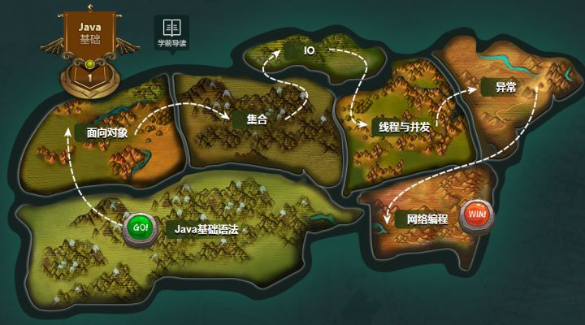

JavaSE基础是Java中级程序员的起点，是帮助你从小白到懂得编程的必经之路。

在Java基础板块中有6个子模块的学习：

- 基础语法，可帮助你建立基本的编程逻辑思维；
- 面向对象，以对象方式去编写优美的Java程序；
- 集合，后期开发中存储数据必备技术；
- IO，对磁盘文件进行读取和写入基础操作；
- 多线程与并发，提高程序效率；
- 异常，编写代码逻辑更加健全；
- 网络编程，应用服务器学习基础，完成数据的远程传输。
- 学习该阶段，可以完成一些简单的管理系统、坦克大战游戏、QQ通信等。

## **二、数据库**

数据库不仅仅是Java开发工程师的必学课程，也是其他语言都需要掌握的技能。用于对交互过程中客户的数据进行存储。

该板块包括关系型数据库和非关系型数据库。

例如：MySQL、oracle、redis、MongoDB等。数据库学习完毕后，可以将数据存储到数据库中，也可以通过SQL语句从数据库中查询数据，结合Java项目可以实现动态站点的数据的保存。

**技术树**

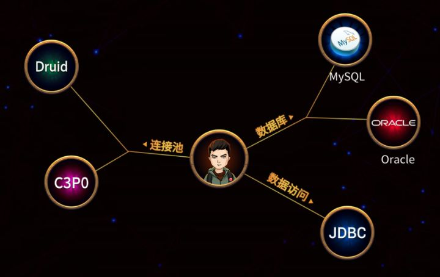

## **三、前端技术**

Javaweb阶段包括前端、数据库和动态网页。Javaweb是互联网项目的入门课程，是学习后面高进阶课程的基础。

首先，我们先看一下前端板块。该板块主要包括如下几个模块：

- HTML5，网页制作标记语言；
- CSS，对HTML制作网页进行美化；
- JavaScript，嵌入在页面中的脚本语言，具备逻辑性；
- Vue，前端框架，简化了与服务器端交互的操作，用户良好的交互体验是必不可少的。

学习前端技术后，可以完成类似京东、淘宝的前端工程的编写。

**技术树**

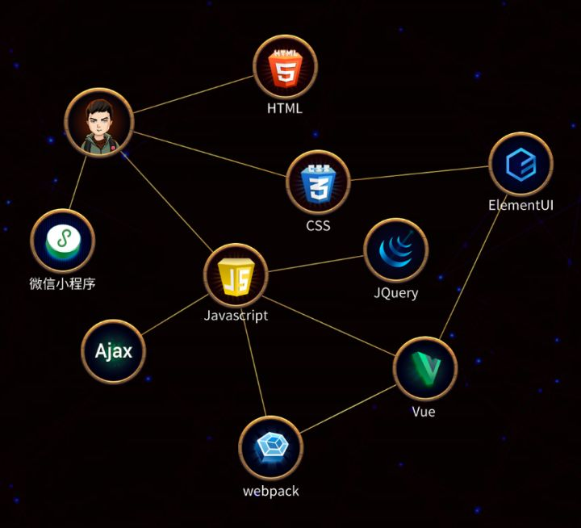

## **四、动态网页技术**

动态网页是中级程序员服务器端编程的基础，是高级框架学习的必备课程，后期学习的框架、服务底层都是基于动态网页技术之上的。

该板块包括Javaweb核心技术、包括Servlet、Request、Response、Cookie和Session等，通过这些技术的学习可以完成动态站点开发，可更好的完成服务器端与客户的交互，让页面的数据“动”起来，做出小型的应用系统。

**技术树**

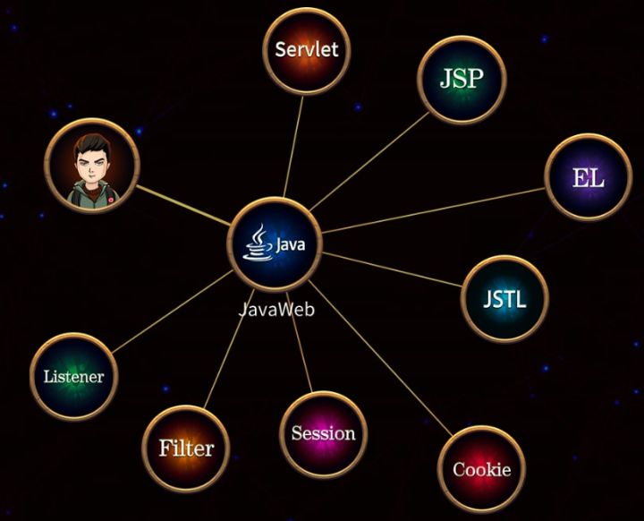

## **五、编程强化**

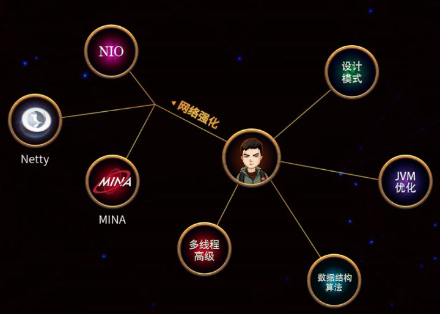

## **六、软件项目管理**

JavaSE基础是Java中级程序员的起点，是帮助你从小白到懂得编程的必经之路。

在Java基础板块中有6个子模块的学习：基础语法，可帮助你建立基本的编程逻辑思维；面向对象，以对象方式去编写优美的Java程序；集合，后期开发中存储数据必备技术；IO，对磁盘文件进行读取和写入基础操作；多线程与并发，提高程序效率；异常，编写代码逻辑更加健全；网络编程，应用服务器学习基础，完成数据的远程传输。

学习该阶段，可以完成一些简单的管理系统、坦克大战游戏、QQ通信等。

技术树

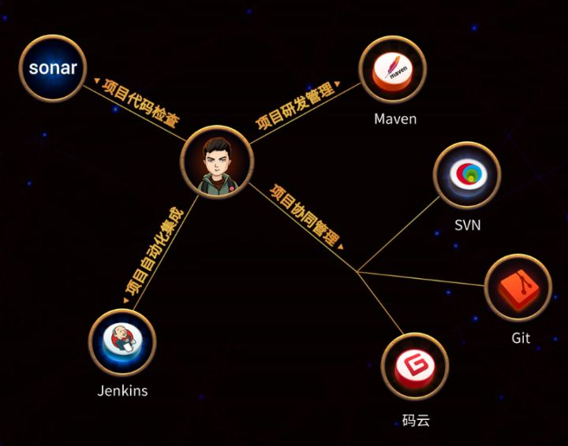

## **七、热门技术框架**

使用Javaweb进行企业级开发是完全可以的，但是开发效率比较低，所以对常用的逻辑操作进行封装就形成了框架，因此框架是企业开发的入门技能。

热门框架板块主流框架有如下几个：Spring框架，占据统治地位，其生态系统涉及各个方面解决方案；MyBatis框架，使用ORM思想对数据库进行操作。

该板块学习后，就可以进行真实企业级项目开发了，做出的项目也会更加符合企业要求。

**技术树**

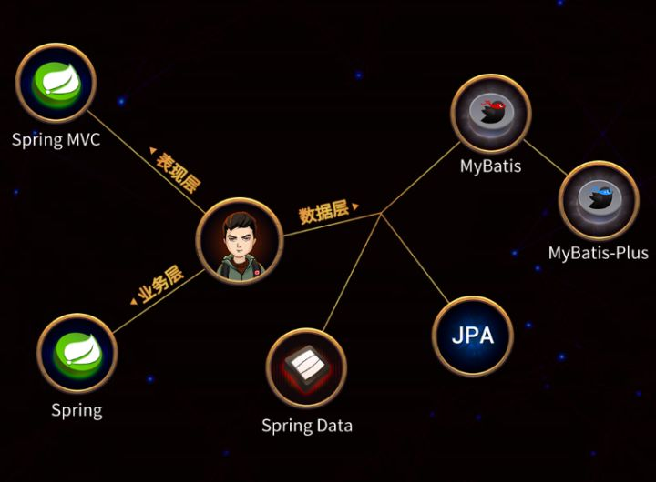

## **八、分布式架构方案**

随着互联网的发展，业务的复杂性和用户的体验性都需要提高，所以分布式架构出现了。该板块主要讲解的是分布式架构的相关解决方案。

主要包括如下模块：Dubbo，高性能的 RPC 服务发布和调用框架；SpringBoot，简化Spring应用的初始搭建以及开发过程；Spring Cloud，一系列框架的有序集合，如服务发现注册、配置中心、负载均衡、断路器、数据监控等。

该板块的学习，可以具备大型互联网项目开发的必备技术和实际经验，为进入BATJ打下基础

**技术树**

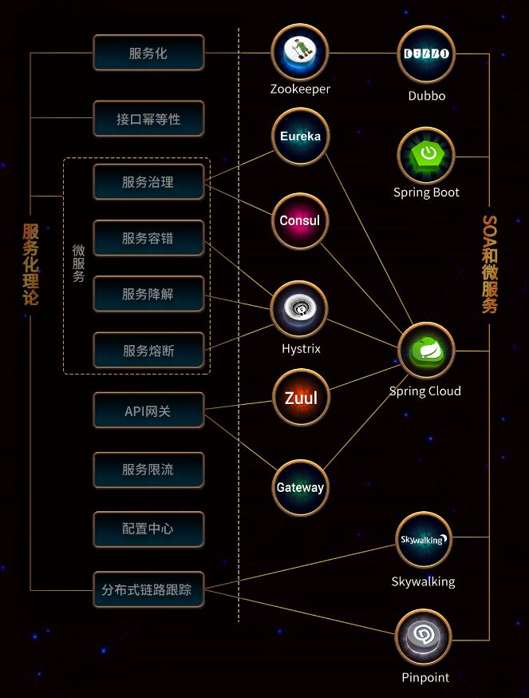

## **九、服务器中间件**

中间件板块是大型互联网项目中必备的。服务中间件可以帮助各子模块间实现互相访问，消息共享或统一访问等功能。其包括远程服务框架中间件，例如阿里（Apache）的RPC框架Dubbo等；消息队列中间件，例如：阿里巴巴开源分布式中间件RocketMQ、高吞吐量消息发布和流处理服务Kafka等。

学习服务中间件是中级JavaEE工程师必要技术，也是JavaEE架构师必须精通的技术。

**技术树**

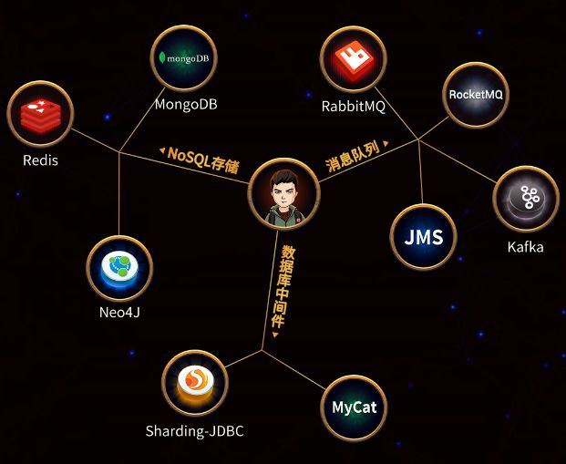

## **十、服务器技术**

不管是使用原生Javaweb进行开发，还是使用框架进行开发，项目最终需要对外发布才能供全世界的人访问到，而服务器板块就可以解决这个问题，所以服务器是项目发布的必要技术。该板块包括虚拟化和web应用服务器的学习，主要包括如下几个模块：Vmware，虚拟机软件；Linux，专门用于服务器的系统；Nginx，集群部署时反向代理服务器；Tomcat，项目发布时主要使用的服务器。

该板块学习后，我们就可以把开发好的项目发布到服务器中，然后供你的小伙伴远程访问了，超酷！

**技术树**

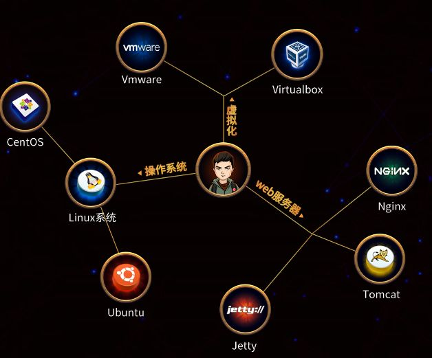

## **十一、容器技术**

容器化技术是近两年超级火的一个专题，通过容器化技术可以对环境进行打包，方便移植，大大提高了开发效率。该板块包括容器化技术Docker和其平台管理引擎Kubernetes，其中，Docker 是一个开源的应用容器引擎，可以打包应用以及依赖包到一个可移植的镜像中，然后发布到任何流行的Linux或Windows 机器上，也可以实现虚拟化。而Kubernetes是一个开源的，用于管理云平台中多个主机上的容器化的应用，Kubernetes的目标是让部署容器化的应用简单并且高效。通过该板块的学习，你可以通过上述技术快速搭建环境，节省开发时间，提高开发效率。

**技术树**

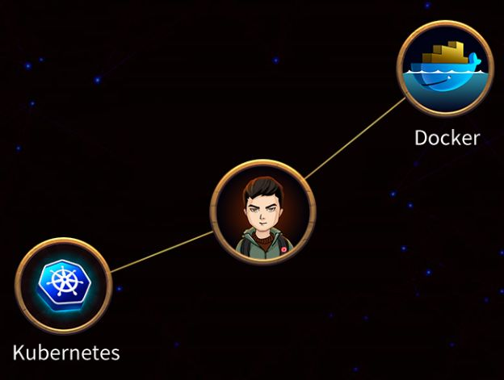

## **十二、业务解决方案**

虽然我们已经具备了基础技术和高阶技术，但是要想与企业开发相接轨，还需要对实际项目的业务解决方案进行探究。而此版块就是在实际业务场景中的真实解决方案集合，常用的业务解决方案有如下：搜索业务场景解决方案、日志收集与分析场景解决方案、工作流引擎场景解决方案、任务调度场景解决方案、地图开发平台场景解决方案、支付开放平台场景解决方案、图表可视化场景解决方案。通过分析实际业务来学习这个解决方案技术集，完全可以达到中级甚至高级工程师水平。

**技术树**

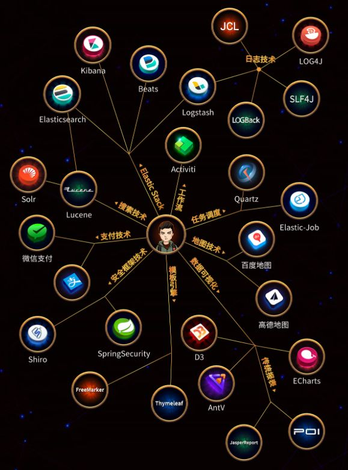