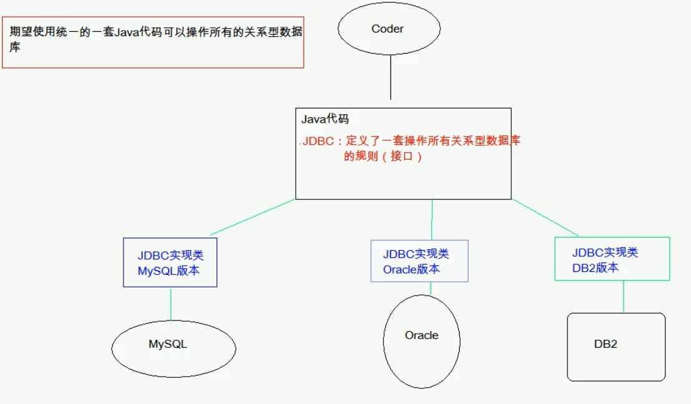

# JDBC

JDBC全称为：Java Data Base Connectivity,它是可以执行SQL语句的Java API，是Java和数据库之间的一个桥梁。



## JDBC 编程步骤

加载驱动程序：

```java
Class.forName(driverClass)
//加载MySql驱动
Class.forName("com.mysql.jdbc.Driver")
//加载Oracle驱动
Class.forName("oracle.jdbc.driver.OracleDriver")
```

获得数据库连接：

```java
DriverManager.getConnection("jdbc:mysql://127.0.0.1:3306/imooc", "root", "root");
```

创建Statement\PreparedStatement对象：

```java
conn.createStatement();
conn.prepareStatement(sql);
```

### 完整实例

```java
import java.sql.Connection;
import java.sql.DriverManager;
import java.sql.ResultSet;
import java.sql.Statement;

public class DbUtil {

    public static final String URL = "jdbc:mysql://localhost:3306/imooc";
    public static final String USER = "root";
    public static final String PASSWORD = "root";

    public static void main(String[] args) throws Exception {
        //1.加载mysql驱动
        Class.forName("com.mysql.jdbc.Driver");
        //2. 获去数据库连接对象
        Connection conn = DriverManager.getConnection(URL, USER, PASSWORD);
        //3.操作数据库，实现增删改查
        Statement stmt = conn.createStatement();
        ResultSet rs = stmt.executeQuery("SELECT user_name, age FROM imooc_goddess");
        //如果有数据，rs.next()返回true
        while(rs.next()){
            System.out.println(rs.getString("user_name")+" 年龄："+rs.getInt("age"));
        }
    }
}
```


### JDBC各个类的详解

#### Connection对象

客户端与数据库所有的交互都是通过Connection来完成的。

**常用方法**

- 创建执行sql语句的statement对象

```java
conn.createStatement();
```

- 事务操作

```java
//开始事务
conn.setAutoCommit(false)

//手动制造异常
int i = 3/0;

//提交事务
conn.commit()

//回滚事务
conn.rollback()
```

#### Statement对象

Statement对象用于向数据库发送Sql语句，对数据库的增删改查都可以通过此对象发送sql语句完成。 Statement对象的常用方法：

```java
//查询
executeQuery(String sql)

//增删改
executeUpdate(String sql)

//任意sql语句都可以，但是目标不明确，很少用
execute(String sql)

//把多条的sql语句放进同一个批处理中
addBatch(String sql)

//向数据库发送一批sql语句执行
executeBatch()
```

#### ResultSet对象

ResultSet对象代表Sql语句的执行结果，当Statement对象执行executeQuery()时，会返回一个ResultSet对象

ResultSet对象维护了一个数据行的游标【简单理解成指针】，调用ResultSet.next()方法，可以让游标指向具体的数据行，进行获取该行的数据

```java
ResultSet rs = stmt.executeQuery("SELECT user_name, age FROM imooc_goddess");

//如果有数据，rs.next()返回true
while(rs.next()){
    System.out.println(rs.getString("user_name")+" 年龄："+rs.getInt("age"));
}
```


### 增删改查

```java
public class DbUtil {
    public static final String URL = "jdbc:mysql://localhost:3306/imooc";
    public static final String USER = "liulx";
    public static final String PASSWORD = "123456";
    private static Connection conn = null;
    static{
        try {
            //1.加载驱动程序
            Class.forName("com.mysql.jdbc.Driver");
            //2. 获得数据库连接
            conn = DriverManager.getConnection(URL, USER, PASSWORD);
        } catch (ClassNotFoundException e) {
            e.printStackTrace();
        } catch (SQLException e) {
            e.printStackTrace();
        }
    }

    public static Connection getConnection(){
        return conn;
    }
}

//模型
package liulx.model;

import java.util.Date;

public class Goddess {

    private Integer id;
    private String user_name;
    private Integer sex;
    private Integer age;
    private Date birthday; //注意用的是java.util.Date
    private String email;
    private String mobile;
    private String create_user;
    private String update_user;
    private Date create_date;
    private Date update_date;
    private Integer isDel;
    //getter setter方法。。。
}

//---------dao层--------------
package liulx.dao;

import liulx.db.DbUtil;
import liulx.model.Goddess;

import java.sql.Connection;
import java.sql.ResultSet;
import java.sql.SQLException;
import java.sql.Statement;
import java.util.ArrayList;
import java.util.List;

public class GoddessDao {
    //增加
    public void addGoddess(Goddess g) throws SQLException {
        //获取连接
        Connection conn = DbUtil.getConnection();
        //sql
        String sql = "INSERT INTO imooc_goddess(user_name, sex, age, birthday, email, mobile,"+
            "create_user, create_date, update_user, update_date, isdel)"
                +"values("+"?,?,?,?,?,?,?,CURRENT_DATE(),?,CURRENT_DATE(),?)";
        //预编译
        PreparedStatement ptmt = conn.prepareStatement(sql); //预编译SQL，减少sql执行

        //传参
        ptmt.setString(1, g.getUser_name());
        ptmt.setInt(2, g.getSex());
        ptmt.setInt(3, g.getAge());
        ptmt.setDate(4, new Date(g.getBirthday().getTime()));
        ptmt.setString(5, g.getEmail());
        ptmt.setString(6, g.getMobile());
        ptmt.setString(7, g.getCreate_user());
        ptmt.setString(8, g.getUpdate_user());
        ptmt.setInt(9, g.getIsDel());

        //执行
        ptmt.execute();
    }

    public void updateGoddess(){
        //获取连接
        Connection conn = DbUtil.getConnection();
        //sql, 每行加空格
        String sql = "UPDATE imooc_goddess" +
                " set user_name=?, sex=?, age=?, birthday=?, email=?, mobile=?,"+
                " update_user=?, update_date=CURRENT_DATE(), isdel=? "+
                " where id=?";
        //预编译
        PreparedStatement ptmt = conn.prepareStatement(sql); //预编译SQL，减少sql执行

        //传参
        ptmt.setString(1, g.getUser_name());
        ptmt.setInt(2, g.getSex());
        ptmt.setInt(3, g.getAge());
        ptmt.setDate(4, new Date(g.getBirthday().getTime()));
        ptmt.setString(5, g.getEmail());
        ptmt.setString(6, g.getMobile());
        ptmt.setString(7, g.getUpdate_user());
        ptmt.setInt(8, g.getIsDel());
        ptmt.setInt(9, g.getId());

        //执行
        ptmt.execute();
    }

    public void delGoddess(){
        //获取连接
        Connection conn = DbUtil.getConnection();
        //sql, 每行加空格
        String sql = "delete from imooc_goddess where id=?";
        //预编译SQL，减少sql执行
        PreparedStatement ptmt = conn.prepareStatement(sql);

        //传参
        ptmt.setInt(1, id);

        //执行
        ptmt.execute();
    }

    public List<Goddess> query() throws SQLException {
        Connection conn = DbUtil.getConnection();
        Statement stmt = conn.createStatement();
        ResultSet rs = stmt.executeQuery("SELECT user_name, age FROM imooc_goddess");

        List<Goddess> gs = new ArrayList<Goddess>();
        Goddess g = null;
        while(rs.next()){
            g = new Goddess();
            g.setUser_name(rs.getString("user_name"));
            g.setAge(rs.getInt("age"));

            gs.add(g);
        }
        return gs;
    }

    public Goddess get(){
        Goddess g = null;
        //获取连接
        Connection conn = DbUtil.getConnection();
        //sql, 每行加空格
        String sql = "select * from  imooc_goddess where id=?";
        //预编译SQL，减少sql执行
        PreparedStatement ptmt = conn.prepareStatement(sql);
        //传参
        ptmt.setInt(1, id);
        //执行
        ResultSet rs = ptmt.executeQuery();
        while(rs.next()){
            g = new Goddess();
            g.setId(rs.getInt("id"));
            g.setUser_name(rs.getString("user_name"));
            g.setAge(rs.getInt("age"));
            g.setSex(rs.getInt("sex"));
            g.setBirthday(rs.getDate("birthday"));
            g.setEmail(rs.getString("email"));
            g.setMobile(rs.getString("mobile"));
            g.setCreate_date(rs.getDate("create_date"));
            g.setCreate_user(rs.getString("create_user"));
            g.setUpdate_date(rs.getDate("update_date"));
            g.setUpdate_user(rs.getString("update_user"));
            g.setIsDel(rs.getInt("isdel"));
        }
        return g;
    }
}
```

