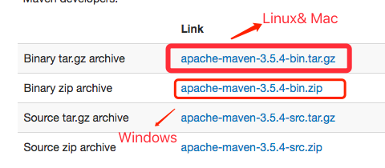

# Maven

构建一个项目包括：下载依赖，编译源代码，执行单元测试，以及打包编译后的源代码等一系列子任务。手工的执行这些任务是一项非常繁琐，且容易出错的事情。Maven封装了这些子任务，并提供给用户执行这些子任务的命令。简而言之，Maven是Java项目的一个管理和构建工具。

## 一、Maven的安装

### 1.1 准备工作

1. 确定电脑上已经成功安装jdk7.0以上版本

2. 下载maven安装包 下载地址：http://maven.apache.org/download.cgi

   

3. 检查JAVA_HOME环境变量

   ```shell
   C:\Users\3137>echo %JAVA_HOME%
   D:\Program Files\Java\jdk1.8.0_111
   ```

### 1.2 解压Maven安装包

解压Maven核心程序的压缩包，放在一个非中文、无空格 的路径下

```shell
D:\develop\apache-maven-3.6.0
```


### 1.3 配置Maven环境变量

#### 1.3.1配置变量名


#### 1.3.2 配置path


### 1.4 验证

运行 `mvn -v` 命令查看Maven查看是否安装成功

## 二、Maven配置

### 指定本地仓库

本机新建一个文件夹当做本地仓库，添加localRepository标签

```c
 <localRepository>D:\develop\apache-maven-3.6.3\repository</localRepository>
```


### 配置阿里云中央仓库

将MAVEN镜像路径为阿里镜像，以便下载速度快

```xml
<mirror>
    <id>aliyunmaven</id>
    <mirrorOf>*</mirrorOf>
    <name>阿里云公共仓库</name>
    <url>https://maven.aliyun.com/repository/public</url>
</mirror>
```


### idea配置maven


