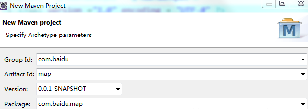

# Maven常用标签


## GroupId和ArtifactId

groupid和artifactId被统称为“坐标”是为了保证项目唯一性而提出的，如果你要把你项目弄到maven本地仓库去，你想要找到你的项目就必须根据这两个id去查找。

​	groupId一般分为多个段，这里我只说两段，第一段为域，第二段为公司名称。域又分为org、com、cn等等。举个apache公司的tomcat项目例子：这个项目的groupId是org.apache，它的域是org，公司名称是apache，artigactId是tomcat。


这里以百度公司为例



新建包的时候，包结构最好是**cn.baidu.map**打头的，如果有个RouteDao，它的全路径就是`cn.baidu.map.dao.RouteDao`

## dependencyManagement

Maven中的dependencyManagement元素提供了一种管理依赖版本号的方式。在dependencyManagement元素中声明所依赖的jar包的版本号等信息，那么所有子项目再次引入此依赖jar包时则无需显式的列出版本号。Maven会沿着父子层级向上寻找拥有dependencyManagement 元素的项目，然后使用它指定的版本号。

**example**

在父项目的POM.xml中配置：

```xml
<dependencyManagement>
        <dependencies>
            <dependency>
                <groupId>org.springframework.boot</groupId>
                <artifactId>spring-boot-starter-web</artifactId>
                <version>1.2.3.RELEASE</version>
            </dependency>
        </dependencies>
</dependencyManagement>
```

此配置即生命了spring-boot的版本信息。

子项目则无需指定版本信息：

```xml
<dependency>
    <groupId>org.springframework.boot</groupId>
    <artifactId>spring-boot-starter-web</artifactId>
</dependency>
```

参考资料

[dependencyManagement](<https://juejin.im/post/5da2aabaf265da5bb977cf78>)