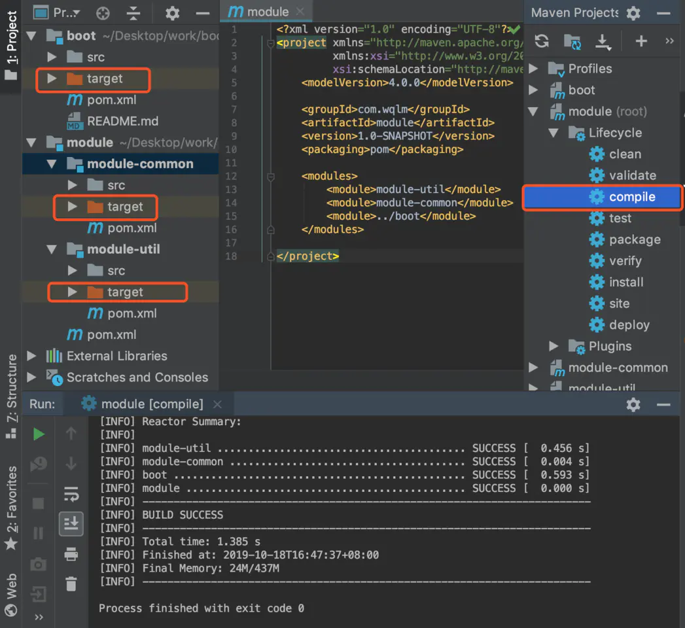
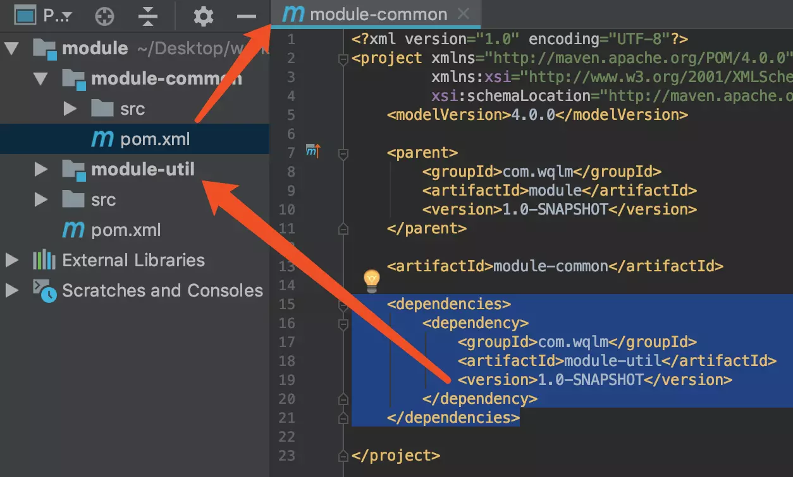
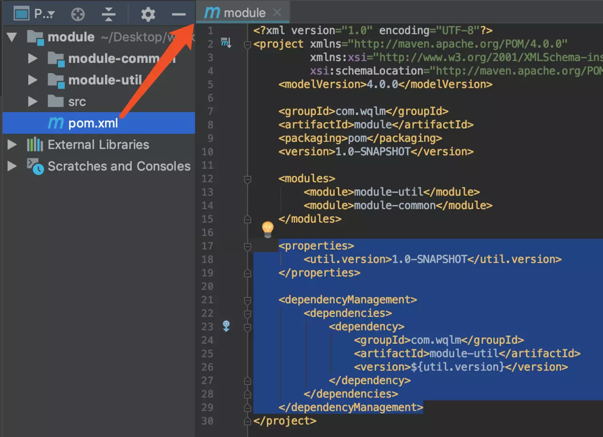
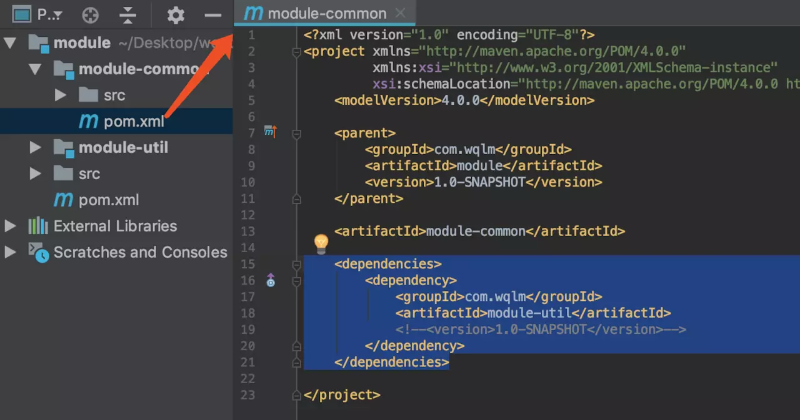
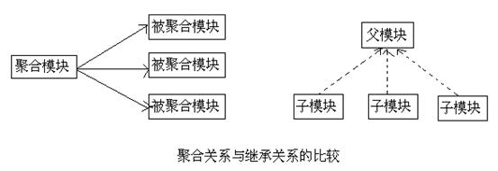

# Maven的聚合与继承

**Maven的聚合特性**可以帮助我们把项目的多个模块聚合在一起，使用一条命令进行构建，即一条命令实现构建多个项目；

**Maven的继承特性**可以将各个模块相同的依赖和插件配置提取出来，在简化POM的同时还可以促进各个模块配置的一致性。

## 一、聚合

为了能够使用一条命令就能构建 account-email和 account-persist两个模块，我们需要建立一个额外的名为 account-aggregator的模块，然后通过该模块构建整个项目的所有模块。 account-aggregator本身也是个 Maven项目，它的 POM如下

```xml
<project>  
    <modelVersion>4.0.0</modelVersion>  
    <groupId>com.juvenxu.mvnbook.account</groupId>  
    <artifactId>account-aggregator</artifactId>  
    <version>1.0.0-SNAPSHOT</version>  
    <packaging> pom </packaging>  
    <name>Account Aggregator</name>  
     <modules>  
        <module>account-email</module>  
        <module>account-persist</module>  
     </modules>  
</project>  
```

批量编译



## 二、继承

maven 的继承，能让我们从父pom中继承到一些配置。我们可以将一些通用的配置放在父pom中，来减少配置项，例如：groupId， version 等可以在父工程中声明，子工程不用再次声明。

**解决版本冲突问题**

子模块之间的依赖,需要在 `dependency` 中引入要依赖的子模块，如图



上图中子模块 **module-common:1.0-SNAPSHOT** 依赖了 **module-util:1.0-SNAPSHOT**。

子模块间的相互依赖，需要管理好依赖项的版本号，负责容易依赖版本冲突。

简单来说就是把公共依赖及版本号在父 pom 中申明，子项目引入依赖时只需要指定 groupId、artifactId 不需要指定版本号

如下，先在父 pom 中申明依赖及版本号



 再在子项目中引入依赖项，注意，不需要指定版本号，默认查找父pom中定义的版本号



## 三、聚合与继承的关系

**区别** ：

**1**.对于聚合模块来说，它知道有哪些被聚合的模块，但那些被聚合的模块不知道这个聚合模块的存在。

2.对于继承关系的父 POM来说，它不知道有哪些子模块继承与它，但那些子模块都必须知道自己的父 POM是什么。

**共同点** ：

1.聚合 POM与继承关系中的父POM的 packaging都是pom

2.聚合模块与继承关系中的父模块除了 POM之外都没有实际的内容。



注：在现有的实际项目中一个POM既是聚合POM，又是父POM，这么做主要是为了方便

## 四、Maven可继承的POM元素

```json
groupId ：项目组 ID ，项目坐标的核心元素；  
version ：项目版本，项目坐标的核心元素；  
description ：项目的描述信息；  
organization ：项目的组织信息；  
inceptionYear ：项目的创始年份；  
url ：项目的 url 地址  
develoers ：项目的开发者信息；  
contributors ：项目的贡献者信息；  
distributionManagerment ：项目的部署信息；  
issueManagement ：缺陷跟踪系统信息；  
ciManagement ：项目的持续继承信息；  
scm ：项目的版本控制信息；  
mailingListserv ：项目的邮件列表信息；  
properties ：自定义的 Maven 属性；  
dependencies ：项目的依赖配置；  
dependencyManagement ：醒目的依赖管理配置；  
repositories ：项目的仓库配置；  
build ：包括项目的源码目录配置、输出目录配置、插件配置、插件管理配置等；  
reporting ：包括项目的报告输出目录配置、报告插件配置等。  
```

