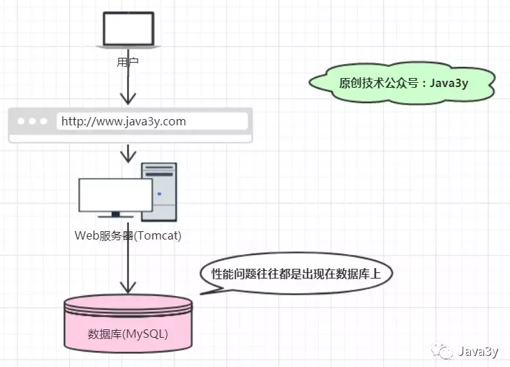

## 学习内容  
- redis概念

- 下载安装

- 命令操作

- 持久化操作

- Java客户端操作redis

  

## redis概念  
Redis是用C语言开发的一个开源的高性能键值对（key-value）数据库，官方提供测试数据，50个并发执行100000个请求,读的速度是110000次/s,写的速度是81000次/s ，且Redis通过提供多种键值数据类型来适应不同场景下的存储需求，


### 1.1 为什么要用Redis？
从上面可知：Redis是基于内存，常用作于缓存的一种技术，并且Redis存储的方式是以key-value的形式。
我们可以发现这不就是Java的Map容器所拥有的特性吗，那为什么还需要Redis呢？
- Java实现的Map是本地缓存，如果有多台实例(机器)的话，每个实例都需要各自保存一份缓存，缓存不具有一致性

- Redis实现的是分布式缓存，如果有多台实例(机器)的话，每个实例都共享一份缓存，缓存具有一致性。

- Java实现的Map不是专业做缓存的，JVM内存太大容易挂掉的。一般用做于容器来存储临时数据，缓存的数据随着JVM销毁而结束。Map所存储的数据结构，缓存过期机制等等是需要程序员自己手写的。

- Redis是专业做缓存的，可以用几十个G内存来做缓存。Redis一般用作于缓存，可以将缓存数据保存在硬盘中，Redis重启了后可以将其恢复。原生提供丰富的数据结构、缓存过期机制等等简单好用的功能。

  

### 1.2 为什么要用缓存？

如果我们的网站出现了性能问题(访问时间慢)，按经验来说，一般是由于数据库撑不住了。因为一般数据库的读写都是要经过磁盘的，而磁盘的速度可以说是相当慢的(相对内存来说)





如果学过Mybaits、Hibernate的同学就可以知道，它们有一级缓存、二级缓存这样的功能(终究来说还是本地缓存)。目的就是为了：**不用每次读取的时候，都要查一次数据库**。

有了缓存之后，我们的访问就变成这样了：


### 1.3 Redis的数据结构

redis存储的是：key,value格式的数据，其中key都是字符串     
value的数据结构：
- 字符串类型 string
- 哈希类型 hash
- 列表类型 list
- 集合类型 set
- 有序集合类型 sortedset  


### 1.4  redis的应用场景  
- 缓存（数据查询、短连接、新闻内容、商品内容等等）
- 聊天室的在线好友列表
- 任务队列。（秒杀、抢购、12306等等）
- 应用排行榜
- 网站访问统计
- 数据过期处理（可以精确到毫秒）
- 分布式集群架构中的session分离  

## 下载安装
- 官网：https://redis.io
- 中文网：http://www.redis.net.cn/
- 解压直接可以使用：
  - redis.windows.conf：配置文件
  - redis-cli.exe：redis的客户端
  - redis-server.exe：redis服务器端

## 持久化
redis是一个内存数据库，当redis服务器重启，获取电脑重启，数据会丢失，我们可以将redis内存中的数据持久化保存到硬盘的文件中。

### 3.1 redis持久化机制：
编辑redis.windwos.conf文件 
1.RDB：默认方式，不需要进行配置，默认就使用这种机制,在一定的间隔时间中，检测key的变化情况，然后持久化数据
```c
#   after 900 sec (15 min) if at least 1 key changed
save 900 1
#   after 300 sec (5 min) if at least 10 keys changed
save 300 10
#   after 60 sec if at least 10000 keys changed
save 60 10000
```
2.AOF：日志记录的方式，可以记录每一条命令的操作。可以每一次命令操作后，持久化数据
```c
appendonly no（关闭aof） --> appendonly yes （开启aof）
# appendfsync always ： 每一次操作都进行持久化
appendfsync everysec ： 每隔一秒进行一次持久化
# appendfsync no	 ： 不进行持久化
```
## Java客户端操作redis  

### 4.1 jedis
Jedis: 一款java操作redis数据库的工具
使用步骤：
1. 下载jedis的jar包
2. 使用
```java
//1. 获取连接
Jedis jedis = new Jedis("localhost",6379);
//2. 操作
jedis.set("username","zhangsan");
//3. 关闭连接
jedis.close();
```

### 4.2 Jedis操作各种redis中的数据结构


**字符串类型 string**

- set
- get

```java
//获取连接
Jedis jedis = new Jedis();//如果使用空参构造，默认值 "localhost",6379端口

//存储
jedis.set("username","zhangsan");

//获取
String username = jedis.get("username");
System.out.println(username);
		
//可以使用setex()方法存储可以指定过期时间的 key value
//将activecode：hehe键值对存入redis，并且20秒后自动删除该键值对
jedis.setex("activecode",20,"hehe");

//3. 关闭连接
jedis.close();
```


**哈希类型 hash ： map格式** 
- hset
- hget
- hgetAll

```java
//获取连接
Jedis jedis = new Jedis();//如果使用空参构造，默认值 "localhost",6379端口

//  操作
jedis.hset("user","name","lisi");
jedis.hset("user","age","23");
jedis.hset("user","gender","female");
    
// 获取hash
String name = jedis.hget("user", "name");
System.out.println(name);
    
    
// 获取hash的所有map中的数据
Map<String, String> user = jedis.hgetAll("user");
    
// keyset
Set<String> keySet = user.keySet();
for (String key : keySet) {
  //获取value
  String value = user.get(key);
  System.out.println(key + ":" + value);
}
    
//3. 关闭连接
jedis.close();
```

  

**列表类型 list ： linkedlist格式。支持重复元素**

- lpush / rpush
- lpop / rpop
- lrange start end : 范围获取

```java
//获取连接
Jedis jedis = new Jedis();//如果使用空参构造，默认值 "localhost",6379端口

// list 存储
jedis.lpush("mylist","a","b","c");//从左边存
jedis.rpush("mylist","a","b","c");//从右边存

// list 范围获取
List<String> mylist = jedis.lrange("mylist", 0, -1);
System.out.println(mylist);

// list 弹出
String element1 = jedis.lpop("mylist");//c
System.out.println(element1);

String element2 = jedis.rpop("mylist");//c
System.out.println(element2);

// list 范围获取
List<String> mylist2 = jedis.lrange("mylist", 0, -1);
System.out.println(mylist2);

//3. 关闭连接
jedis.close();
```


**集合类型 set  ： 不允许重复元素**

- sadd
- smembers:获取所有元素

```java
//获取连接
Jedis jedis = new Jedis();//如果使用空参构造，默认值 "localhost",6379端口

// set 存储
jedis.sadd("myset","java","php","c++");

// set 获取
Set<String> myset = jedis.smembers("myset");
System.out.println(myset);

//3. 关闭连接
jedis.close();
```


**有序集合类型 sortedset：不允许重复元素，且元素有顺序**

- zadd
- zrange

```java
//获取连接
Jedis jedis = new Jedis();//如果使用空参构造，默认值 "localhost",6379端口

// sortedset 存储
jedis.zadd("mysortedset",3,"亚瑟");
jedis.zadd("mysortedset",30,"后裔");
jedis.zadd("mysortedset",55,"孙悟空");

// sortedset 获取
Set<String> mysortedset = jedis.zrange("mysortedset", 0, -1);

System.out.println(mysortedset);

//3. 关闭连接
jedis.close();
```


###  4.3 jedis连接池： JedisPool  

初始化一个连接通常都是耗费资源的一种操作，为了节省资源，我们使用JedisPool。


**使用步骤**

1. 创建JedisPool连接池对象
2. 调用方法 getResource()方法获取Jedis连接

```java

//0.创建一个配置对象
JedisPoolConfig config = new JedisPoolConfig();
config.setMaxTotal(50);
config.setMaxIdle(10);

//1.创建Jedis连接池对象
JedisPool jedisPool = new JedisPool(config,"localhost",6379);

//2.获取连接
Jedis jedis = jedisPool.getResource();

//3. 使用
jedis.set("hehe","heihei");


//4. 关闭 归还到连接池中
jedis.close();
```


**连接池工具类**

```java
public class JedisPoolUtils {

    private static JedisPool jedisPool;

    static{
        //读取配置文件
        InputStream is = JedisPoolUtils.class.getClassLoader().getResourceAsStream("jedis.properties");
        //创建Properties对象
        Properties pro = new Properties();
        //关联文件
        try {
            pro.load(is);
        } catch (IOException e) {
            e.printStackTrace();
        }
        //获取数据，设置到JedisPoolConfig中
        JedisPoolConfig config = new JedisPoolConfig();
        config.setMaxTotal(Integer.parseInt(pro.getProperty("maxTotal")));
        config.setMaxIdle(Integer.parseInt(pro.getProperty("maxIdle")));

        //初始化JedisPool
        jedisPool = new JedisPool(config,pro.getProperty("host"),Integer.parseInt(pro.getProperty("port")));

    }

    //获取连接方法
    public static Jedis getJedis(){
        return jedisPool.getResource();
    }
}
```


## 案例

**案例需求：**
1. 提供index.html页面，页面中有一个省份 下拉列表   
2. 当 页面加载完成后 发送ajax请求，加载所有省份