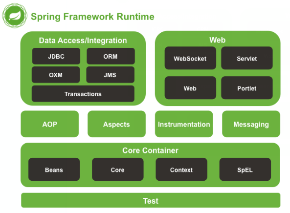
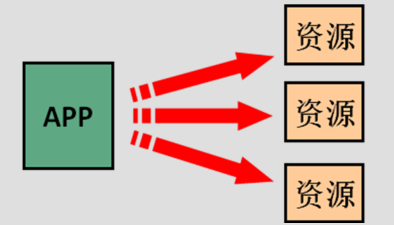
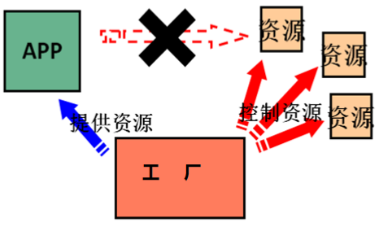
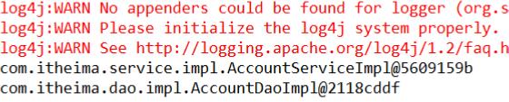

# Spring

## 第一章Spring概述

### 1.1 spring是什么

Spring是分层的 Java SE/EE应用 `full-stack` 轻量级开源框架，以 **IoC**（Inverse Of Control：
反转控制）和 **AOP**（Aspect Oriented Programming：面向切面编程）为内核，提供了展现层 Spring
MVC 和持久层 Spring JDBC 以及业务层事务管理等众多的企业级应用技术，还能整合开源世界众多
著名的第三方框架和类库，逐渐成为使用最多的Java EE 企业应用开源框架。

### 1.2 spring的优势

- **方便解耦，简化开发**

  通过 Spring提供的 IoC容器，可以将对象间的依赖关系交由 Spring进行控制，避免硬编码所造
  成的过度程序耦合。用户也不必再为单例模式类、属性文件解析等这些很底层的需求编写代码，可
  以更专注于上层的应用。

- **AOP编程的支持**

  通过 Spring的 AOP 功能，方便进行面向切面的编程，许多不容易用传统OOP 实现的功能可以通过 AOP 轻松应付。

- **声明式事务的支持**

  可以将我们从单调烦闷的事务管理代码中解脱出来，通过声明式方式灵活的进行事务的管理，
  提高开发效率和质量。

- **方便集成各种优秀框架**                 

### 1.3 spring 的 体系结构



## 第二章 IOC的概念和作用

### 2.1 什么是程序的耦合

​	是对模块间关联程度的度量。耦合的强弱取决于模块间接口的复杂性、调用模块的方式以及通过界面传送数据的多少。模块间的耦合度是指模块之间的依赖关系，包括控制关系、调用关系、数据传递关系。模块间联系越多，其耦合性越强，同时表明其独立性越差( 降低耦合性，可以提高其独立性)。耦合性存在于各个领域，而非软件设计中独有的，但是我们只讨论软件工程中的耦合。

​	在软件工程中，耦合指的就是就是对象之间的**依赖性**。对象之间的耦合越高，维护成本越高。因此对象的设计应使类和构件之间的耦合最小。软件设计中通常用**耦合度**和**内聚度**作为衡量模块独立程度的标准。 划分模块的一个准则就是**高内聚低耦合**。

 **它有如下分类**：

1. 内容耦合。当一个模块直接修改或操作另一个模块的数据时，或一个模块不通过正常入口而转入另一个模块时，这样的耦合被称为内容耦合。内容耦合是最高程度的耦合，应该避免使用之。
2. 公共耦合。两个或两个以上的模块共同引用一个全局数据项，这种耦合被称为公共耦合。在具有大量公共耦合的结构中，确定究竟是哪个模块给全局变量赋了一个特定的值是十分困难的。
3.  外部耦合 。一组模块都访问同一全局简单变量而不是同一全局数据结构，而且不是通过参数表传递该全局变量的信息，则称之为外部耦合。
4. 控制耦合 。一个模块通过接口向另一个模块传递一个控制信号，接受信号的模块根据信号值而进行适当的动作，这种耦合被称为控制耦合。
5. 标记耦合 。若一个模块 A 通过接口向两个模块 B 和 C 传递一个公共参数，那么称模块 B 和 C 之间存在一个标记耦合。
6. 数据耦合。模块之间通过参数来传递数据，那么被称为数据耦合。数据耦合是最低的一种耦合形式，系统中一般都存在这种类型的耦合，因为为了完成一些有意义的功能，往往需要将某些模块的输出数据作为另一些模块的输入数据。
7. 非直接耦合 。两个模块之间没有直接关系，它们之间的联系完全是通过主模块的控制和调用来实
   现的。

**总结：**

​	耦合是影响软件复杂程度和设计质量的一个重要因素，在设计上我们应采用以下原则：如果模块间必须
存在耦合，就尽量使用**数据耦合**，少用控制耦合，限制公共耦合的范围，尽量避免使用内容耦合。

**内聚与耦合**

​	内聚标志一个模块内各个元素彼此结合的紧密程度，它是信息隐蔽和局部化概念的自然扩展。内聚是从功能角度来度量模块内的联系，一个好的内聚模块应当恰好做一件事。它描述的是模块内的功能联系。耦合是软件结构中各模块之间相互连接的一种度量，耦合强弱取决于模块间接口的复杂程度、进入或访问一个模块的点以及通过接口的数据。 程序讲究的是**低耦合，高内聚**。就是同一个模块内的各个元素之间要高度紧密，但是各个模块之间的相互依存度却要不那么紧密。

​	内聚和耦合是密切相关的，同其他模块存在高耦合的模块意味着低内聚，而高内聚的模块意味着该模块同其他模块之间是低耦合。在进行软件设计时，应力争做到高内聚，低耦合。

### 2.1 程序的解耦

- `耦合`: 程序间的依赖关系.在开发中,应该做到解决`编译期依赖`,即`编译期不依赖,运行时才依赖`.
- 解耦的思路: 使用**反射来创建对象**,而避免使用**new关键字**,并通过读取配置文件来获取要创建的对象**全限定类名**.

##### 解耦实例1: JDBC驱动注册

JDBC操作中注册驱动时,我们不使用`DriverManager`的`register`方法,而采用`Class.forName("驱动类全类名")`的方式,因为`com.mysql.jdbc.Driver`是字符串，即使驱动类不存在,在编译时也不会报错,解决了`编译器依赖`.

```java
public class JdbcDemo1 {
    public static void main(String[] args) throws  Exception{
        //1.注册驱动
        //DriverManager.registerDriver(new com.mysql.jdbc.Driver());
        Class.forName("com.mysql.jdbc.Driver");//此处只是一个字符串

        //2.获取连接
        Connection conn = DriverManager.getConnection("jdbc:mysql://localhost:3306/eesy","root","1234");
        //3.获取操作数据库的预处理对象
        PreparedStatement pstm = conn.prepareStatement("select * from account");
        //4.执行SQL，得到结果集
        ResultSet rs = pstm.executeQuery();
        //5.遍历结果集
        while(rs.next()){
            System.out.println(rs.getString("name"));
        }
        //6.释放资源
        rs.close();
        pstm.close();
        conn.close();
    }
}
```

查看`com.mysql.jdbc.Driver`类的源码如下,在类加载和初始化时,会执行static代码块中的部分,也就是说加载类的时候就自动注册驱动了.

```java
public class Driver extends NonRegisteringDriver implements java.sql.Driver {

	static {
	    try {
	        java.sql.DriverManager.registerDriver(new Driver());	// 类初始化时执行注册动作
	    } catch (SQLException E) {
	        throw new RuntimeException("Can't register driver!");
	    }
	}

    public Driver() throws SQLException {
    // Required for Class.forName().newInstance()
    }
}
```


##### 解耦实例2: UI层,Service层,Dao层的调用

在Web项目中,`UI层`,`Service层`,`Dao层`之间有着前后调用的关系.

```
public class MyServiceImpl implements IMyService {

    private IMyDao myDao = new MyDaoImpl();	// 业务层要调用持久层的接口和实现类

    public void myService(){
        myDao.serviceProcess();
    }
}
```

`业务层`依赖`持久层`的接口和实现类,若编译时不存在没有持久层实现类,则编译将不能通过,这构成了`编译期依赖`

### 2.3 解决耦合的思路: 工厂模式解耦

在实际开发中可以把三层的对象的全类名都使用配置文件保存起来,当启动服务器应用加载的时候,创建这些对象的实例并保存在`容器`中. 在获取对象时,不使用new的方式,而是直接从`容器`中获取,这就是`工厂设计模式`.

### 2.4 控制反转-Inversion Of Control

我们在获取对象时，都是采用 new 的方式。是主动的。



现在：我们获取对象时，同时跟工厂要，有工厂为我们查找或者创建对象。是被动的。



这种被动接收的方式获取对象的思想就是控制反转，它是 spring 框架的核心之一。


明确 ioc的作用：削减类之间的耦合(解除我们代码中的依赖关系)。

## 第三章 使用Spring的IOC解决程序耦合

### 基于XML的IOC配置

#### 实现步骤

##### 1. 创建一个maven工程

 创建MAVEN项目,配置其`pom.xml`如下:

```xml
<?xml version="1.0" encoding="UTF-8"?>
<project xmlns="http://maven.apache.org/POM/4.0.0"
         xmlns:xsi="http://www.w3.org/2001/XMLSchema-instance"
         xsi:schemaLocation="http://maven.apache.org/POM/4.0.0 http://maven.apache.org/xsd/maven-4.0.0.xsd">
    <modelVersion>4.0.0</modelVersion>

    <groupId>cn.maoritian</groupId>
    <artifactId>learnspring</artifactId>
    <version>1.0-SNAPSHOT</version>

    <dependencies>
    	<!-- 引入-->
        <dependency>
            <groupId>org.springframework</groupId>
            <artifactId>spring-context</artifactId>
            <version>5.0.2.RELEASE</version>
        </dependency>
    </dependencies>

</project>
```

##### 2.配置baen.xml

在类的根路径下的`resource`目录下创建`bean.xml`文件,把对象的创建交给spring来管理.

每个`<bean>`标签对应一个类,其`class`属性为该类的全类名,`id`属性为该类的id,在spring配置中,通过`id`获取类的对象.

```xml
 <?xml version="1.0" encoding="UTF-8"?>
 <beans xmlns="http://www.springframework.org/schema/beans"
        xmlns:xsi="http://www.w3.org/2001/XMLSchema-instance"
        xsi:schemaLocation="http://www.springframework.org/schema/beans
         http://www.springframework.org/schema/beans/spring-beans.xsd">
 
     <!--把对象的创建交给spring来管理-->
    <bean id="accountService" class="com.itheima.service.impl.AccountServiceImpl"></bean>
 </beans>
```

在表现层文件`Client.java`中通过`容器`创建对象.通过核心容器的`getBean()`方法获取具体对象.

```java
public class Client {
     public static void main(String[] args) {
         // 获取核心容器对象
         ApplicationContext ac = new ClassPathXmlApplicationContext("bean.xml");
         // 根据id获取Bean对象,accountService是bean.xml中的id
         IAccountService as  = (IAccountService)ac.getBean("accountService");
         
         // 执行as的具体方法
         system.out.println(as);
     }
 }

```

执行程序，as对象被打印，此时不用new来创建对象了。



#### bean标签

作用: 配置托管给spring的对象,默认情况下调用类的无参构造函数,若果没有无参构造函数则不能创建成功

属性:

1. `id`: 指定对象在容器中的标识,将其作为参数传入`getBean()`方法可以获取获取对应对象.
2. `class`: 指定类的全类名,默认情况下调用无参构造函数
3. `scope`: 指定对象的作用范围,可选值如下
   1. `singleton`: 单例对象,默认值
   2. `rototype`: 多例对象
4. `init-method`：指定类中的初始化方法名称,在对象创建成功之后执行
5. `destroy-method`：指定类中销毁方法名称,对`prototype`多例对象没有作用,因为多利对象的销毁时机不受`容器`控制


### 基于注解的IOC配置

#### 用于创建对象的注解

这些注解的作用相当于`bean.xml`中的`<bean>`标签

1. `@Component`: 把当前类对象存入spring容器中,其属性如下
   1. `value`: 用于指定当前类的`id`. 不写时默认值是当前类名,且首字母改小写
2. `Controller`: 将当前表现层对象存入spring容器中
3. `@Service`: 将当前业务层对象存入spring容器中
4. `@Repository`: 将当前持久层对象存入spring容器中

`@Controller`,`@Service`,`@Repository`注解的作用和属性与`@Component`是一模一样的,可以相互替代,它们的作用是使三层对象的分别更加清晰.

#### 新增注解

1. `configuration`指定当前类是一个配置类,可理解为用spring的时候xml里面的`<beans>`标签
2. `bean`标记在方法之上,**方法的返回值**作为bean对象存入spring的ioc容器中，方法的名称相当于id属性.
3. `ComponentScan`做的事情就是告诉Spring从哪里找到bean

#### 用于注入数据的注解

这些注解的作用相当于`bean.xml`中的`<property>`标签.

1. `@Autowired`: 自动按照成员变量类型注入

2. `@Value`: 注入基本数据类型和String类型数据

   属性：用于指定数据的值,可以使用el表达式(`${表达式}`)

3. `@Qualifier`: 在自动按照类型注入的基础之上,再按照bean的`id`注入

4. `@Resource`: 直接按照bean的`id`注入,它可以独立使用.独立使用时相当于同时使用`@Autowired`和`@Qualifier`两个注解

#### 用于改变作用范围的注解

这些注解的作用相当于`bean.xml`中的`<bean>`标签的`scope`属性.

`@Scope`: 指定bean的作用范围

​	`value`: 用于指定作用范围的取值,"singleton","prototype","request","session","globalsession"

#### 和生命周期相关的注解

这些注解的作用相当于`bean.xml`中的`<bean>`标签的`init-method`和`destroy-method`属性

`@PostConstruct`: 用于指定初始化方法

`@PreDestroy`: 用于指定销毁方法


