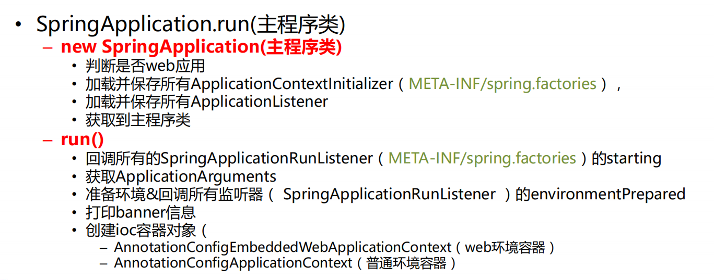
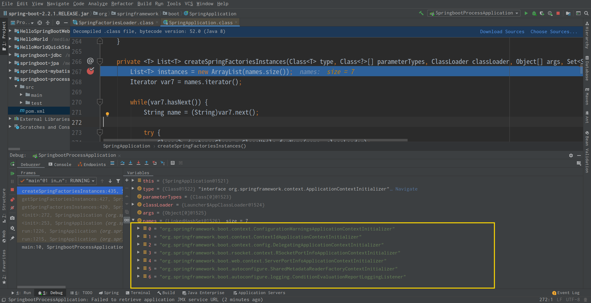
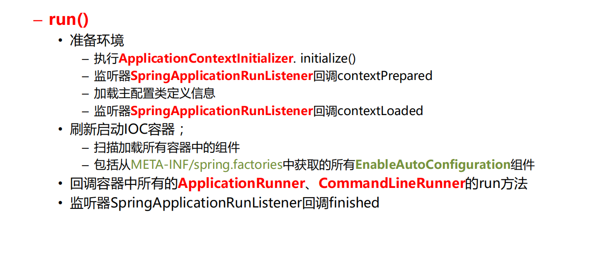
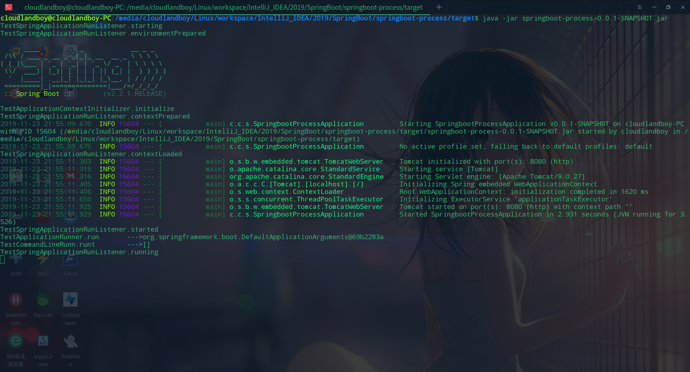
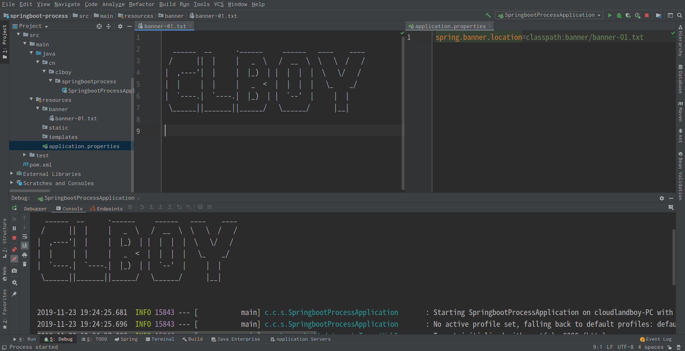

# SpringBoot启动流程



## 启动原理

```java
    public static void main(String[] args) {
        //xxx.class：主配置类，（可以传多个）
        SpringApplication.run(xxx.class, args);
    }
```

1. 从run方法开始，创建SpringApplication，然后再调用run方法

       /**
        * ConfigurableApplicationContext(可配置的应用程序上下文)
        */
       public static ConfigurableApplicationContext run(Class<?> primarySource, String... args) {
           //调用下面的run方法
           return run(new Class[]{primarySource}, args);
       }
       
       public static ConfigurableApplicationContext run(Class<?>[] primarySources, String[] args) {
           return (new SpringApplication(primarySources)).run(args);
       }

2. 创建SpringApplication

   ```java
   //primarySources：主配置类
   new SpringApplication(primarySources)
   ```

   ```java
       public SpringApplication(Class<?>... primarySources) {
           //调用下面构造方法
           this((ResourceLoader) null, primarySources);
       }
   
       public SpringApplication(ResourceLoader resourceLoader, Class<?>... primarySources) {
           this.sources = new LinkedHashSet();
           this.bannerMode = Mode.CONSOLE;
           this.logStartupInfo = true;
           this.addCommandLineProperties = true;
           this.addConversionService = true;
           this.headless = true;
           this.registerShutdownHook = true;
           this.additionalProfiles = new HashSet();
           this.isCustomEnvironment = false;
           this.lazyInitialization = false;
           this.resourceLoader = resourceLoader;
           Assert.notNull(primarySources, "PrimarySources must not be null");
           //保存主配置类
           this.primarySources = new LinkedHashSet(Arrays.asList(primarySources));
           //获取当前应用的类型，是不是web应用，见2.1
           this.webApplicationType = WebApplicationType.deduceFromClasspath();
           //从类路径下找到META‐INF/spring.factories配置的所有ApplicationContextInitializer；然后保存起来，见2.2
           this.setInitializers(this.getSpringFactoriesInstances(ApplicationContextInitializer.class));
           //从类路径下找到META‐INF/spring.ApplicationListener；然后保存起来,原理同上
           this.setListeners(this.getSpringFactoriesInstances(ApplicationListener.class));
           //从多个配置类中找到有main方法的主配置类，见下图(在调run方法的时候是可以传递多个配置类的)
           this.mainApplicationClass = this.deduceMainApplicationClass();
           //执行完毕，SpringApplication对象就创建出来了，返回到1处，调用SpringApplication对象的run方法，到3
       }
   ```

   

   <details>

   <summary>2.1 判断是不是web 应用</summary>

   ```java
       static WebApplicationType deduceFromClasspath() {
           if (ClassUtils.isPresent("org.springframework.web.reactive.DispatcherHandler", (ClassLoader)null) && !ClassUtils.isPresent("org.springframework.web.servlet.DispatcherServlet", (ClassLoader)null) && !ClassUtils.isPresent("org.glassfish.jersey.servlet.ServletContainer", (ClassLoader)null)) {
               return REACTIVE;
           } else {
               String[] var0 = SERVLET_INDICATOR_CLASSES;
               int var1 = var0.length;
   
               for(int var2 = 0; var2 < var1; ++var2) {
                   String className = var0[var2];
                   if (!ClassUtils.isPresent(className, (ClassLoader)null)) {
                       return NONE;
                   }
               }
   
               return SERVLET;
           }
       }
   ```

   </details>

   <details>

   <summary>2.2 getSpringFactoriesInstances(ApplicationContextInitializer.class)</summary>

   ```java
       private <T> Collection<T> getSpringFactoriesInstances(Class<T> type) {
           //调用下面重载方法，type：ApplicationContextInitializer.class
           return this.getSpringFactoriesInstances(type, new Class[0]);
       }
   
       private <T> Collection<T> getSpringFactoriesInstances(Class<T> type, Class<?>[] parameterTypes, Object... args) {
           ClassLoader classLoader = this.getClassLoader();
           //获取key为ApplicationContextInitializer全类名的所有值，见下2.2.1
           Set<String> names = new LinkedHashSet(SpringFactoriesLoader.loadFactoryNames(type, classLoader));
           //根据拿到的类名集合，使用反射创建对象放到集合中返回 见 2.2.2
           List<T> instances = this.createSpringFactoriesInstances(type, parameterTypes, classLoader, args, names);
           AnnotationAwareOrderComparator.sort(instances);
           return instances; //返回到2 set
       }
   ```

   <details>

   <summary>2.2.1</summary>

   

      上图65行中调用重载的方法：

      ```java
      //把类路径下所有META‐INF/spring.factories中的配置都存储起来，并返回，见下图
      (List)loadSpringFactories(classLoader)
      ```

      然后再调用`getOrDefault(factoryTypeName, Collections.emptyList())`方法，获取key为

      `ApplicationContextInitializer`类名的value集合

   

      好了，回到2.2

   </details>

   <details>

   <summary>2.2.2</summary>

   ```java
   private <T> List<T> createSpringFactoriesInstances(Class<T> type, Class<?>[] parameterTypes, ClassLoader classLoader, Object[] args, Set<String> names) {
       List<T> instances = new ArrayList(names.size());
       Iterator var7 = names.iterator();
   
       while(var7.hasNext()) {
           String name = (String)var7.next();
   
           try {
               Class<?> instanceClass = ClassUtils.forName(name, classLoader);
               Assert.isAssignable(type, instanceClass);
               Constructor<?> constructor = instanceClass.getDeclaredConstructor(parameterTypes);
               T instance = BeanUtils.instantiateClass(constructor, args);
               instances.add(instance);
           } catch (Throwable var12) {
               throw new IllegalArgumentException("Cannot instantiate " + type + " : " + name, var12);
           }
       }
   
       return instances;
   }
   ```

   

   返回到2.2 `this.setInitializers(ApplicationContextInitializer类型对象的集合)`


   </details>

   </details>

3. 调用SpringApplication对象的run方法

   

   ```java
       public ConfigurableApplicationContext run(String... args) {
           StopWatch stopWatch = new StopWatch();
           stopWatch.start();
           //声明IOC容器
           ConfigurableApplicationContext context = null;
           Collection<SpringBootExceptionReporter> exceptionReporters = new ArrayList();
           this.configureHeadlessProperty();
           //从类路径下META‐INF/spring.factories获取SpringApplicationRunListeners，原理同2中获取ApplicationContextInitializer和ApplicationListener
           SpringApplicationRunListeners listeners = this.getRunListeners(args);
           //遍历上一步获取的所有SpringApplicationRunListener，调用其starting方法
           listeners.starting();
   
           Collection exceptionReporters;
           try {
               //封装命令行
               ApplicationArguments applicationArguments = new DefaultApplicationArguments(args);
               //准备环境，把上面获取到的listeners传过去，见3.1
               ConfigurableEnvironment environment = this.prepareEnvironment(listeners, applicationArguments);
               this.configureIgnoreBeanInfo(environment);
               //打印Banner，就是控制台那个Spring字符画
               Banner printedBanner = this.printBanner(environment);
               //根据当前环境利用反射创建IOC容器
               context = this.createApplicationContext();
           //从类路径下META‐INF/spring.factories获取SpringBootExceptionReporter，原理同2中获取ApplicationContextInitializer和ApplicationListener
               exceptionReporters = this.getSpringFactoriesInstances(SpringBootExceptionReporter.class, new Class[]{ConfigurableApplicationContext.class}, context);
               //准备IOC容器，见3.3
               this.prepareContext(context, environment, listeners, applicationArguments, printedBanner);
               //刷新IOC容器，可查看配置嵌入式Servlet容器原理 链接在3.4
               this.refreshContext(context);
               //这是一个空方法
               this.afterRefresh(context, applicationArguments);
               stopWatch.stop();
               if (this.logStartupInfo) {
                   (new StartupInfoLogger(this.mainApplicationClass)).logStarted(this.getApplicationLog(), stopWatch);
               }
               //调用所有SpringApplicationRunListener的started方法
               listeners.started(context);
               //见3.5 ，从ioc容器中获取所有的ApplicationRunner和CommandLineRunner进行回调ApplicationRunner先回调，CommandLineRunner再
               this.callRunners(context, applicationArguments);
           } catch (Throwable var10) {
               this.handleRunFailure(context, var10, exceptionReporters, listeners);
               throw new IllegalStateException(var10);
           }
   
           try {
               //调用所有SpringApplicationRunListener的running方法
               listeners.running(context);
               return context;
           } catch (Throwable var9) {
               this.handleRunFailure(context, var9, exceptionReporters, (SpringApplicationRunListeners)null);
               throw new IllegalStateException(var9);
           }
       }
   ```

   //容器创建完成，返回步骤1处，最后返回到启动类

   <details>

   <summary>3.1</summary>

   ```java
       private ConfigurableEnvironment prepareEnvironment(SpringApplicationRunListeners listeners, ApplicationArguments applicationArguments) {
           //获取或者创建环境，有则获取，无则创建
           ConfigurableEnvironment environment = this.getOrCreateEnvironment();
           //配置环境
           this.configureEnvironment((ConfigurableEnvironment)environment, applicationArguments.getSourceArgs());
           ConfigurationPropertySources.attach((Environment)environment);
           //创建环境完成后，调用前面获取的所有SpringApplicationRunListener的environmentPrepared方法
           listeners.environmentPrepared((ConfigurableEnvironment)environment);
           this.bindToSpringApplication((ConfigurableEnvironment)environment);
           if (!this.isCustomEnvironment) {
               environment = (new EnvironmentConverter(this.getClassLoader())).convertEnvironmentIfNecessary((ConfigurableEnvironment)environment, this.deduceEnvironmentClass());
           }
   
           ConfigurationPropertySources.attach((Environment)environment);
           return (ConfigurableEnvironment)environment;
       }
   ```

   回到3，将创建好的environment返回

   </details>

   <details>

   <summary>3.2</summary>

   ```java
       protected ConfigurableApplicationContext createApplicationContext() {
           Class<?> contextClass = this.applicationContextClass;
           if (contextClass == null) {
               try {
                   switch(this.webApplicationType) {
                   case SERVLET:
                       contextClass = Class.forName("org.springframework.boot.web.servlet.context.AnnotationConfigServletWebServerApplicationContext");
                       break;
                   case REACTIVE:
                       contextClass = Class.forName("org.springframework.boot.web.reactive.context.AnnotationConfigReactiveWebServerApplicationContext");
                       break;
                   default:
                       contextClass = Class.forName("org.springframework.context.annotation.AnnotationConfigApplicationContext");
                   }
               } catch (ClassNotFoundException var3) {
                   throw new IllegalStateException("Unable create a default ApplicationContext, please specify an ApplicationContextClass", var3);
               }
           }
   
           return (ConfigurableApplicationContext)BeanUtils.instantiateClass(contextClass);
       }
   ```

   将创建好的IOC容器返回，到3

   </details>

   <details>

   <summary>3.3</summary>

   ```java
       private void prepareContext(ConfigurableApplicationContext context, ConfigurableEnvironment environment, SpringApplicationRunListeners listeners, ApplicationArguments applicationArguments, Banner printedBanner) {
           //将创建好的环境放到IOC容器中
           context.setEnvironment(environment);
           //注册一些组件
           this.postProcessApplicationContext(context);
           //获取所有的ApplicationContextInitializer调用其initialize方法，这些ApplicationContextInitializer就是在2步骤中获取的，见3.3.1
           this.applyInitializers(context);
           //回调所有的SpringApplicationRunListener的contextPrepared方法，这些SpringApplicationRunListeners是在步骤3中获取的
           listeners.contextPrepared(context);
           
           //打印日志
           if (this.logStartupInfo) {
               this.logStartupInfo(context.getParent() == null);
               this.logStartupProfileInfo(context);
           }
   
           ConfigurableListableBeanFactory beanFactory = context.getBeanFactory();
           beanFactory.registerSingleton("springApplicationArguments", applicationArguments);
           if (printedBanner != null) {
               beanFactory.registerSingleton("springBootBanner", printedBanner);
           }
   
           if (beanFactory instanceof DefaultListableBeanFactory) {
               ((DefaultListableBeanFactory)beanFactory).setAllowBeanDefinitionOverriding(this.allowBeanDefinitionOverriding);
           }
   
           if (this.lazyInitialization) {
               context.addBeanFactoryPostProcessor(new LazyInitializationBeanFactoryPostProcessor());
           }
   
           Set<Object> sources = this.getAllSources();
           Assert.notEmpty(sources, "Sources must not be empty");
           this.load(context, sources.toArray(new Object[0]));
           //回调所有的SpringApplicationRunListener的contextLoaded方法
           listeners.contextLoaded(context);
       }
   
   ```

   prepareContext方法运行完毕，返回到步骤3，执行refreshContext方法

   <details>

   <summary>3.3.1</summary>

   ```java
       protected void applyInitializers(ConfigurableApplicationContext context) {
           Iterator var2 = this.getInitializers().iterator();
   
           while(var2.hasNext()) {
               ApplicationContextInitializer initializer = (ApplicationContextInitializer)var2.next();
               Class<?> requiredType = GenericTypeResolver.resolveTypeArgument(initializer.getClass(), ApplicationContextInitializer.class);
               Assert.isInstanceOf(requiredType, context, "Unable to call initializer.");
               initializer.initialize(context);
           }
   
       }
   ```
   </details>

   </details>

   <details>

   <summary>3.4</summary>

   [onRefresh方法](https://cloudlandboy.github.io/myNote/#/backend/springboot/configservletcontainer?id=%e5%b5%8c%e5%85%a5%e5%bc%8fservlet%e5%ae%b9%e5%99%a8%e5%90%af%e5%8a%a8%e5%8e%9f%e7%90%86)

   </details>

   <details>

   <summary>3.5</summary>

   ```java
       private void callRunners(ApplicationContext context, ApplicationArguments args) {
           List<Object> runners = new ArrayList();
           runners.addAll(context.getBeansOfType(ApplicationRunner.class).values());
           runners.addAll(context.getBeansOfType(CommandLineRunner.class).values());
           AnnotationAwareOrderComparator.sort(runners);
           Iterator var4 = (new LinkedHashSet(runners)).iterator();
   
           while(var4.hasNext()) {
               Object runner = var4.next();
               if (runner instanceof ApplicationRunner) {
                   this.callRunner((ApplicationRunner)runner, args);
               }
   
               if (runner instanceof CommandLineRunner) {
                   this.callRunner((CommandLineRunner)runner, args);
               }
           }
   
       }
   ```

   

   </details>


## 几个重要的事件回调机制

**配置在META-INF/spring.factories**

- ApplicationContextInitializer
- SpringApplicationRunListener

**只需要放在ioc容器中**

- ApplicationRunner
- CommandLineRunner

## 测试

1. 创建`ApplicationContextInitializer`和`SpringApplicationRunListener`的实现类，并在META-INF/spring.factories文件中配置

   ```java
   public class TestApplicationContextInitializer implements ApplicationContextInitializer {
   
       @Override
       public void initialize(ConfigurableApplicationContext configurableApplicationContext) {
           System.out.println("TestApplicationContextInitializer.initialize");
       }
   }
   ```

   ```java
   public class TestSpringApplicationRunListener implements SpringApplicationRunListener {
       @Override
       public void starting() {
           System.out.println("TestSpringApplicationRunListener.starting");
       }
   
       @Override
       public void environmentPrepared(ConfigurableEnvironment environment) {
           System.out.println("TestSpringApplicationRunListener.environmentPrepared");
       }
   
       @Override
       public void contextPrepared(ConfigurableApplicationContext context) {
           System.out.println("TestSpringApplicationRunListener.contextPrepared");
       }
   
       @Override
       public void contextLoaded(ConfigurableApplicationContext context) {
           System.out.println("TestSpringApplicationRunListener.contextLoaded");
       }
   
       @Override
       public void started(ConfigurableApplicationContext context) {
           System.out.println("TestSpringApplicationRunListener.started");
       }
   
       @Override
       public void running(ConfigurableApplicationContext context) {
           System.out.println("TestSpringApplicationRunListener.running");
       }
   
       @Override
       public void failed(ConfigurableApplicationContext context, Throwable exception) {
           System.out.println("TestSpringApplicationRunListener.failed");
       }
   }
   ```

   ```properties
   org.springframework.context.ApplicationContextInitializer=\
   cn.clboy.springbootprocess.init.TestApplicationContextInitializer
   
   org.springframework.boot.SpringApplicationRunListener=\
   cn.clboy.springbootprocess.init.TestSpringApplicationRunListener
   ```

   启动报错：说是没有找到带org.springframework.boot.SpringApplication和String数组类型参数的构造器，给TestSpringApplicationRunListener添加这样的构造器

   

   ```java
       public TestSpringApplicationRunListener(SpringApplication application,String[] args) {
       }
   ```

2. 创建`ApplicationRunner`实现类和`CommandLineRunner`实现类，注入到容器中

   ```java
   @Component
   public class TestApplicationRunner implements ApplicationRunner {
   
       @Override
       public void run(ApplicationArguments args) throws Exception {
           System.out.println("TestApplicationRunner.run\t--->"+args);
       }
   }
   ```

   ```java
   @Component
   public class TestCommandLineRunn implements CommandLineRunner {
   
       @Override
       public void run(String... args) throws Exception {
           System.out.println("TestCommandLineRunn.runt\t--->"+ Arrays.toString(args));
       }
   }
   ```

   

   


## 修改Banner

默认是找类路径下的`banner.txt`，可以在配置文件中修改

```properties
spring.banner.location=xxx.txt
```

生成banner的网站：<http://patorjk.com/software/taag>



也可以使用图片(将其像素解析转换成assii编码之后打印)，默认是在类路径下找名为`banner`后缀为`"gif", "jpg", "png"`的图片

```
static final String[] IMAGE_EXTENSION = new String[]{"gif", "jpg", "png"};
```

也可以在配置文件中指定

```properties
spring.banner.image.location=classpath:abc.png
```

