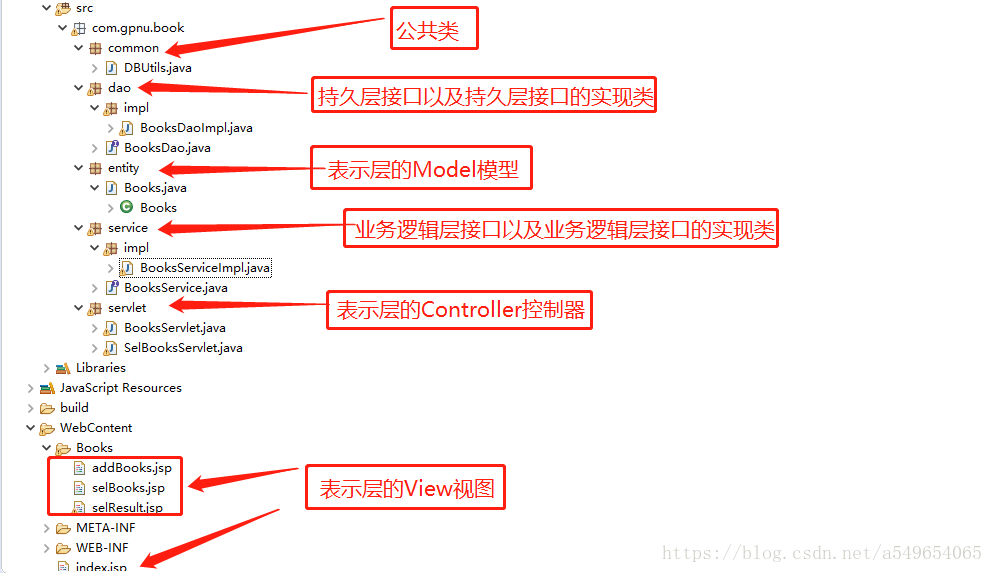

# 三层架构

三层架构(3-tier architecture) 通常意义上的三层架构就是将整个业务应用划分为：界面层（User Interface layer）、业务逻辑层（Business Logic Layer）、数据访问层（Data access layer）。区分层次的目的即为了“高内聚低耦合”的思想。在软件体系架构设计中，分层式结构是最常见，也是最重要的一种结构。微软推荐的分层式结构一般分为三层，从下至上分别为：数据访问层（又称为持久层）、业务逻辑层（又或称为领域层）、表示层。

- **表示层: ** 通俗讲就是展现给用户的界面，即用户在使用一个系统的时候他的所见所得。 
- **业务逻辑层**：针对具体问题的操作，也可以说是对数据层的操作，对数据业务逻辑处理。 
- **数据访问层**：该层所做事务直接操作数据库，针对数据的增添、删除、修改、更新、查找等。 

