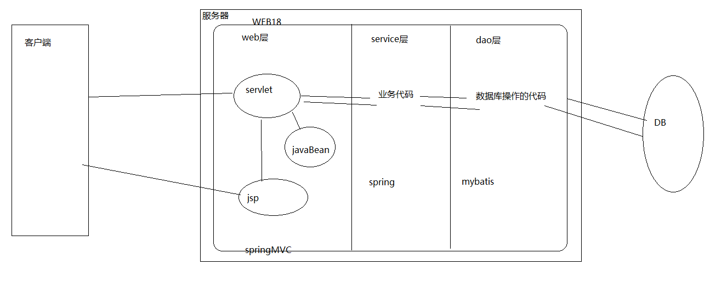
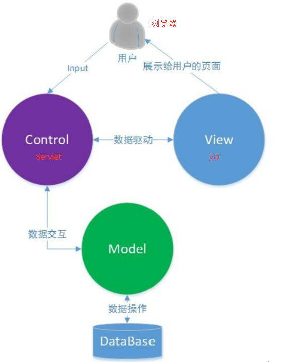
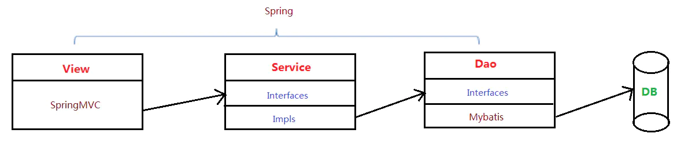

# 三层架构和MVC模式

## **为什么要有架构？**

**这是为了满足“低耦合，高内聚”，实现代码的健壮性和可扩展性**。比如为了更好的降低各层间的耦合度，在三层架构程序设计中，采用面向抽象编程。即上层对下层的调用，是通过接口实现的。而下层对上层的真正服务提供者，是下层接口的实现类。服务标准（接口）是相同的，服务提供者（实现类）可以更换。

## **三层架构是什么？**

三层架构是javaee规范中的推荐架构，传统意义上的是分为表示层（UI）、业务逻辑层（BLL）、数据访问层（DAL）。

- 表现层：通俗讲就是展现给用户的界面，即用户在使用一个系统的时候他的所见所得。 
- 业务逻辑层：针对具体问题的操作，也可以说是对数据层的操作，对数据业务逻辑处理。 
- 数据访问层：该层所做事务直接操作数据库，针对数据的增添、删除、修改、更新、查找等。 

举个例子：

- 持久层从持久库中取出-10。
- 业务层按照一定的逻辑（这里我们举例取温度的逻辑）翻译成-10摄氏度。
- 表示层显现给用户“哎呀，今天好冷！”。

## **MVC框架是什么？**

MVC框架是由Model模型（JavaBean），View视图(Jsp) 和 Controller控制器(Servlet)构成

- Model（模型）

  数据模型，提供要展示的数据，因此包含数据和行为，可以认为是领域模型(domain)或JavaBean组件（包含数据和行为），不过现在一般都分离开来：Value Object（数据） 和 服务层（行为）。也就是模型提供了模型数据查询和模型数据的状态更新等功能，包括数据和业务。

  

- View（视图）

  负责进行模型的展示，一般就是我们见到的用户界面，客户想看到的东西。

  

- Controller（控制器）

  接收用户请求，委托给模型进行处理（状态改变），处理完毕后把返回的模型数据返回给视图，由视图负责展示。 也就是说控制器做了个调度员的工作。

## 三层架构和MVC的区别与联系

MVC是 Model-View-Controller，严格说这三个加起来以后才是三层架构中的UI层，也就是说，MVC把三层架构中的UI层再度进行了分化，分成了控制器、视图、实体三个部分，控制器完成页面逻辑，通过实体来与界面层完成通话；而C层直接与三层中的BLL进行对话。

MVC可以是三层中的一个表现层框架，属于表现层。三层和mvc可以共存。

三层是基于业务逻辑来分的，而MVC是基于页面来分的。

MVC主要用于表现层，3层主要用于体系架构，3层一般是表现层、中间层、数据层，其中表现层又可以分成M、V、C，(Model View Controller)模型－视图－控制器 

MVC是表现模式（Presentation Pattern）

三层架构是典型的架构模式（Architecture Pattern）

三层架构的分层模式是典型的上下关系，上层依赖于下层。但MVC作为表现模式是不存在上下关系的，而是相互协作关系。即使将MVC当作架构模式，也不是分层模式。MVC和三层架构基本没有可比性，是应用于不同领域的技术。

  

## SSM与三层架构的关系

SSM，即 SpringMVC、Spring 与 MyBatis 三个框架。它们在三层架构中所处的位置是不同的，即它们在三层架构中的功能各不相同，各司其职。

- SpringMVC：作为 View 层的实现者，完成用户的请求接收功能。SpringMVC 的 Controller作为整个应用的控制器，完成用户请求的转发及对用户的响应。

- MyBatis：作为 Dao 层的实现者，完成对数据库的增、删、改、查功能。

- Spring：以整个应用大管家的身份出现。整个应用中所有 Bean 的生命周期行为，均由Spring 来管理。即整个应用中所有对象的创建、初始化、销毁，及对象间关联关系的维护，均由 Spring 进行管理。

  