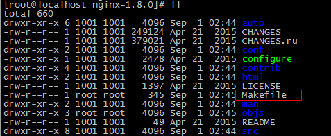
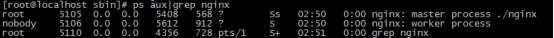
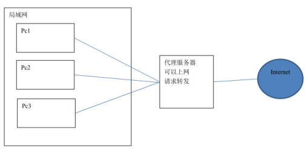
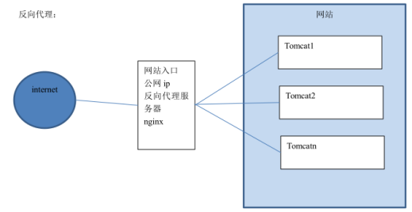

# Nginx

## 1.学习目标

- Nginx的安装
- 掌握Nginx的静态网站部署
- 理解Nginx的反向代理与负载均衡，能够配置反向代理与负载均衡

## 2.Nginx的安装与启动

### 2.1什么是Nginx

Nginx 是一款高性能的 http 服务器/反向代理服务器及电子邮件（IMAP/POP3）代理服务器。由俄罗斯的程序设计师伊戈尔·西索夫（Igor Sysoev）所开发，官方测试 nginx 能够支支撑 5 万并发链接，并且 cpu、内存等资源消耗却非常低，运行非常稳定。


Nginx 应用场景：

1、http 服务器。Nginx 是一个 http 服务可以独立提供 http 服务。可以做网页静态服务器。
2、虚拟主机。可以实现在一台服务器虚拟出多个网站。例如个人网站使用的虚拟主机。
3、反向代理，负载均衡。当网站的访问量达到一定程度后，单台服务器不能满足用户的请求时，需要用多台服务器集群可以使用 nginx 做反向代理。并且多台服务器可以平均分担负载，不会因为某台服务器负载高宕机而某台服务器闲置的情况。 

### 2.2 Nginx在Linux下的安装

重新准备一台虚拟机作为服务器。比如IP地址为192.168.177.129  

#### 2.2.1环境准备

（1）需要安装 gcc 的环境

```
yum install gcc-c++
```

（2）第三方的开发包。

- **PCRE**

PCRE(Perl Compatible Regular Expressions)是一个 Perl 库，包括 perl 兼容的正则表达式库。nginx 的 http 模块使用 pcre 来解析正则表达式，所以需要在 linux 上安装 pcre 库。

```
yum install -y pcre pcre-devel
```

注：pcre-devel 是使用 pcre 开发的一个二次开发库。nginx 也需要此库。

- **zlib**

  zlib 库提供了很多种压缩和解压缩的方式，nginx 使用 zlib 对 http 包的内容进行 gzip，所以需要在 linux 上安装 zlib 库。

```
yum install -y zlib zlib-devel
```

- **OpenSSL**

  OpenSSL 是一个强大的安全套接字层密码库，囊括主要的密码算法、常用的密钥和证书封装管理功能及 SSL 协议，并提供丰富的应用程序供测试或其它目的使用。nginx 不仅支持 http 协议，还支持 https（即在 ssl 协议上传输 http），所以需要在 linux安装 openssl 库。

```
yum install -y openssl openssl-devel
```


#### 2.2.2 Nginx下载

官方网站下载 nginx：http://nginx.org/
我们使用的版本是 1.8.0 版本。

#### 2.2.3 Nginx安装

第一步：把 nginx 的源码包nginx-1.8.0.tar.gz上传到 linux 系统
第二步：解压缩

```
tar zxvf nginx-1.8.0.tar.gz
```

第三步：进入nginx-1.8.0目录   使用 configure 命令创建一 makeFile 文件。

```
./configure \
--prefix=/usr/local/nginx \ 
--pid-path=/var/run/nginx/nginx.pid \
--lock-path=/var/lock/nginx.lock \
--error-log-path=/var/log/nginx/error.log \
--http-log-path=/var/log/nginx/access.log \
--with-http_gzip_static_module \
--http-client-body-temp-path=/var/temp/nginx/client \
--http-proxy-temp-path=/var/temp/nginx/proxy \
--http-fastcgi-temp-path=/var/temp/nginx/fastcgi \
--http-uwsgi-temp-path=/var/temp/nginx/uwsgi \
--http-scgi-temp-path=/var/temp/nginx/scgi
```

执行后可以看到Makefile文件




Makefile是一种配置文件， Makefile 一个工程中的源文件不计数，其按类型、功能、模块分别放在若干个目录中，makefile定义了一系列的规则来指定，哪些文件需要先编译，哪些文件需要后编译，哪些文件需要重新编译，甚至于进行更复杂的功能操作，因为 makefile就像一个Shell脚本一样，其中也可以执行操作系统的命令。


configure参数

```
./configure \
--prefix=/usr \                                   指向安装目录
--sbin-path=/usr/sbin/nginx \                     指向（执行）程序文件（nginx）
--conf-path=/etc/nginx/nginx.conf \               指向配置文件
--error-log-path=/var/log/nginx/error.log \       指向log
--http-log-path=/var/log/nginx/access.log \       指向http-log
--pid-path=/var/run/nginx/nginx.pid \             指向pid
--lock-path=/var/lock/nginx.lock \        安装文件锁定，防止安装文件被别人利用，或自己误操作。）
--user=nginx \
--group=nginx \
--with-http_ssl_module \  启用ngx_http_ssl_module支持（使支持https请求，需已安装openssl）
--with-http_flv_module \  启用ngx_http_flv_module支持（提供寻求内存使用基于时间的偏移量文件）
--with-http_stub_status_module \ 启用ngx_http_stub_status_module支持（获取nginx自上次启动以来的工作状态）
--with-http_gzip_static_module \ 启用ngx_http_gzip_static_module支持（在线实时压缩输出数据流）
--http-client-body-temp-path=/var/tmp/nginx/client/ \  设定http客户端请求临时文件路径
--http-proxy-temp-path=/var/tmp/nginx/proxy/ \     设定http代理临时文件路径
--http-fastcgi-temp-path=/var/tmp/nginx/fcgi/ \    设定http fastcgi临时文件路径
--http-uwsgi-temp-path=/var/tmp/nginx/uwsgi \      设定http uwsgi临时文件路径
--http-scgi-temp-path=/var/tmp/nginx/scgi \        设定http scgi临时文件路径
--with-pcre 启用pcre库
```

第四步：编译

```
make
```

第五步：安装

```
make install
```


#### 2.3 Nginx启动与访问

注意：启动nginx 之前，上边将临时文件目录指定为/var/temp/nginx/client， 需要在/var  下创建此 目录

```
mkdir /var/temp/nginx/client -p
```

进入到Nginx目录下的sbin目录

```
cd /usr/local/ngiux/sbin
```

输入命令启动Nginx

```
./nginx
```

启动后查看进程

```
ps aux|grep nginx
```



地址栏输入虚拟机的IP即可访问（默认为80端口）

关闭 nginx：

```
./nginx -s stop
或者
./nginx -s quit
```

重启 nginx：

1、先关闭后启动。

2、刷新配置文件：

```
./nginx -s reload
```


## 3.Nginx静态网站部署

#### 3.1 静态网站的部署

将/资料/静态页面/index目录下的所有内容 上传到服务器的/usr/local/nginx/html下即可访问 


#### 3.2 配置虚拟主机

虚拟主机，也叫“网站空间”，就是把一台运行在互联网上的物理服务器划分成多个“虚拟”服务器。虚拟主机技术极大的促进了网络技术的应用和普及。同时虚拟主机的租用服务也成了网络时代的一种新型经济形式。

##### 3.2.1 端口绑定

（1）上传静态网站：

将/资料/静态页面/index目录上传至  /usr/local/nginx/index下

将/资料/静态页面/regist目录上传至  /usr/local/nginx/regist下

（2）修改Nginx 的配置文件：/usr/local/nginx/conf/nginx.conf

```
server {
        listen       81; # 监听的端口
        server_name  localhost; # 域名或ip
        location / {	# 访问路径配置
            root   index;# 根目录
            index  index.html index.htm; # 默认首页
        }
                error_page   500 502 503 504  /50x.html;	# 错误页面
        location = /50x.html {
            root   html;
        }
    }


     server {
        listen       82; # 监听的端口
        server_name  localhost; # 域名或ip
        location / {	# 访问路径配置
            root   regist;# 根目录
            index  regist.html; # 默认首页
        }
        error_page   500 502 503 504  /50x.html;	# 错误页面
        location = /50x.html {
            root   html;
        }

        
    }
```

（3）访问测试：

地址栏输入http://192.168.177.129/:81 可以看到首页面

地址栏输入http://192.168.177.129/:82 可以看到注册页面

##### 3.2.2 域名绑定

一个域名对应一个 ip 地址，一个 ip 地址可以被多个域名绑定。

本地测试可以修改 hosts 文件（C:\Windows\System32\drivers\etc）

以配置域名和 ip 的映射关系，如果 hosts 文件中配置了域名和 ip 的对应关系，不需要走dns 服务器。

192.168.177.129	www.hmtravel.com;

192.168.177.129	regist.hmtravel.com

做好域名指向后，修改nginx配置文件

```
server {
        listen       80;
        server_name  www.hmtravel.com;
        location / {
            root   cart;
            index  cart.html;
        }
    }
    server {
        listen       80;
        server_name  regist.hmtravel.com;
        location / {
            root   search;
            index  search.html;
        }
    }
```


执行以下命令，刷新配置

[root@localhost sbin]# ./nginx -s reload

测试：

地址栏输入www.hmtravel.com;


地址栏输入http://regist.hmtravel.com/ 


## 4.Nginx反向代理与负载均衡

### 4.1 反向代理

### 4.1.1 什么是反向代理

​	反向代理（Reverse Proxy）方式是指以代理服务器来接受internet上的连接请求，然后将请求转发给内部网络上的服务器，并将从服务器上得到的结果返回给internet上请求连接的客户端，此时代理服务器对外就表现为一个反向代理服务器。

首先我们先理解正向代理，如下图：




正向代理是针对你的客户端，而反向代理是针对服务器的，如下图




### 4.1.2 配置反向代理-准备工作

（1） 将travel案例部署到tomcat中（ROOT目录），上传到服务器。

（2）启动TOMCAT，输入网址http://192.168.177.129:8080 可以看到网站首页

### 4.1.3 配置反向代理

（1）在Nginx主机修改 Nginx配置文件

```
upstream tomcat-travel{
	   server 192.168.177.129:8080;
    }

    server {
        listen       80; # 监听的端口
        server_name  www.hmtravel.com; # 域名或ip
        location / {	# 访问路径配置
            # root   index;# 根目录
	    proxy_pass http://tomcat-travel;
            index  index.html index.htm; # 默认首页
        }
}
```

（2）重新启动Nginx  然后用浏览器测试：<http://www.hmtravel.com>  （此域名须配置域名指向）

## 4.2 负载均衡

### 4.2.1 什么是负载均衡

​	负载均衡 建立在现有网络结构之上，它提供了一种廉价有效透明的方法扩展[网络设备](http://baike.baidu.com/item/%E7%BD%91%E7%BB%9C%E8%AE%BE%E5%A4%87)和[服务器](http://baike.baidu.com/item/%E6%9C%8D%E5%8A%A1%E5%99%A8)的带宽、增加[吞吐量](http://baike.baidu.com/item/%E5%90%9E%E5%90%90%E9%87%8F)、加强网络数据处理能力、提高网络的灵活性和可用性。

负载均衡，英文名称为Load Balance，其意思就是分摊到多个操作单元上进行执行，例如Web[服务器](http://baike.baidu.com/item/%E6%9C%8D%E5%8A%A1%E5%99%A8)、[FTP服务器](http://baike.baidu.com/item/FTP%E6%9C%8D%E5%8A%A1%E5%99%A8)、[企业](http://baike.baidu.com/item/%E4%BC%81%E4%B8%9A)关键应用服务器和其它关键任务服务器等，从而共同完成工作任务。

### 4.2.2 配置负载均衡-准备工作

（1）将刚才的存放工程的tomcat复制三份，修改端口分别为8080 ，8081，8082 。

（2）分别启动这三个tomcat服务。

（3）为了能够区分是访问哪个服务器的网站，可以在首页标题加上标记以便区分。

### 4.2.3 配置负载均衡

修改 Nginx配置文件：

```
 upstream tomcat-travel {
	   server 192.168.177.129:8080;
	   server 192.168.177.129:8081;
	   server 192.168.177.129:8082;
    }

    server {
        listen       80; # 监听的端口
        server_name  www.hmtravel.com; # 域名或ip
        location / {	# 访问路径配置
            # root   index;# 根目录
	    proxy_pass http://tomcat-travel;

            index  index.html index.htm; # 默认首页
        }
        error_page   500 502 503 504  /50x.html;	# 错误页面
        location = /50x.html {
            root   html;
        }
    }
```

地址栏输入http:// www.hmtravel.com /  刷新观察每个网页的标题，看是否不同。

经过测试，三台服务器出现的概率各为33.3333333%，交替显示。

如果其中一台服务器性能比较好，想让其承担更多的压力，可以设置权重。

比如想让NO.1出现次数是其它服务器的2倍，则修改配置如下：

```
upstream tomcat-travel {
	   server 192.168.177.129:8080;
	   server 192.168.177.129:8081 weight=2;
	   server 192.168.177.129:8082;
    }
```

经过测试，每刷新四次，有两次是8081