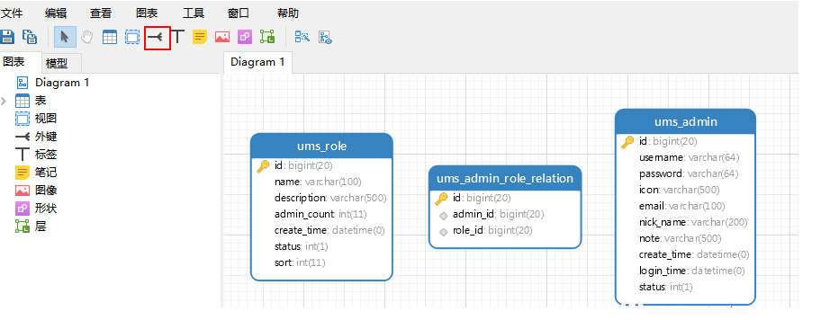

# Navicat

> Navicat是一套快速、可靠的数据库管理工具，专为简化数据库的管理及降低系统管理成本而设。它的设计符合数据库管理员、开发人员及中小企业的需要。Navicat 是以直觉化的图形用户界面而建的，让你可以以安全并且简单的方式创建、组织、访问并共用信息。

## 数据库设计

用Navicat来设计数据库。

**打开模型**

**新建表**

通过工具栏中的`表`按钮新建一张表；

新建完成后通过双击`设计表`的界面，然后添加对应字段，这里新建了一张`ums_admin`表；

**建立外键关系**

如果我们的表没有外键，当表越来越多，关系越来越复杂时，我们就无法理清表与表之间的关系了，所以我们在设计的时候需要通过外键来标注表与表之间的关系。

我们再新建两张表`ums_role`和`ums_admin_role_relation`用于演示建立多对多关系，并通过工具栏的`外键`按钮建立外键；

点击`外键`按钮后直接点击需要建立外键的字段，这里点击的是`admin_id`，之后你会发现多了一个`小连线`；

双击这个`小连线`进行外键的编辑操作，修改参考表为`ums_admin`，参考字段为`id`；

编辑完成后就会出现表示外键关系的连线了；

之后可以把整个`mall`项目权限管理模块的表都建立起来练习下，下面是建立完成后的效果；

如何你觉得排版不好的话，可以点击下工具栏的`自动调整版面功能`，是不是个很贴心的功能呢！

## 导出SQL

我们一般在设计数据库的时候通过`外键`来建立关系，但是在数据库中往往不使用外键，通常通过逻辑来关联，所以在我们导出SQL的时候需要设置去除外键的生成。

导出SQL功能在工具菜单下面；

导出时需要在`高级`中去除外键的生成，点击确定就可以成功导出SQL语句了。

