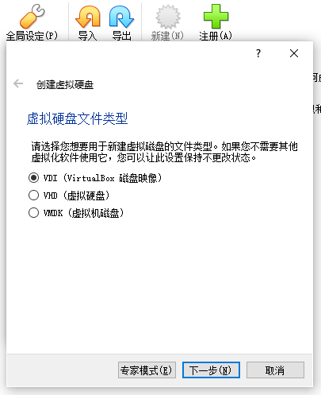
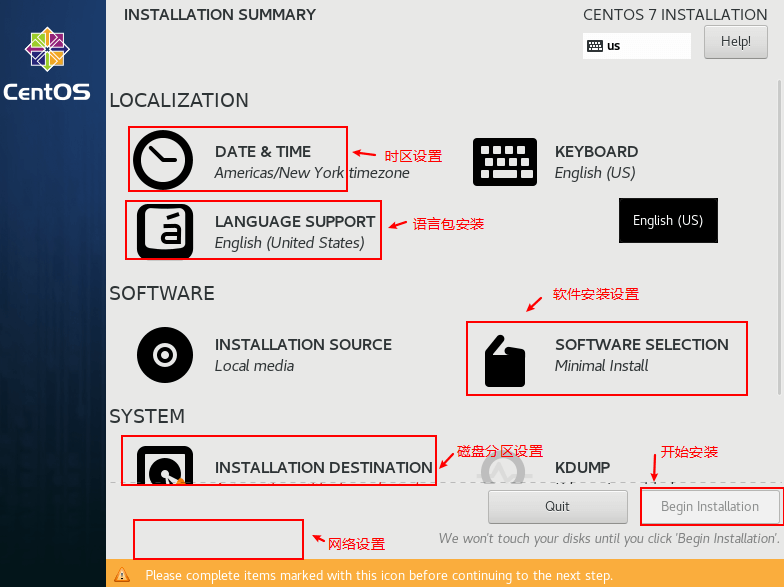
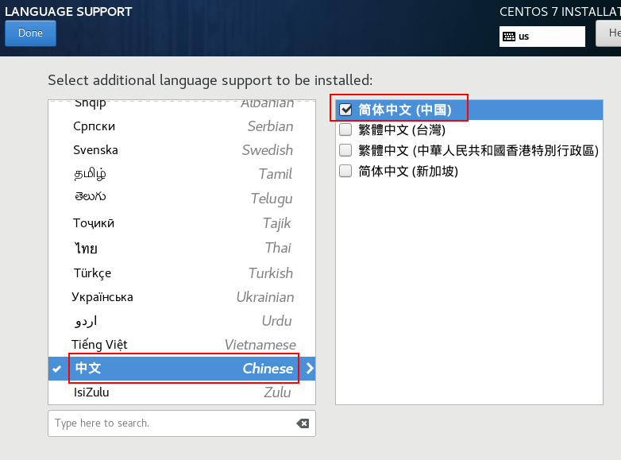
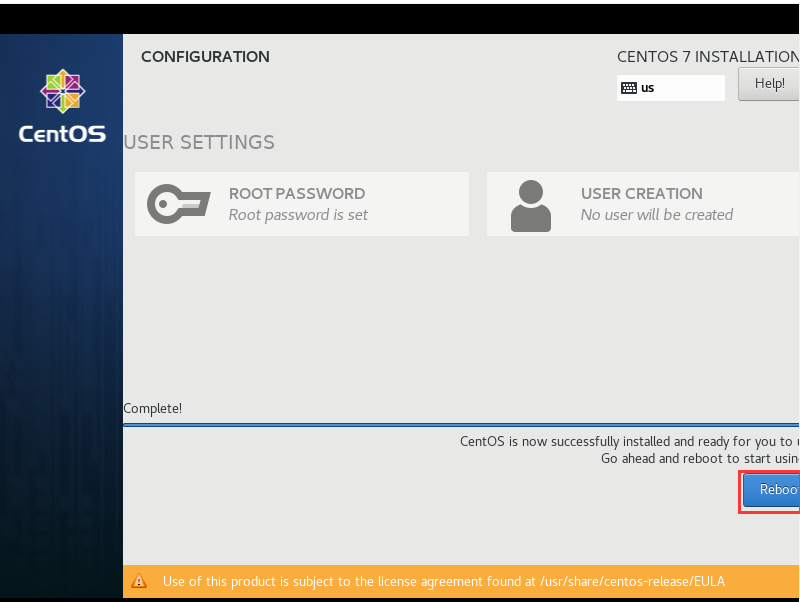

# VirtualBox 

## VirtualBox的安装

下载VirtualBox安装包，下载地址：<https://www.virtualbox.org/wiki/Downloads>

下载完成后双击运行安装包一路点击下一步即可：

## 创建虚拟机

- 点击新建一个虚拟机

- 分配虚拟机内存大小，可以根据自己电脑配置来决定：

- 创建虚拟硬盘：

- 设置虚拟硬盘文件类型，这里选择DVI格式：

- 选择动态分配空间大小，如果你的硬盘空间比较大的话，可以选择固定大小：

## 安装Linux

> CentOS（Community Enterprise Operating System）是Linux发行版之一，中文意思为社区企业操作系统。它是来自于商业版 Red Hat Enterprise Linux依照开放源代码规定释出的源代码所编译而成，因此具有高度稳定性且完全开源。本文将以CentOS 7.6为例来介绍Linux系统的安装。

### 下载Linux镜像

- 下载地址：http://archive.kernel.org/centos-vault/7.6.1810/isos/x86_64/
- 下载文件：CentOS-7-x86_64-DVD-1810.ios 

### 安装

- 为虚拟机添加虚拟光盘，虚拟光盘指定为我们下载的ISO镜像文件：

- 点击启动运行虚拟机：

- 运行成功后，选择`Install CentOS 7`进行安装：

- 选择系统安装过程中的语言，建议选择`English`选项：

- 需要进行设置的部分示意图：

- 时区设置，地区选择`Asia`，城市选择`Shanghai`：

- 语言支持选择安装英文、简体中文两种语言安装包：

- 网络设置，设置主机名称和进行网络激活操作：

- 设置点击`Begin Installation`

- 安装过程中可以设置`root`用户的密码；

- 安装完成点击重启

- 登录linux系统

- 设置网络

## xshell

