# 如何做好业务建模？

随着项目的推进，一些相对原有需求更加复杂的需求被拿上了工作日程，包括有技术顾问试车场景，保险顾问大事故/索赔场景，以及拆分付款&卡券3.0接入。

以上的每一样事情都需要做需求调研，业务分析，业务建模，数据建模等。

## 一、业务分析的方法

### 1. 流程图

可以使用跨角色的，多泳道的流程图等工具来处理，如下图：

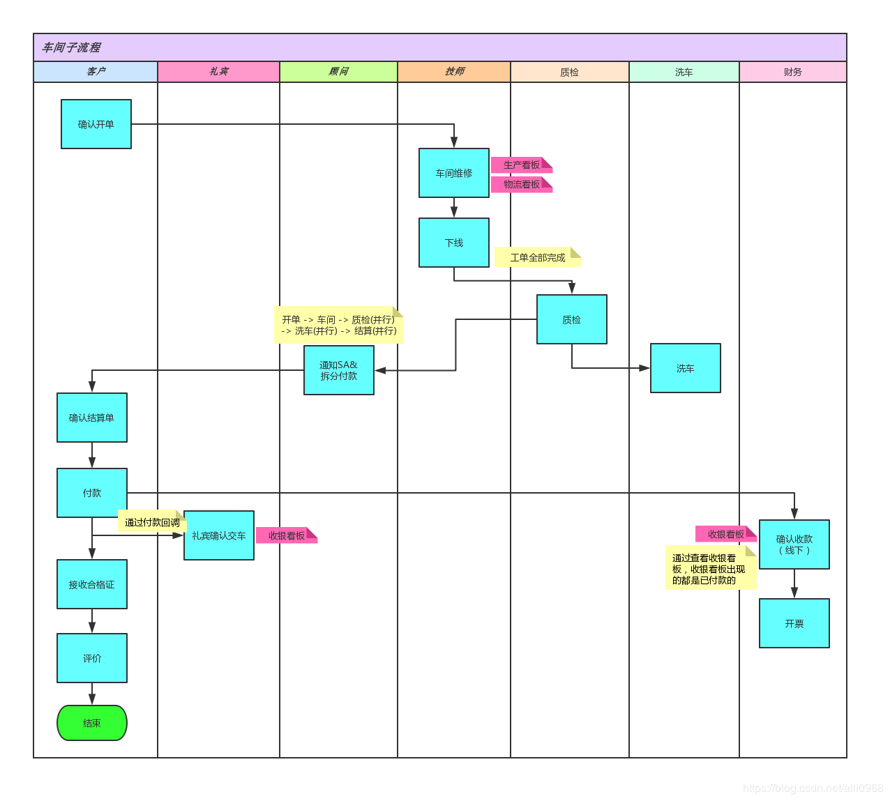

### 2. 时序图

按照时间的顺序表达出各角色或业务部件的交互，如下图：

**线上预约保养服务（UST-004）**

【用例UST004：线上预约保养服务】

1）用户选择“去保养”后，进入预约保养页面；

2）点击后选择保养时间，后台查询是否有货，根据是否有无货品做出对应的操作；

3）根据用户购买保养包类型及数量，组合计算“保养预计时长”；客户也可以选择希望取车时间，可选择时间段需>“保养预计时长”；

4）用户可选择保养预约时间，可查看每日可提供预约时间段及预约情况，并支持时间段备注信息，如“线下好评赠百元红包”等内容，点击“预约”按钮提示预约成功，请准时到场；

5）车辆注册方式：1.上传行驶证，通过ocr识别；2.手工输入车牌号；

6）输入：公里数、联系人、手机号、是否上门取送车、发票信息收集（如开发票，则收集发票类型和抬头）

7）点击预约提交后，展示预提交页面，供用户确认，无误后点击确定，提交给moby系统。

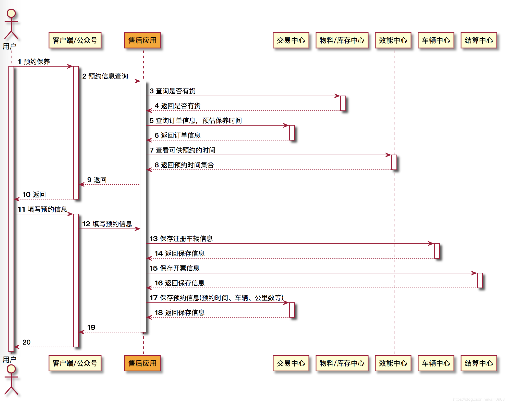

### 3. 产品原型图

主要由产品team输出，包括原型图，UI图等，如下图：

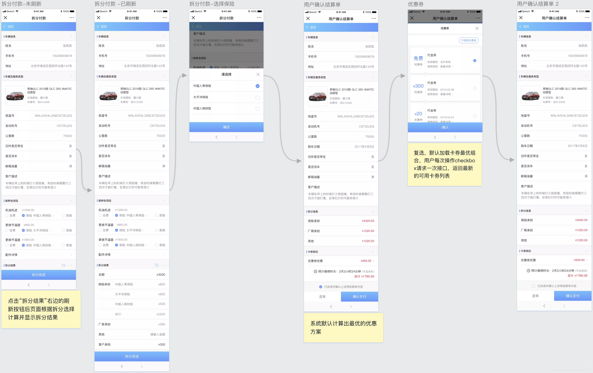

### 4. 业务模型图

业务建模是业务分析BA工作中很重要的一环，业务模型图一般都以对象图（Object）的形式体现，做好业务建模有助于理解需求，促进业务专家和技术团队的沟通等，如下图：

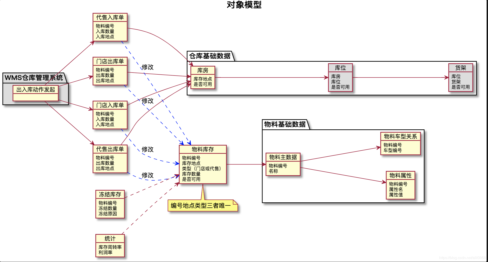

这个不叫对象模型，应该就是业务模型

“库存地点”“库房”这样的描述比较含糊，用仓库，仓库id，仓库名称，仓库地址等替代

上图物料库存需要表示出物料库存和仓库主数据的关系（上图出现了断层）

业务模型不需要再进一步画，需要从业务模型直接体现全量的业务场景

不关注的东西不要出现在模型图里，如上图的WMS

业务模型不能出现动词（一般都是名词），动作都在线上

图里出现的应该都是业务上的概念，不要出现“物料主数据”这样的字眼，这是设计上的概念

统计应该细分为若干个视图，如库存周转率视图，利润率视图

上述图可以加入人的图标，标识由人来发起某个动作

上图需要体现出“仓库基础数据”，“物料基础数据”在哪里可以找到， 即表示出设计之间的关联

最终修改版：
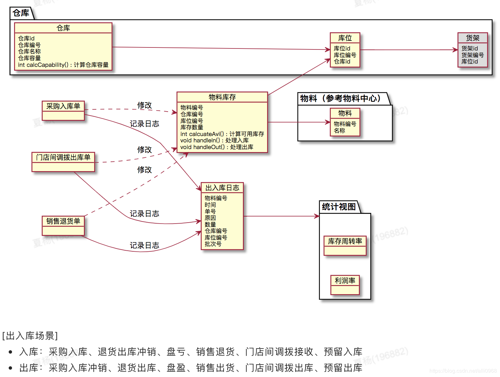

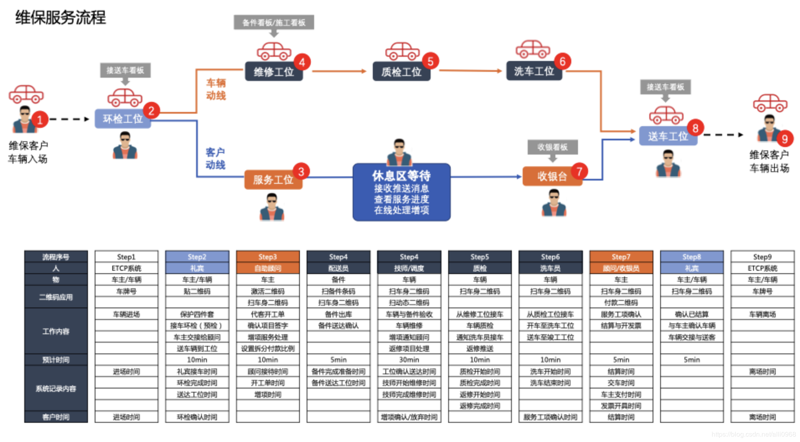

### 5. 数据模型图

如数据库概念模型，物理模型等，如下图：

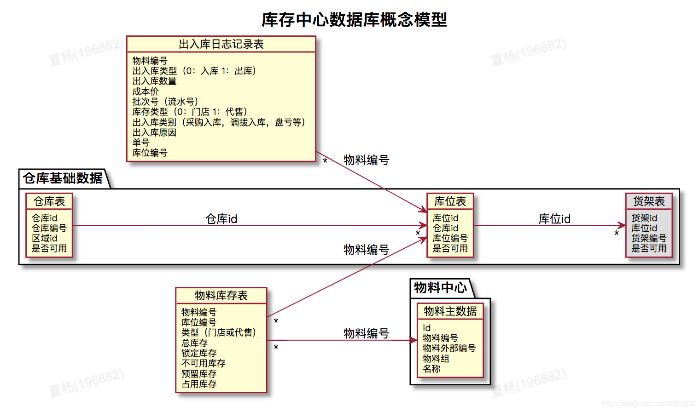

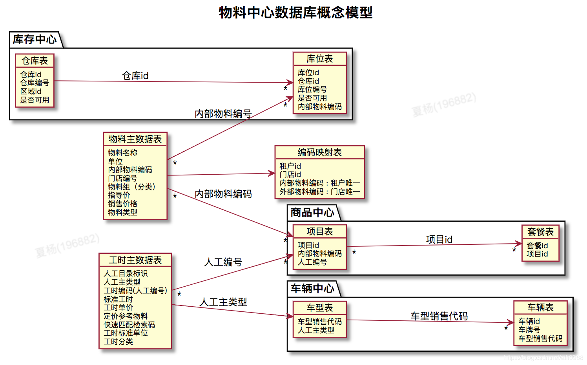

### 6. 其他

如下的总体架构图，对接系统图，思维导图等等

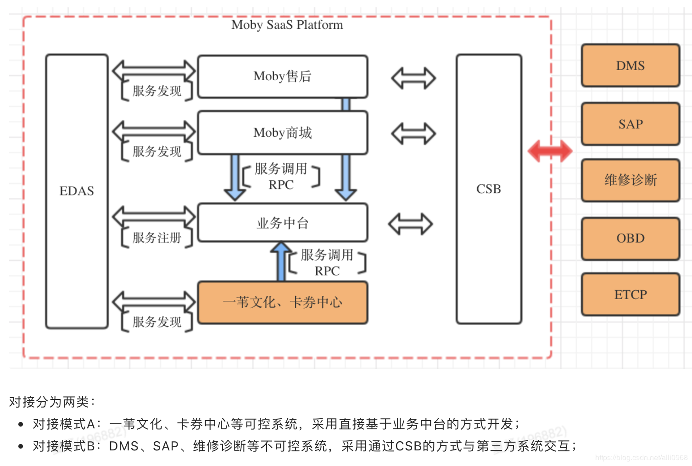

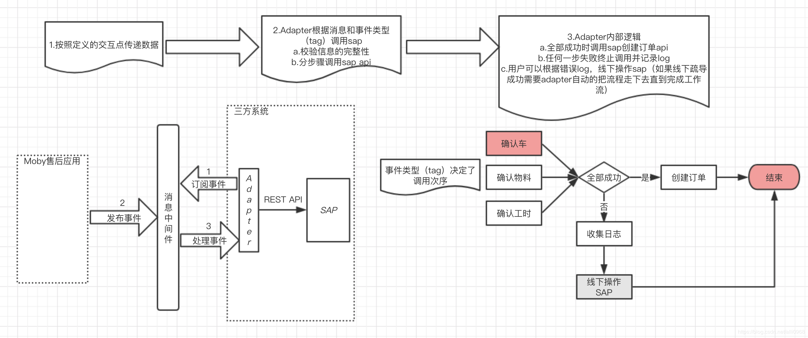

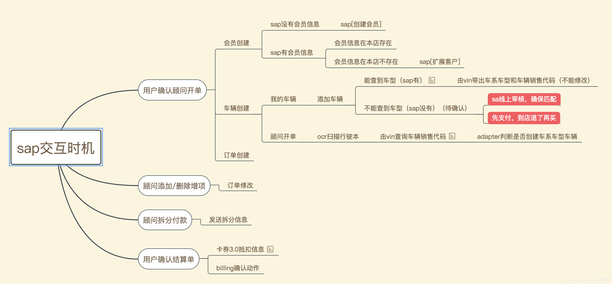

## 二、建模工具

建模工具包括数据库建模工具Power Designer，UML建模工具Visio、Rational Rose、PlantUML、在线作图Processor等，原型建模工具如Axure RP、Sketch，还有就是其他综合类的如Office软件、甘特图OmniPlan

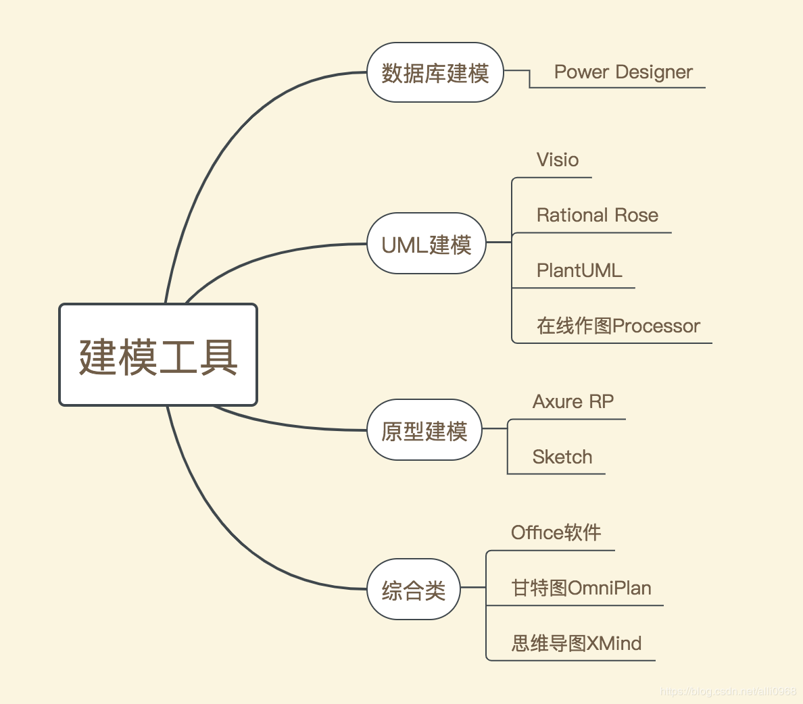

## 三、总结

1. 综合运用好各类图表（包括图形和表格）来解决不同的问题，特定类型的图表能解决特定的问题，不能一味的照搬照套，需要灵活变通。如时序图的长处在于能体现时间序列下各模块的交互顺序，而对象图则体现了对象与对象间的关联以及因果关系。

2. 业务分析BA主要是跟人打交道（可能还得具备行业知识），而技术架构SA则更偏向于跟机器打交道。而只有想通这一点才能把工作做好。

3. 不管的业务架构还是技术架构，关键在于“理解需求”。
  