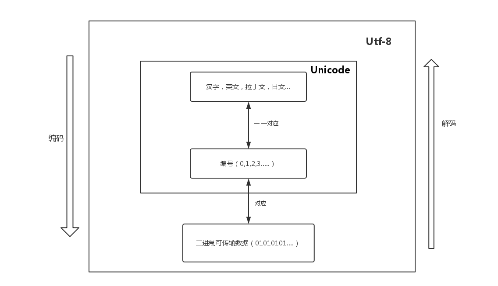

# 字符集与编码

相信很多对字符集编码不够了解的程序员经常会出现很多乱码问题，抱有很多疑惑。
比如，为什么会出现乱码？
这里用的是什么字符编码？

创建一个文本它是`GBK`编码还是`UTF-8`编码？

`Unicode`和`UTF-8`的区别是什么？

## 基础概念

### 字节（byte）

**字节**是计算存储容量的一种计量单位。我们知道计算机只能识别1和0组成的二进制位。一个数就是1位（bit），为了方便计算，我们规定8位就是一个**字节**。

例如 ：`00001111` 这个8位二进制数就占了一个**字节**的存储容量。

### 字符

字符和字节不太一样，任何一个文字或符号都是一个字符，但所占字节不一定，不同的编码导致一个字符所占的内存不同。

例如：标点符号`+`是一个字符，汉字`我们`是两个字符，在`GBK`编码中一个汉字占2个字节，在`UTF-8`编码中一个汉字占3个字节。

### 编码字符集（字符集）

我们平时说的字符集就是这个。在一个字库表中，每**一个字符都有一个对应的二进制地址**，而编码字符集就是这些地址的集合。

例如：在ASCII码的编码字符集中，字母A的序号（地址）是65，65的二进制就是01000001。我们可以说编码字符集就是用来存储这些二进制数的。而这个二进制数就是编码字符集中的一个元素，同时它也是字库表中字母A的地址。我们根据这个地址就可以显示出字母A。


### 字符编码（编码方式）

直接使用字符对应的二进制地址来显示文字是十分浪费的，Unicode 编码规范中包括了几百万个字符，想要包括几百万个不同的字符，起码需要3个字节的容量，为了方便将来扩展，Unicode还保留了更多未使用的空间，最多可以存储4个字节的容量。

因此为了区分每个字符，哪怕是`00000000 00000000 00000000 00001111`这种其实只占了1个字节的字符，我们也要为他分配4个字节的空间，这就导致一个可以用1G保存的文件，现在需要4G才能保存，这是极其浪费的做法。

于是程序员制定了一套算法来节省空间，而每种不同的算法都被称作一种编码方式（下文中为了便于理解都将使用编码方式来称呼字符编码）。一套编码规范可以有多种不同的编码方式，不同的编码方式有不同的适应场景。

例如：`UTF-8`就是一种编码方式，Unicode是一种编码规范。此外，Unicode还有`UTF-16`,`UTF-32`这两种编码方式。不同的编码方式节约的空间不同。

总结：一个较短的二进制数，通过一种编码方式，转换成编码字符集中正常的地址，然后在字库表中找到一个对应的字符，最终显示给用户。

## 编码与解码

### 解码

一串二进制数，使用一种编码方式，转换成字符，这个过程我们称之为**解码**。就像解开密码一样，程序员可以选用任意的编码方式进行**解码**，但往往只有一种编码方式可以解开密码显示出正确的文字，而**使用错误的编码方式，产生其他不合理的字符，这就是我们通常说的————乱码！**

### 编码

一串已经解码后的字符，我们也可以选用任意类型的编码方式重新转换成一串二进制数，这个过程就是编码，我们也可以称之为加密过程，无论使用哪一种编码方式进行编码，最终都是产生计算机可识别的二进制数，但如果编码规范的字库表不包含目标字符，则无法在字符集中找到对应的二进制数。这将导致不可逆的乱码！例如：像ISO-8859-1的字库表中不包含中文，因此哪怕将中文字符使用ISO-8859-1进行编码，再使用ISO-8859-1进行解码，也无法显示出正确的中文字符。

## 代码演示

以java语言为例，我们先将一串中文字符串使用UTF-8 编码方式进行**编码**变成字节数组，然后将字节数组打印出来。

```java
String chinese="汉";
//使用UTF-8编码方式进行编码。
byte[] bs = chinese.getBytes("UTF-8");
for (byte b : bs) {
	System.out.print(b+" ");
}
```


结果：

```java
-26 -79 -119
```

可以看出，1个汉字变成了3个字节，证明了1个汉字在UTF-8 编码方式下占3个字节。

我们继续，将字节数组，使用UTF-8 编码方式进行**解码**。

```java
//使用UTF-8编码方式进行解码。
String utf8 = new String(bs,"UTF-8");
System.out.println(utf8); //汉
```


解码后正确的显示了中文字符`汉`字。
但如果我们使用GBK进行**解码**。

```java
//使用GBK编码方式进行解码。
String gbk = new String(bs, "GBK");
System.out.println(gbk);//姹?
```

说明使用错误的解码方式就会乱码。


## Unicode 和 UTF-8 有什么区别？

简单来说：

- Unicode 是「字符集」
- UTF-8 是「编码规则」


**举例**

`It's 知乎日报`你看到的unicode字符集是这样的编码表：

```java
I 0049
t 0074
' 0027
s 0073
  0020
知 77e5
乎 4e4e
日 65e5
报 62a5
```

每一个字符对应一个十六进制数字。

计算机只懂二进制，因此，严格按照unicode的方式(UCS-2)，应该这样存储：

```java
I 00000000 01001001
t 00000000 01110100
' 00000000 00100111
s 00000000 01110011
  00000000 00100000
知 01110111 11100101
乎 01001110 01001110
日 01100101 11100101
报 01100010 10100101
```

这个字符串总共占用了18个字节，但是对比中英文的二进制码，可以发现，英文前9位都是0！浪费啊，浪费硬盘，浪费流量。

于是，就出现了如下解决方案：uft-8，utf-16，utf-32这些编码方案。

UTF-8是这样做的：

1. 单字节的字符，字节的第一位设为0，对于英语文本，UTF-8码只占用一个字节，和ASCII码完全相同；

2. n个字节的字符(n>1)，第一个字节的前n位设为1，第n+1位设为0，后面字节的前两位都设为10，这n个字节的其余空位填充该字符unicode码，高位用0补足。

于是，”It's 知乎日报“就变成了：

```java
I 01001001
t 01110100
' 00100111
s 01110011
  00100000
知 11100111 10011111 10100101
乎 11100100 10111001 10001110
日 11100110 10010111 10100101
报 11100110 10001010 10100101

```

和上边的方案对比一下，英文短了，每个中文字符却多用了一个字节。但是整个字符串只用了17个字节，比上边的18个短了一点点。



参考资料

<https://www.cnblogs.com/dhsz/p/7737480.html>

<https://www.zhihu.com/question/23374078>

<https://blog.csdn.net/qq_42068856/article/details/83792174>

