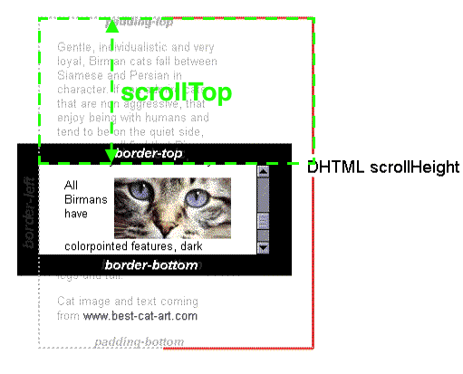
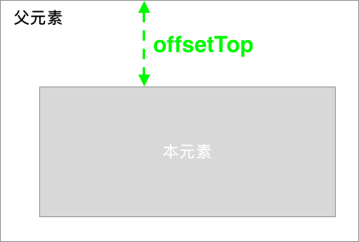

# clientHeight、offsetHeight、scrollHeight、offsetTop、scrollTop

网页可见区域高：`document.body.clientHeight`

网页正文全文高：`document.body.scrollHeight`

网页可见区域高（包括边线的高）：`document.body.offsetHeight`

网页被卷去的高：`document.body.scrollTop`

屏幕分辨率高：`window.screen.height`

----


每个HTML元素都具有`clientHeight` ，`offsetHeight`， `scrollHeight` ，`offsetTop` ，`scrollTop` 这5个和元素高度、滚动、位置相关的属性，单凭单词很难搞清楚分别代表什么意思之间有什么区别。

通过阅读它们的文档总结出规律如下：

clientHeight = height + padding

  

offsetHeight = height + padding + border

/

scrollHeight = 内容宽度（不包含border）

scrollHeight: 因为子元素比父元素高，父元素不想被子元素撑的一样高就显示出了滚动条，在滚动的过程中本元素有部分被隐藏了，`scrollHeight`代表包括当前不可见部分的元素的高度。而可见部分的高度其实就是`clientHeight`，也就是`scrollHeight>=clientHeight`恒成立。在有滚动条时讨论`scrollHeight`才有意义，在没有滚动条时scrollHeight==clientHeight恒成立。单位px，只读元素。


scrollTop: 代表在有滚动条时，滚动条向下滚动的距离也就是元素顶部被遮住部分的高度。在没有滚动条时scrollTop==0恒成立。单位px，可读可设置。



offsetTop: 当前元素顶部距离最近父元素顶部的距离,和有没有滚动条没有关系。单位px，只读元素。



**例子：**

判断元素是否触底

```javascript
let wrapper = document.querySelector(".wrapper");
 wrapper.addEventListener("scroll", () => {
    let offsetHeight = wrapper.offsetHeight;
    let clientHeight = wrapper.clientHeight;
    let scrollHeight = wrapper.scrollHeight;
    let scrollTop = wrapper.scrollTop;

     if (scrollTop + clientHeight == scrollHeight) {
         console.log("触底了");
     }
})
```

判断文档是否触底

```javascript
document.addEventListener("scroll", (e) => {
    var clientHeight = document.documentElement.clientHeight;
    var scrollHeight = document.documentElement.scrollHeight;
    var scrollTop = window.pageYOffset;

    if (scrollTop + clientHeight == scrollHeight) {
        alert("触底了");
    }
})
```

