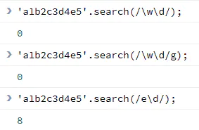

# javascript正则表达式

正则表达式是用于匹配字符串中字符组合的模式。主要应用于正则对象的test和esec方法,以及字符串的search、split、match、replace中。

## 创建正则

### 字面量创建

> **字面量**：指特定的数字、字符串or布尔值，能够明确表现自己的类型并为变量进行赋值的值

语法

```javascript
var reg = /正则表达式主体/修饰符;
```

实例

```javascript
var patt = /runoob/i
```


**修饰符**

| 符号 | 含义                                                         |
| ---- | ------------------------------------------------------------ |
| g    | global，表示全文搜索；若不添加g，则搜索到第一个匹配结果即停止匹配 |
| i    | ignore case，忽略大小写；若不添加i，则默认大小写严格匹配     |
| m    | multiple lines，多行搜索                                     |


### 构造函数创建

在js中提供了一个内置构造函数RegExp来创建一个正则对象

语法

```javascript
var reg =  new RegExp(pattern [, flags]);
```
实例
```javascript
var reg = /abc/g;
// 等价于
var reg = new RegExp("abc", "g");
```

## 元字符

正则表达式由2种基本字符类型组成：

1）**原义文本字符**：表示原来字符含义的字符。
 如：abc、123

2）**元字符**：指有特殊含义的非字母字符。
 包括：`*`、`?`、`$`、`^`、`.`、`|`、`\`、`()`、`{}`、`[]`
 如：`\b` 匹配边界，`\n` 换行，`\d` 数字，`\s` 空白字符


## 字符类

一般情况下，正则表达式的一个字符匹配一个字符。如：`abc` 匹配 "abc"。对于正则匹配多个字符的场景，可使用元字符 `[]` 来构建一个简单的类（泛指符合某些特性的对象，非特指某个字符）。

**案例1：**

表达式 `[abc]` 把字符a、b、c归为一类，表达式可以匹配该类的任一字符（a或b或c）
实现效果：字符a、b、c都被替换成设置的A


**案例2：**

字符类取反（反向类/负向类）
元字符：`^`
含义：不属于某个类的内容
表达式：`[^abc]` 表示非字符（a或b或c）的内容
实现效果：匹配到a/b/c字符以外的其他字符并替换成A


## 范围类

若以上使用字符类正则 `[0123456789]` 匹配数字，以及所有英文字母的匹配，写起来相对比较麻烦且效率不高。为了改善此种场景下字符类的正则写法，正则表达式提供了范围类，如：可使用 `[a-z]` 来匹配从a到z的任意字符（包含a和z）。

**案例1：**

```javascript
var r = 'a1b2c3x6z9ABc'.replace(/[a-z]/g, 'Q');
console.log(r); //Q1Q2Q3Q6Q9ABQ
```

运行结果：
将所有的小写字母都替换成了Q


**案例2：**

在 `[]` 组成的类内部可以连写，如：`[a-zA-z0-9]` 匹配所有的大小写字母、数字字符

```javascript
var r = 'a1b2c3x6z9ABc'.replace(/[a-zA-Z0-9]/g, 'Q');
console.log(r); //QQQQQQQQQQQQQ
```

**案例3：**

在范围类之内匹配包含有连接符 `-` ，正则如：`[0-9-]`
使用范围类，在`[]`内字符范围之后新增连接符：

```javascript
var r = '2018-12-22'.replace(/[0-9-]/g, 'Q');
console.log(r); //QQQQQQQQQQ
```

对比组1：使用范围类，匹配数字字符，只替换数字

```javascript
var r = '2018-12-22'.replace(/[0-9]/g, 'Q');
console.log(r); //QQQQ-QQ-QQ
```

## JS预定义类&边界

### 1）预定义类

正则表达式提供预定义类来匹配常见的字符类，常用的预定义类：`.`、`\d`、`\D`、`\s`、`\S`、`\w`、`\W`

| 字符 | 等价类          | 含义                           |
| ---- | --------------- | ------------------------------ |
| .    | [^\r\n]         | 除了回车、换行符之外的其他字符 |
| \d   | [0-9]           | 数字字符                       |
| \D   | [^0-9]          | 非数字字符                     |
| \s   | [\t\n\x0B\f\r]  | 空白符                         |
| \S   | [^\t\n\x0B\f\r] | 非空白符                       |
| \w   | [a-zA-Z_0-9]    | 单词字符(字母、数字、下划线)   |
| \W   | [^a-zA-Z_0-9]   | 非单词字符                     |

结合英文原意记忆：
 d ==> digit（数字）
 s ==> space（空白）
 w ==> word（单词）

**案例：**

匹配字符串：abc+数字+任意字符
正则写法1：`abc[0-9][^\r\n]`
正则写法2：`abc\d.`

### 2）边界

常用的边界匹配字符：`^`、`$`、`\b`、`\B`

| 字符 | 含义       |
| ---- | ---------- |
| ^    | 以xxx开始  |
| $    | 以xxx结束  |
| \b   | 单词边界   |
| \B   | 非单词边界 |

b ==> boundary（边界）

**案例1：元字符 `\b`和`\B` 的使用**

对比组1：匹配字符"is"，其左右皆无边界

```javascript
var str = 'This is JavaScript';
var r = str.replace(/is/g, 'A');
console.log(r); //ThA A JavaScript
```

对比组2：匹配单词is，其左右皆有边界

```javascript
var r = str.replace(/\bis\b/g, 'A');
console.log(r) //This A JavaScript
```

对比组3：匹配字符"is"，其左边无单词边界，右边有单词边

```javascript
var r = str.replace(/\Bis\b/g, 'A');
console.log(r)  //ThA is JavaScript
```

**案例2：元字符 `^`和`$` 的使用**

对比组1：

```javascript
var str = '@999@777@';
var r = str.replace(/@./g, 'A');
console.log(r); //A99A77@
```

对比组2：

```jsx
var str = '@999@777@';
var r = str.replace(/^@./g, 'A');
console.log(r); //A99@777@
```

对比组3：

```javascript
var str = '@999@777@';
var r = str.replace(/.@/g, 'A');
console.log(r); //@99A77A
```

对比组4：

```javascript
var str = '@999@777@';
var r = str.replace(/.@$/g, 'A');
console.log(r); //@999@77A
```

案例3：多行匹配（修饰符：`m`）

对比组1：

```javascript
var str = "@123\n@456\n@789";
var r = str.replace(/^@\d/g, 'A');
console.log(r);
//A23
//@456
//@789
```

对比组2：

```javascript
var str = "@123\n@456\n@789";
var r = str.replace(/^@\d/g, 'A');
console.log(r);
//A23
//A56
//A89
```

## 量词

匹配一个出现n次的字符串，n=0,1,...,N

| 字符  | 含义            |
| ----- | --------------- |
| ?     | 0或1 次         |
| +     | ≥1 次           |
| *     | ≥0 次（任意次） |
| {n}   | n 次            |
| {n,m} | n到m 次         |
| {n,}  | ≥n 次           |

## 正则贪婪模式 & 非贪婪模式

### 1）贪婪模式：

尽可能多的匹配（首先取最多可匹配的数量为一组进行匹配），当匹配剩余的字符串，还会继续尝试新的匹配，直到匹配不到为止，为默认模式

**案例**：对字符串"123456789"，匹配其中的数字3-6次：`\d{3,6}`，并替换为特定字符
 ==> 先匹配数字出现6次的字符串（123456），然后再从剩余字符串（789）中匹配出现数字3次的情况，剩余字符若没有出现数字3次则停止匹配

实例1
```javascript
var str = "12345678";
var r = str.replace(/\d{3,6}/g, 'A');
console.log(r); // A78
```

实例2

```javascript
var str = "123456789";
var r = str.replace(/\d{3,6}/g, 'A');
console.log(r); // AA
```

### 2）非贪婪模式：

尽可能少的匹配（每次取最少匹配的数量为一组进行匹配），直到匹配不到为止
**使用方法**：在量词后加上 `?`

```javascript
var str = "0123456789";
var r = str.replace(/\d{3,6}?/g, 'A');
console.log(r); //AAA9
```

以上，是对 012、345、678分组匹配，剩余字符9未能再匹配

## 分组

使用 `()` 进行分组，使量词作用于分组内的整体部分。如：`(Candy){3}`

```javascript
var str = "a1b2c3d456789";
var r = str.replace(/([a-z]\d){3}/g, 'A');
console.log(r); // Ad456789
```

**或**：使用符号 `|`
可联合分组符号使用，如下：

```javascript
var str = "Nancy-Lucy";
var r = str.replace(/(Nan|Lu)cy/g, 'A');
console.log(r); //A-A
```

**忽略分组**：既想使用分组，又不希望捕获分组，则只需要在分组内的左侧加上符号 `?:`

```javascript
var str = "Date: 2018-12-31";
var r = str.replace(/(?:.*)(\d{4})-(\d{2})-(\d{2})/g, '$3/$2/$1');
console.log(r); // 31/12/2018
```

## 前瞻

**前**：正则表达式从文本头部向尾部开始解析，文本尾部方向即为“前”；预示“未来的”方向，待匹配的方向
 **前瞻**：在正则匹配到规则时，向前检查是否符合断言；后顾/后瞻方向相反（JavaScript不支持后顾）
 **正向/肯定 匹配**：符合特定断言
 **负向/否定 匹配**：不符合特定断言
 **断言**：JavaScript前瞻的语法

既要符合exp正则，又要满足断言要求

| 名称     | 正则写法      | 含义                            |
| -------- | ------------- | ------------------------------- |
| 正向前瞻 | exp(?=assert) | 符合exp正则，且符合设置的断言   |
| 负向前瞻 | exp(?!assert) | 符合exp正则，且不符合设置的断言 |

**PS：以上断言部分只作为约束条件而存在，并不会参与字符本身的匹配和替换，匹配字符的是exp正则部分**

**案例：**

约束条件：`\w(?=\d)`，单词字符后需要紧跟着数字
 匹配：`\w`，单词字符（字母、数字、下划线）

```javascript
var str = "abc1-23_45";
var r = str.replace(/\w(?=\d)/g, 'A');
console.log(r);
```


以上，c1、23、_4、45都满足约束条件，则分别将会把每组符合条件的字符串中左边的单词字符替换为"A"，即：A1、A3、AA5

## JS对象属性

对象属性：

| 名称       | 含义                                                         |
| ---------- | ------------------------------------------------------------ |
| global     | `g`：全文搜索，默认false                                     |
| ignoreCase | `i`：大小写敏感，默认false                                   |
| multiline  | `m`：多行搜索，默认false                                     |
| lastIndex  | 下次匹配的起始位置 该属性只有设置标志`g`才能使用，实现遍历检索匹配 |
| source     | 正则的文本字符串（正则主体）                                 |

语法：

```css
RegExpObject.global
RegExpObject.ignoreCase
RegExpObject.multiline
RegExpObject.lastIndex
RegExpObject.source
```

## test()方法、exec()方法

### 1）RegExp.prototype.test(str)

**作用**：测试字符串参数中是否存在所匹配正则的字符串。若存在则返回true，否则返回false

**prototype**：JavaScript中的每个函数作为一个对象，每个函数对象都拥有一个子对象prototype。prototype是全局属性，适用于所有的Javascript对象，允许向对象添加属性和方法
 RegExp.exec() 和 RegExp.test()方法都以 lastIndex 属性所指的位置作为下次检索的起始点，可通过反复调用这2个方法来遍历一个字符串中的所有匹配文本。当这2个方法再也找不到可以匹配的文本时，它们会自动把 lastIndex 属性重置为 0。

正则中无 `g` 标志：


正则中有 `g` 标志：


对于设置的参数，当有效匹配其中字符串时，获取对应lastIndex的取值：


以上，根据lastIndex属性指定的下一次检索起始点，正则反复调用test()方法匹配文本过程中，当匹配到文本时返回true，遍历直到未匹配到文本时返回false，然后此时test()方法将lastIndex属性重置为0；再次匹配时又会重新开始循环，因此同一个参数的同一正则连续匹配时会出现周期循环返回true和false的结果。

### 2）RegExp.prototype.exec(str)

使用正则对字符串执行搜索，并更新全局RegExp对象的属性，即根据lastIndex属性反映匹配结果。若字符串中有匹配的值返回该匹配值（以数组形式展示），否则返回 null

所返回结果数组的属性：
 `index`：声明匹配文本的第1个字符的位置
 `input`：存放被检索的字符串string

对于非全局调用：
 调用非全局的RegExp对象的exec()方法时，返回的是数组，其中：
 *第1个元素：与正则匹配的文本 第2个元素：RegExp对象的第1个子表达式（如：分组）相匹配的文本 ... 第n个元素：RegExp对象的第（n-1）个子表达式相匹配的文本*

```javascript
var reg3 = /\d(\w)(\w)\d/;
var reg4 = /\d(\w)(\w)\d/g;
var str = '$1ab2cd3ef4gh5ijk'
var result = reg3.exec(str);

var r3 = reg3.lastIndex + '\t' + result.index + '\t' + result.toString();
console.log(r3);

console.log('----------------');

while (result = reg4.exec(str)) {
    var r4 = reg4.lastIndex + '\t' + result.index + '\t' + result.toString();
    console.log(r4);
}
```


## JS字符串对象方法

### 1）String.prototype.search(reg)

**search()方法**：
用于检索字符串中指定的子字符串，or检索与正则匹配的子字符串。该方法返回第一个匹配结果的index，检索不到则返回-1；该方法将忽略标志`g`，不执行全局匹配，且总是从字符串的开始进行检索





### 2）String.prototype.match(reg)

**match()方法**：
 将检索字符串，以找到一个or多个正则匹配的文本；该方法会受到标志`g`的影响

非全局调用
 当正则没有标志`g`时，match()方法只能在字符串中执行1次匹配。
 若没有找到如何匹配的文本，则返回null；否则若匹配到文本，则返回一个数组，在其中存放有找到匹配文本相关的信息。所返回的数组如下：
 ①元素
 *第1个元素：存放匹配的文本 其余元素：存放于正则子表达式匹配的文本*
 ②对象属性
 *index：声明匹配文本的起始字符在字符串中的位置 input：声明对String对象的引用*

全局调用
 当正则有标志`g`时，match()方法将执行全局搜索，找到字符串中所有匹配的子串。若没有找到任何匹配的子串，则返回null；若找到1个or多个匹配的子串，则返回一个数组：数组中存放字符串中所有匹配的子串，但没有index和input属性

```javascript
var reg3 = /\d(\w)(\w)\d/;
var reg4 = /\d(\w)(\w)\d/g;
var str = '$1ab2cd3ef4gh5ijk'
var result = str.match(reg3);

console.log(result);

var r3 = reg3.lastIndex + '\t' + result.index + '\t' + result.toString();
console.log(r3);

console.log('----------------');

var result = str.match(reg4);
console.log(result);
var r4 = reg4.lastIndex + '\t' + result.index + '\t' + result.toString();
console.log(r4);
```


PS：
 【1】对于非全局调用，exec()方法的参数是字符串，使用：`reg.exec(str)`；match()方法的参数是正则表达式，使用：`str.match(reg)`，此时两个方法的返回结果是一致的结构
 【2】对于全局调用，match()方法比exec()方法匹配的数据较少（如：不会返回匹配的具体字符位置、分组信息，主要给出所匹配的子串），但match(reg)方法匹配效率更高

### 3）String.prototype.split(reg)

**split()方法**：
 将字符串分割为字符数组

```javascript
var arr1 = 'a,b,c'.split(',');
console.log(arr1);

var arr2 = 'a,b,c,d'.split(/,/);
console.log(arr2);

var arr3 = 'a1b2c3d4e'.split(/\d/);
console.log(arr3);

var arr4 = 'a1b|c_d2e-f'.split(/[\d|_-]/);
console.log(arr4);
```


### 4）String.prototype.replace()

**replace()方法**：
 查找字符并替换为新的字符，or替换一个与正则匹配的子串
 使用：

```css
String.prototype.replace(str, replaceStr)
String.prototype.replace(reg, replaceStr)
String.prototype.replace(reg, function)
```


**当替换值为动态值时，可考虑使用 function 函数生成替换文本**
 function函数中的参数：
 ①匹配的字符串
 ②正则分组内容（选填）
 ③匹配项在字符串中的index
 ④原字符串

```jsx
'a1b2c3d4c5e6'.replace(/\d/g, function(match,index,origin){
    console.log(index);
    return parseInt(match)+1;
});
```


```jsx
'1b23d45c6'.replace(/(\d)(\w)(\d)/g, function(match,group1,group2,group3,index,origin){
    console.log(match);
    return group1+group3;
});
```


