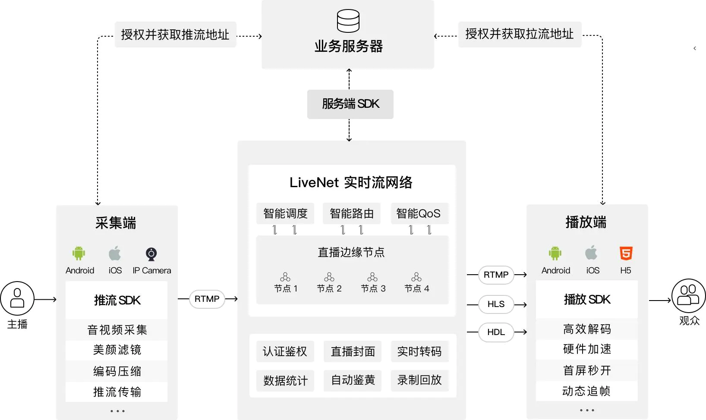
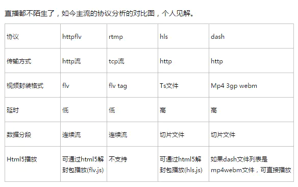
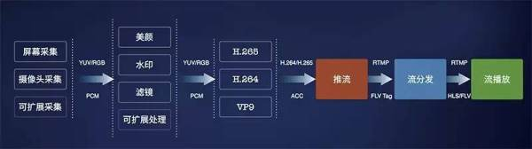
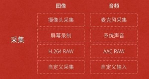
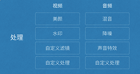
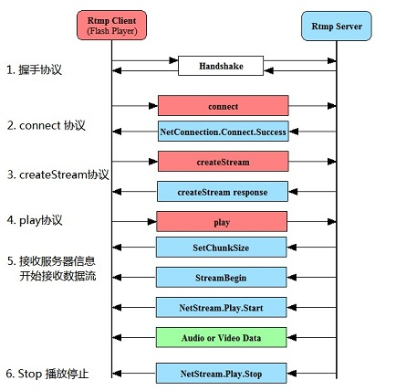

# 直播技术原理

## **直播App架构图**

## 视频直播流程

**推流端过程：**

1. 音视频采集
2. 美颜滤镜处理
3. 编码压缩
4. 推流

**服务器端过程：**
1. 实时转码
2. 录制回放
3. 自动鉴黄

**拉流端过程：**
1. 拉流
2. 解码
3. 播放

### **1.采集**

**音视频采集** 

​	采集是整个视频推流过程中的第一个环节，它从系统的采集设备中获取原始视频数据，将其输出到下一个环节。视频的采集涉及两方面数据的采集：音频采集和图像采集，它们分别对应两种完全不同的输入源和数据格式。

- 音频采集 
  音频数据既能与图像结合组合成视频数据，也能以纯音频的方式采集播放，后者在很多成熟的应用场景如在线电台和语音电台等起着非常重要的作用。音频的采集过程主要通过设备将环境中的模拟信号采集成 PCM 编码的原始数据，然后编码压缩成 MP3 等格式的数据分发出去。常见的音频压缩格式有：MP3，AAC，HE-AAC，Opus，FLAC，Vorbis (Ogg)，Speex 和 AMR等。 
  音频采集和编码主要面临的挑战在于：延时敏感、卡顿敏感、噪声消除（Denoise）、回声消除（AEC）、静音检测（VAD）和各种混音[算法](http://lib.csdn.net/base/datastructure)等。
- 图像采集 
  将图像采集的图片结果组合成一组连续播放的动画，即构成视频中可肉眼观看的内容。图像的采集过程主要由摄像头等设备拍摄成 YUV 编码的原始数据，然后经过编码压缩成 H.264 等格式的数据分发出去。常见的视频封装格式有：MP4、3GP、AVI、MKV、WMV、MPG、VOB、FLV、SWF、MOV、RMVB 和 WebM 等。 
  图像由于其直观感受最强并且体积也比较大，构成了一个视频内容的主要部分。图像采集和编码面临的主要挑战在于：设备兼容性差、延时敏感、卡顿敏感以及各种对图像的处理操作如美颜和水印等。

视频采集的采集源主要有 摄像头采集、屏幕录制和从视频文件推流。

### 2.处理

视频或者音频完成采集之后得到原始数据，为了增强一些现场效果或者加上一些额外的效果，我们一般会在将其编码压缩前进行处理，比如打上时间戳或者公司 Logo 的水印，祛斑美颜和声音混淆等处理。在主播和观众连麦场景中，主播需要和某个或者多个观众进行对话，并将对话结果实时分享给其他所有观众，连麦的处理也有部分工作在推流端完成。

如上图所示，处理环节中分为音频和视频处理，音频处理中具体包含混音、降噪和声音特效等处理，视频处理中包含美颜、水印、以及各种自定义滤镜等处理。

### 3.编码和封装

（1）编码

- 视频编码的意义 
  原始视频数据存储空间大，一个 1080P 的 7 s 视频需要 817 MB 
  原始视频数据传输占用带宽大，10 Mbps 的带宽传输上述 7 s 视频需要 11 分钟 
  而经过 H.264 编码压缩之后，视频大小只有 708 k ，10 Mbps 的带宽仅仅需要 500 ms ，可以满足实时传输的需求，所以从视频采集传感器采集来的原始视频势必要经过视频编码。
- 基本原理 
  为什么巨大的原始视频可以编码成很小的视频呢?这其中的技术是什么呢?核心思想就是去除冗余信息： 
  1）空间冗余：图像相邻像素之间有较强的相关性 
  2）时间冗余：视频序列的相邻图像之间内容相似 
  3）编码冗余：不同像素值出现的概率不同 
  4）视觉冗余：人的视觉系统对某些细节不敏感 
  5）知识冗余：规律性的结构可由先验知识和背景知识得到
- 编码器的选择 
  视频编码器经历了数十年的发展，已经从开始的只支持帧内编码演进到现如今的 H.265 和 VP9 为代表的新一代编码器，下面是一些常见的视频编码器： 
  1）H.264/AVC 
  2）HEVC/H.265 
  3）VP8 
  4）VP9 
  5）FFmpeg 
  注：音频编码器有Mp3, AAC等。

（2）封装 
沿用前面的比喻，封装可以理解为采用哪种货车去运输，也就是媒体的容器。 
所谓容器，就是把编码器生成的多媒体内容(视频，音频，字幕，章节信息等)混合封装在一起的标准。容器使得不同多媒体内容同步播放变得很简单，而容器的另一个作用就是为多媒体内容提供索引，也就是说如果没有容器存在的话一部影片你只能从一开始看到最后，不能拖动进度条，而且如果你不自己去手动另外载入音频就没有声音。下面是几种常见的封装格式： 
1）AVI 格式(后缀为 .avi) 
2）DV-AVI 格式(后缀为 .avi) 
3）QuickTime File Format 格式(后缀为 .mov) 
4）MPEG 格式(文件后缀可以是 .mpg .mpeg .mpe .dat .vob .asf .3gp .mp4等) 
5）WMV 格式(后缀为.wmv .asf) 
6）Real Video 格式(后缀为 .rm .rmvb) 
7）Flash Video 格式(后缀为 .flv) 
8）Matroska 格式(后缀为 .mkv) 
9）MPEG2-TS 格式 (后缀为 .ts) 
目前，我们在流媒体传输，尤其是直播中主要采用的就是 **FLV** 和 **MPEG2-TS** 格式，分别用于 **RTMP/HTTP-FLV** 和 **HLS** 协议。

### 4.推流到服务器

​	推流是直播的第一公里，直播的推流对这个直播链路影响非常大，如果推流的网络不稳定，无论我们如何做优化，观众的体验都会很糟糕。所以也是我们排查问题的第一步，如何系统地解决这类问题需要我们对相关理论有基础的认识。 

**推送协议主要有三种：**

- RTSP（Real Time Streaming Protocol）：实时流传送协议，是用来控制声音或影像的多媒体串流协议, 由Real Networks和Netscape共同提出的；
- RTMP(Real Time Messaging Protocol)：实时消息传送协议，是Adobe公司为Flash播放器和服务器之间音频、视频和数据传输 开发的开放协议；
- HLS(HTTP Live Streaming)：是苹果公司(Apple Inc.)实现的基于HTTP的流媒体传输协议；

RTMP协议基于 TCP，是一种设计用来进行实时数据通信的网络协议，主要用来在 flash/AIR 平台和支持 RTMP 协议的流媒体/交互服务器之间进行音视频和数据通信。支持该协议的软件包括 Adobe Media Server/Ultrant Media Server/red5 等。 

**它有三种变种：**

- RTMP工作在TCP之上的明文协议，使用端口1935；
- RTMPT封装在HTTP请求之中，可穿越防火墙；
- RTMPS类似RTMPT，但使用的是HTTPS连接；

RTMP 是目前主流的流媒体传输协议，广泛用于直播领域，可以说市面上绝大多数的直播产品都采用了这个协议。 
RTMP协议就像一个用来装数据包的容器，这些数据可以是AMF格式的数据,也可以是FLV中的视/音频数据。一个单一的连接可以通过不同的通道传输多路网络流。这些通道中的包都是按照固定大小的包传输的。 

### 5.服务器流分发

**常用服务器**

- SRS:一款国人开发的优秀开源流媒体服务器系统
- BMS:也是一款流媒体服务器系统，但不开源，是SRS的商业版，比如SRS功能更多
- nginx: 免费开源web服务器，常用来配置流媒体服务器

**数据分发**  

CDN: (Content Delivery Network),即内容分发网络，将网站的内容发布到最接近用户的网络“边缘”，使用户可以就近取得所需的内容，解决Internet网络拥挤的状况，提高用户访问网站的响应速度。

CDN工作原理：比如请求流媒体数据：1.上传流媒体数据到服务器（源站）–2.源站存储流媒体数据–3.客户端播放流媒体，向CDN请求编码后的流媒体数据–4.CDN的服务器响应请求，若节点上没有该流媒体数据存在，则向源站继续请求流媒体数据；若节点上已经缓存了该视频文件，则跳到第6步–5.源站响应CDN的请求，将流媒体分发到相应的CDN节点上–6.CDN将流媒体数据发送到客户端。

### 6.播放器流播放

主要是实现直播节目在终端上的展现。因为我这里使用的传输协议是RTMP， 所以只要支持 RTMP 流协议的播放器都可以使用，譬如：

- 电脑端：VLC等
- 手机端：Vitamio以及ijkplayer等

一般情况下我们把上面流程的前四步称为第一部分，即视频主播端的操作。视频采集处理后推流到流媒体服务器，第一部分功能完成。第二部分就是流媒体服务器，负责把从第一部分接收到的流进行处理并分发给观众。第三部分就是观众啦，只需要拥有支持流传输协议的播放器即可。 

