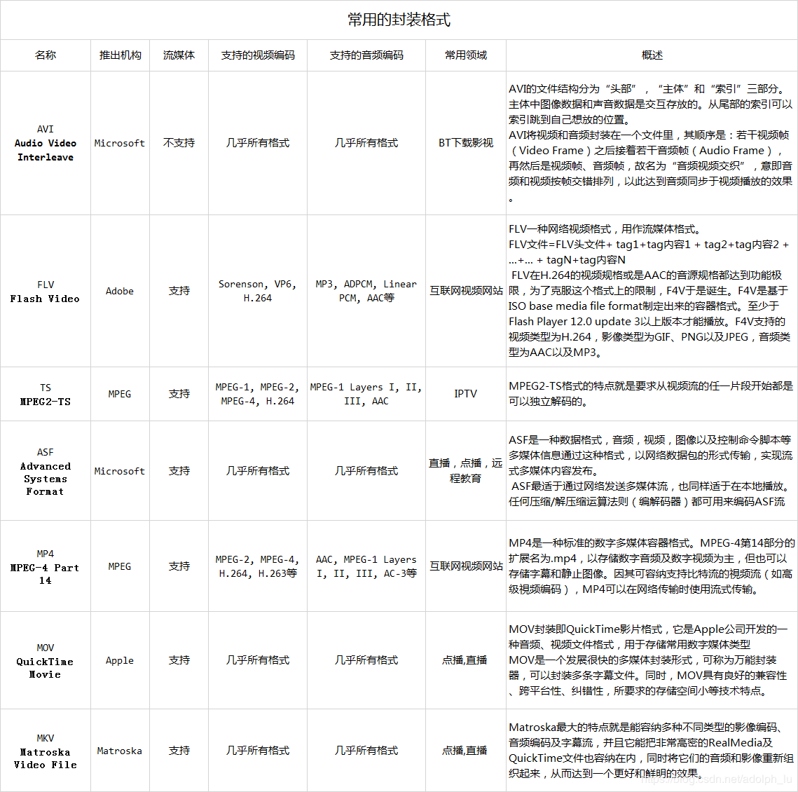
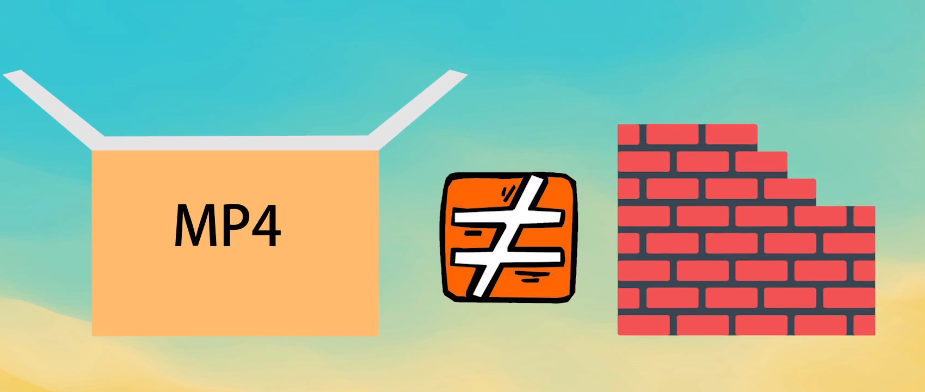

# 视频的基本知识

## 视频的封装格式

​	封装格式也称多媒体容器，它只是为多媒体编码提供了一个“外壳”，也就是将所有的处理好的视频、音频或字幕都包装到一个文件容器内呈现给观众，这个包装的过程就叫封装。 

**常用的封装格式**

   

##  视频编码

视频编码就是指通过压缩技术，将原始视频格式的文件转换成另一种视频格式文件的方式。 常见的有H.264、MPEG系列、WMV等。由于原始的视音频数据非常大，不方便存储和传输，通过压缩编码的方式将原始视音频进行压缩。它定义了视频数据在存储和传输过程中的规范。 

我们不能把封装格式和编码混淆，简单的说封装格式是一个外壳容器，编码是压缩技术。

## 码率

​	视频码率就是数据传输时单位时间传送的数据位数，一般我们用的单位是`kbps`即千位每秒。通俗一点的理解就是取样率，单位时间内取样率越大，精度就越高，处理出来的文件就越接近原始文件，清晰度越高。			

文件体积与取样率是成正比的，所以几乎所有的编码格式重视的都是如何用最低的码率达到最少的失真，围绕这个核心衍生出来的**固定码率**和**可变码率**。

通常情况下

1920*1080分辨率的视频，码率应该在8M以上。

1080*720的分辨率，应该在5M左右

720*576分辨率，应该在3M左右

640*480分辨率，应该在1.5M左右

320*240的分辨率，应该在600K左右。

达到以上码率后，视频的清晰度就可以了，再高了，用眼睛就难以分别出来了。 

## 帧率

帧率就是1秒钟显示画面数，比如说帧率为25帧每秒的视频，就是一秒钟会有25张画面。帧率影响的是画面的`流畅度`，视频帧率越高，画面越流畅。视频帧率越高，视频的体积也会越大。

## 分辨率

分辨率（屏幕分辨率）是屏幕图像的精密度，是指显示器所能显示的像素有多少。由于屏幕上的点、线和面都是由像素组成的，显示器可显示的像素越多，画面就越精细，同样的屏幕区域内能显示的信息也越多，所以分辨率是个非常重要的性能指标之一。 

可以把整个图像想象成是一个大型的棋盘，而分辨率的表示方式就是所有经线和纬线交叉点的数目。显示分辨率一定的情况下，显示屏越小图像越清晰，反之，显示屏大小固定时，显示分辨率越高图像越清晰。 

比如一个视频的分辨率为`1280*720`,就代表了这个视频的水平方向有1280个像素，垂直方向有720个像素。 

