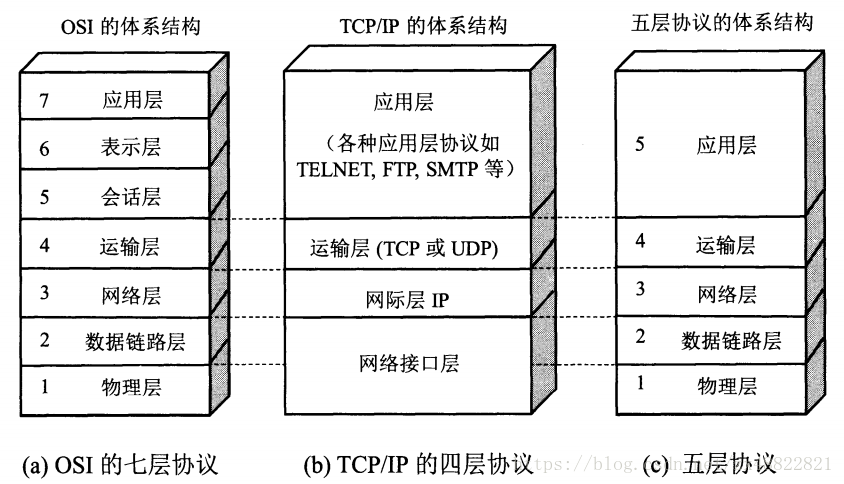
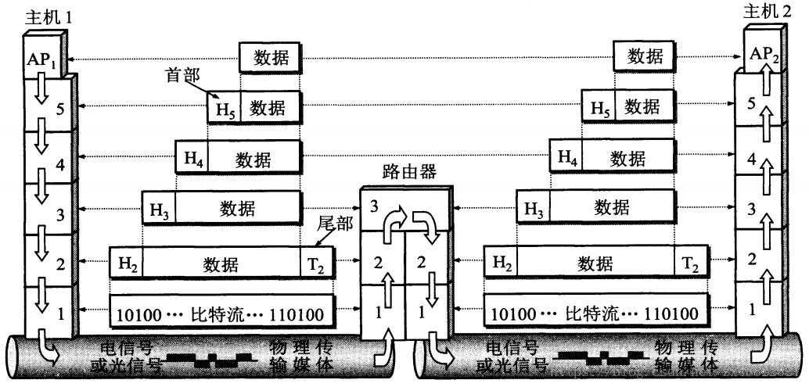
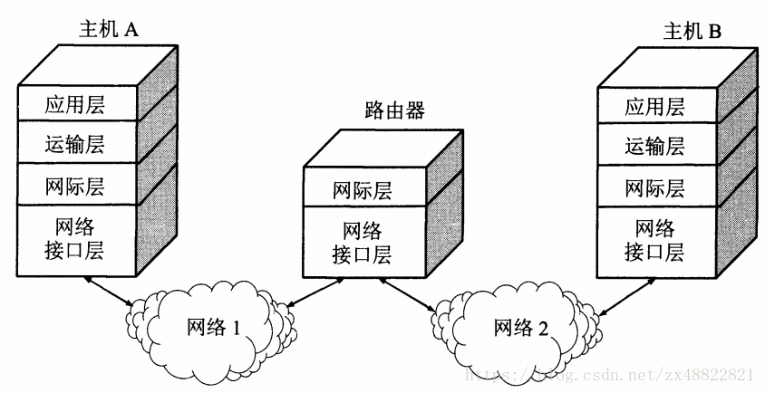
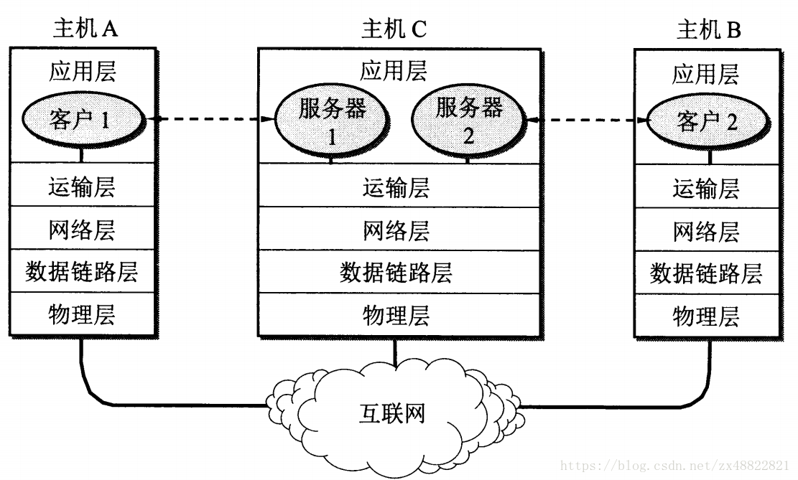

# 计算机网络基础 之一：概述

## 前言

本来这段时间是打算好好写写 SpringMVC 的源码分析的，但是上来阅读相关的参考资料的时候产生了回顾网络基础的想法，因此有了这个专栏。首推书籍，当然是《计算机网络》(谢希仁 编着)，我读的是第七版，本专栏也将大量引用谢老师的文字，就不一一注明了。这个专栏计划是仔细写写计算机网络的体系结构，因此我着重会从此书的前六章去切入，后面几章的知识在我看来要用的时候去查阅就行了。

你此刻所读到的文字，就来源于网络，大多数人并不了解这与写个纸条给别人有什么区别，里面蕴含了多少令人头痛又着迷的知识，就结果而言，使用者对网络的感觉是正确的。计算机网络体系结构的层层封装，向上支持，向下透明，使得每个人都无须去关注细节问题，而对于渴望深入了解它们的人而言，深究下去，可以看到这纸条源头的大树，根系是多么发达，由根部一层一层向上的结构，使得计算机网络拥有着如何的生机。

## 分层

计算机网络是个非常复杂的系统。为了说明这一点，可以设想一种最简单的情况:连接在网络上的两台计算机要互相传送文件。显然，在这两台计算机之间必须有一条传送数据的通路。但这还远远不够。至少还有以下几项工作需要去完成:

1. 发起通信的计算机必须将数据通信的通路进行激活(activate)。所谓“激活”就是要发出一些信令，保证要传送的计算机数据能在这条通路上正确发送和接收。

2. 要告诉网络如何识别接收数据的计算机。

3. 发起通信的计算机必须查明对方计算机是否己开机，并且与网络连接正常。

4. 发起通信的计算机中的应用程序必须弄清楚，在对方计算机中的文件管理程序是否已做好接收文件和存储文件的准备工作。

5. 若计算机的文件格式不兼容，则至少其中一台计算机应完成格式转换功能。

6. 对出现的各种差错和意外事故，如数据传送错误、重复或丢失，网络中某个结点交换机出现故障等，应当有可靠的措施保证对方计算机最终能够收到正确的文件。

还可以列举出一些要做的其他工作。由此可见，相互通信的两个计算机系统必须高度协调工作才行，而这种“协调”是相当复杂的。为了设计这样复杂的计算机网络，早在最初的ARPANET设计时即提出了分层的方法。“分层”可将庞大而复杂的问题，转化为若干较小的局部问题，而这些较小的局部问题就比较易于研究和处理。

## 具有五层协议的体系结构



可以看到图中所示的这几种体系结构，OSI 体系结构不实用，所以 TCP/IP的体系结构广泛实际应用，为什么，因为TCP/IP简单。不过我们在学习的时候，把两者结合一下来理解，会好一些。

## 计算机网络缩影



其实计算机网络的缩影就是如此，两台主机，一台路由，那么大一点呢？



如图，两台主机以及路由其实是网络中的小小一部分。那么我们常说的服务器呢？

 

## 计算机网络的性能

**速率**

连接在计算机网络上的主机在数字信道上传送数据位数的速率，也称data rate或bit rate(比特率)，单位是b/s, kb/s, Mb/s, Gb/s。和正常理解的网速的关系是除以8.

**带宽**

数据通信领域中，数字信道所能传送的最高数据率，单位是b/s, kb/s, Mb/s, Gb/s。常见的是Mpbs。

**吞吐量**

在单位时间内通过某个网络的数据量，单位是b/s, Mb/s。

**时延**

包括发送时延，传播时延，处理时延，排队时延。发送时延等于数据块长度(bit)除以信道带宽(bit/s). 更快的发送速度意味着波长越短，链路上的数据量更大；更快的传播速度意味着在网线中更快的传播速度。

**时延X带宽(时延带宽积)**

有多少数据正在线路上。

**往返时间(RTT, Round-Trip Time)**

从发送方发送数据开始，到发送方收到接收方确认数据的时间。例如ping一下。

**利用率**

包括信道利用率：有数据通过的时间/总时间
网络利用率：信道利用率的加权平均
网络当前时延D = 网络空闲时时延D0 / (1 - 信道利用率U)

**速率与带宽的区别**

带宽是通道传输信息的能力；

传输速率是单位时间内在通道中传输的信息量。

举例

```java
马路--->信道
车流--->信息流
同一时刻能通过的最大车子数--->带宽
某段路一段时间内通过的车量--->信道速率
```

1兆宽带下的网速是125KB/秒，它们之间是速率的关系，10M的理论数值是10MB/8 ≈1.25MB的理论值， 当然会根据用户的情况以及网络负载而上下浮动。

速度参照如下:

1M正常下载速率在75-125KBs之间

2M正常下载速率在150-250KBs之间

3M正常下载速率在225-375KBs之间

4M正常下载速率在300-500KBs之间，以此类推。


## 结语

就是如此，接下来的每一章，我都会来分析其中的一层，自底向上。
