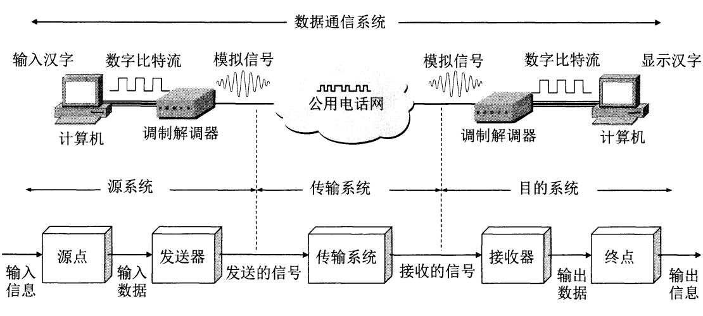
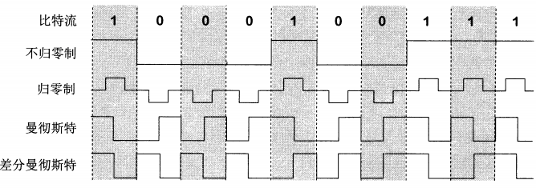
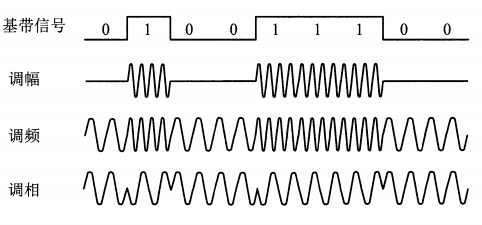
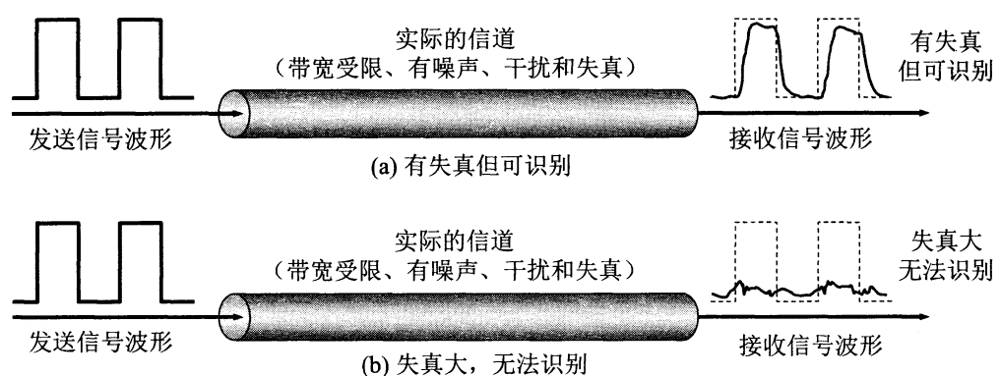
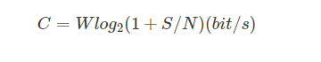
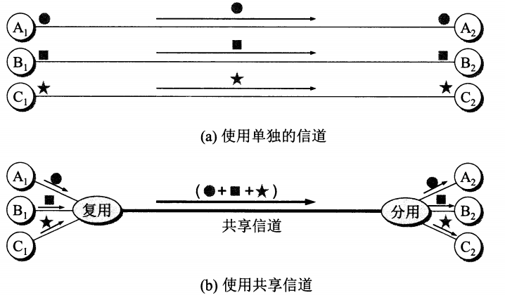
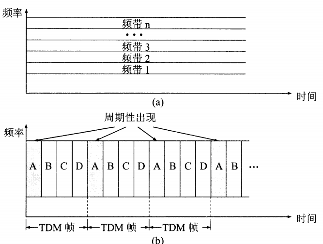
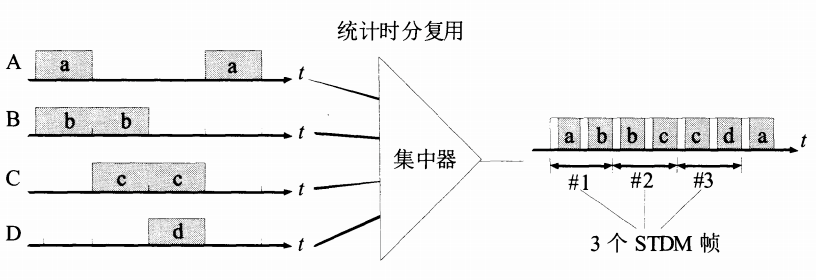
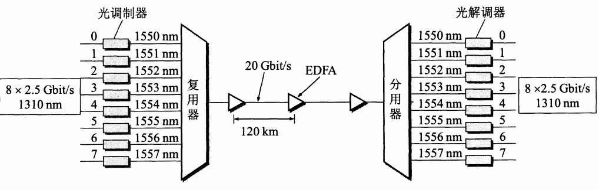

# 计算机网络基础 之二：物理层

##  前言
物理层是计算机网络的第一层，它虽然处于最底层，却是整个开放系统的基础。物理层为设备之间的数据通信提供传输媒体及互连设备，为数据传输提供可靠的环境。如果您想要用尽量少的词来记住这个第一层，那就是“信号和介质”。

所以，谢老师在书中所涉及到的5（数字传输系统）、6（宽带接入技术）略去不讲，并且，重点关注数据通信相关的知识，关于介质相关的知识会少一些，即3（物理层下面的传输媒体）。有需要的读者可自行查阅。

## 基本概念

为什么要讲概念，因为物理层这一处虽然带着‘物理’二字，可并不意味着这一层是实体，物理层规定传输数据所需要的物理链路创建、维持、拆除，而提供具有机械的，电子的，功能的和规范的特性，主要关心如何传输信号。

比如说我们通常知道数字信号其实是由0和1组成的，那么我们是怎么规定0和1的（电压大小），如何确保0和1在传输过程中种种干扰的准确性（传输媒体、编码方式等）。其实物理层的相关知识，仅仅包含通讯信号的特性（机械特性、电气特性、 功能特性、过程特性），但传输媒体实体并不属于物理层。

## 数据通信的基础知识

如图所示，一个数据通信系统可划分为三大部分，即源系统(或发送端、发送方)、传输系统(或传输网络)和目的系统(或接收端、接收方)。

通信的目的是传送消息(message)。如话音、文字、图像、视频等都是消息。数据(data)是运送消息的实体。根据RFC 4949给出的定义，数据是使用特定方式表示的信息，通常是有意义的符号序列。这种信息的表示可用计算机或其他机器(或人)处理或产生。信号(signal)则是数据的电气或电磁的表现。

根据信号中代表消息的参数的取值方式不同，信号可分为以下两大类：

1. `模拟信号`，或`连续信号`—代表消息的参数的取值是连续的。例如在图中，用户家中的调制解调器到电话端局之间的用户线上传送的就是模拟信号。
2. 数字信号，或离散信号—代表消息的参数的取值是离散的。例如在图中，用户家中的计算机到调制解调器之间，或在电话网中继线上传送的就是数字信号。在使用时间域(或简称为时域)的波形表示数字信号时，代表不同离散数值的基本波形就称为码元。在使用二进制编码时，只有两种不同的码元，一种代表0状态而另一种代表1状态。

## 有关信道的几个基本概念

在许多情况下，我们要使用`信道(channel)`这一名词。信道和电路并不等同。信道一般都是用来表示向某一个方向传送信息的媒体。因此，一条通信电路往往包含一条发送信道和一条接收信道。从通信的双方信息交互的方式来看，可以有以下三种基本方式：

1. 单向通信又称为`单工通信`，即只能有一个方向的通信而没有反方向的交互。无线电广播或有线电广播以及电视广播就属于这种类型。
2. 双向交替通信又称为`半双工通信`，即通信的双方都可以发送信息，但不能双方同时发送(当然也就不能同时接收)。这种通信方式是一方发送另一方接收，过一段时间后可以再反过来。
3. 双向同时通信又称为`全双工通信`，即通信的双方可以同时发送和接收信息。单向通信只需要一条信道，而双向交替通信或双向同时通信则都需要两条信道(每个方向各一条)。显然，双向同时通信的传输效率最高。

来自信源的信号常称为`基带信号`(即基本频带信号)。像计算机输出的代表各种文字或图像文件的数据信号都属于基带信号。许多信道并不能传输基带信号中的低频分量或直流分量。为了解决这一问题，就必须对基带信号进行`调制(modulation)`。`调制`可分为两大类：

1. 这类调制称为`基带调制`。仅仅对基带信号的波形进行变换，使它能够与信道特性相适应。变换后的信号仍然是基带信号。由于这种基带调制是把数字信号转换为另一种形式的数字信号，因此大家更愿意把这种过程称为`编码(coding)`。
2. 这类调制称为`带通调制`。使用载波(carrier)进行调制，把基带信号的频率范围搬移到较高的频段，并转换为模拟信号，这样就能够更好地在模拟信道中传输。经过载波调制后的信号称为`带通信号`(即仅在一段频率范围内能够通过信道)。

常用编码方式，如上图，`不归零制`正电平代表1，负电平代表0；`归零制`正脉冲代表1，负脉冲代表0；`曼彻斯特编码`位周期中心的向上跳变代表0，位周期中心的向下跳变代表但也可反过来定义；`差分曼彻斯特编码`在每一位的中心处始终都有跳变。位开始边界有跳变代表0，而位开始边界没有跳变代表。

常用带通调制，如上图。调幅(AM)即载波的振幅随基带数字信号而变化。例如，0或1分别对应于无载波或有载波输出；调频((FM)即载波的频率随基带数字信号而变化。例如，0或1分别对应于频率 f1 或 f2 ;调相(PM)即载波的初始相位随基带数字信号而变化。例如，0或1分别对应于相位0度或180度。

## 信道的极限容量

任何实际的信道都不是理想的，都不可能以任意高的速率进行传送。数字通信的优点就是：虽然信号在信道上传输时会不可避免地产生失真，但在接收端只要我们从失真的波形中能够识别出原来的信号，那么这种失真对通信质量就没有影响。如图：

从概念上讲，限制码元在信道上的传输速率的因素有以下两个：

1. 信道能够通过的频率范围

   由于系统传输总特性不理想，导致前后码元的波形畸变、展宽，并使前面波形出现很长的拖尾，蔓延到当前码元的抽样时刻上，从而对当前码元的判决造成干扰，这就是码间串扰，如上图(b)。为了避免码间串扰，奈奎斯特(Nyquist)
   推导出了着名的奈氏准则。他给出了在假定的理想条件下，为了避免码间串扰，码元的传输速率的上限值。所以，在任何信道中，码元传输的速率是有上限的，传输速率超过此上限，就会出现严重的码间串扰的问题，使接收端对码元的判决(即识别)成为不可能。

2. 信噪比

   噪声存在于所有的电子设备和通信信道中。信噪比就是信号的平均功率和噪声的平均功率之比，常记为S/N，并用分贝(dB)作为度量单位。在1948年，信息论的创始人`香农((Shannon)`推导出了着名的`香农公式`。香农公式指出，**信道的极限信息传输速率C**是

式中，W为信道的带宽(以Hz为单位)，S为信道内所传信号的平均功率，N为信道达部的高斯噪声功率。香农公式表明，信道的带宽或信道中的信噪比越大，信息的极限传输速率就越高。香农公式指出了信息传输速率的上限。香农公式的意义在于：只要信息传输速率低于信道的极限信息传输速率，就一定存在某种办法来实现无差错的传输。

## 物理层下面的传输媒体

传输媒体也称为传输介质或传输媒介，它就是数据传输系统中在发送器和接收器之间的物理通路。传输媒体可分为两大类，即导引型传输媒体和非导引型传输媒体(这里的“导引型”的英文就是guided，也可译为“导向传输媒体”。在导引型传输媒体中，电磁波被导引沿着固体媒体(铜线或光纤)传播；而非导引型传输媒体就是指自由空间，在非导引型传输媒体中电磁波的传输常称为无线传输。

### 信道复用技术

`复用(multiplexing)`是通信技术中的基本概念。在计算机网络中的信道广泛地使用各种复用技术。下面对信道复用技术进行简单的介绍。

如上图，虽然复用要付出一定代价(共享信道由于带宽较大因而费用也较高，再加上复用器和分用器)。但如果复用的信道数量较大，那么在经济上还是合算的。

### 频分复用FDM (Frequency Division Multiplexing)、时分复用TDM(Time Division Multiplexing)

频分复用最简单，其特点如上图(a)所示。用户在分配到一定的频带后，在通信过程中自始至终都占用这个频带。可见**频分复用的所有用户在同样的时间占用不同的带宽资源**(请注意，这里的“带宽”是频率带宽而不是数据的发送速率)。

而时分复用则是将时间划分为一段段等长的时分复用帧( TDM 帧)。每一个时分复用的用户在每一个TDM帧中占用固定序号的时隙。

为简单起见，在上图(b)中只画出了4个用户A,B, C和D。每一个用户所占用的时隙周期性地出现(其周期就是TDM帧的长度)。因此TDM信号也称为等时((isochronous)信号。可以看出，时分复用的所有用户是在不同的时间占用同样的频带宽度。这两种复用方法的优点是技术比较成熟，但缺点是不够灵活。时分复用则更有利于数字信号的传输。

### 统计时分复用STDM (Statistic TDM)

统计时分复用STDM (Statistic TDM)是一种改进的时分复用，它能明显地提高信道的利用率。集中器(concentrator)常使用这种统计时分复用。

上图是统计时分复用的原理图。一个使用统计时分复用的集中器连接4个低速用户，然后将它们的数据集中起来通过高速线路发送到一个远程计算机。

统计时分复用使用STDM帧来传送复用的数据。但每一个STDM帧中的时隙数小于连接在集中器上的用户数。各用户有了数据就随时发往集中器的输入缓存，然后集中器按顺序依次扫描输入缓存，把缓存中的输入数据放入STDM帧中。对没有数据的缓存就跳过去。当一个帧的数据放满了，就发送出去。

### 波分复用WDM (Wavelength Division Multiplexing)

波分复用WDM (Wavelength Division Multiplexing)就是光的频分复用。光纤技术的应用使得数据的传输速率空前提高。现在人们借用传统的载波电话的频分复用的概念，就能做到使用一根光纤来同时传输多个频率很接近的光载波信号。这样就使光纤的传输能力可成倍地提高。由于光载波的频率很高，因此习惯上用波长而不用频率来表示所使用的光载波。这样就得出了波分复用这一名词。

### 码分复用CDM (Code Division Multiplexing)

码分复用CDM (Code Division Multiplexing)是另一种共享信道的方法，这里只简单介绍一下。实际上，人们更常用的名词是码分多址CDMA (Code Division Multiple Access)。每一个用户可以在同样的时间使用同样的频带进行通信。

由于各用户使用经过特殊挑选的不同码型，因此各用户之间不会造成干扰。码分复用最初用于军事通信，因为这种系统发送的信号有很强的抗干扰能力，其频谱类似于白噪声，不易被敌人发现。

随着技术的进步，CDMA设备的价格和体积都大幅度下降，因而现在已广泛使用在民用的移动通信中，特别是在无线局域网中。采用CDMA可提高通信的话音质量和数据传输的可靠性，减少干扰对通信的影响，增大通信系统的容量(是使用GSM的4-5倍)，降低手机的平均发射功率，等等。

